<!-- cspell:words neondatabase lifecycles precaches precaching inlines refetches inspectable Recomputable typeaheads arriv clientcomp Cpayload -->

# Throughline — Architecture

**A teaching document.** This is not a feature list. It explains how the application actually
works end to end: what happens when a request arrives, where data lives, which layer is allowed
to talk to which, and _why_ each boundary is drawn where it is.

It assumes you already understand databases, SQL, data modeling, and APIs. It does **not** assume
you know Next.js, React Server Components, TypeScript type-level patterns, or ORM idiom. Those
are explained from the ground up wherever they appear.

Three kinds of statement appear throughout, and they are labeled:

| Label                   | Meaning                                                        |
| ----------------------- | -------------------------------------------------------------- |
| (no label)              | Verified in the code. A file path and symbol name is given.    |
| **Framework behavior:** | Something Next.js, React, or Postgres does. Not our code.      |
| **Likely rationale:**   | Inference. The code does not say why; this is a reading of it. |
| **Not implemented:**    | Described in `docs/` or the spec, absent from the code.        |

Every discrepancy found between the committed documentation and the committed implementation is
recorded in [§25](#25-documentation-vs-implementation-discrepancies). **The implementation is
treated as the source of truth throughout.**

---

## Table of contents

| §                                                       | Section                                        |
| ------------------------------------------------------- | ---------------------------------------------- |
| [1](#1-system-architecture)                             | System architecture                            |
| [2](#2-file-structure)                                  | File structure                                 |
| [3](#3-startup-lifecycle)                               | Startup lifecycle                              |
| [4](#4-user-interaction-lifecycles)                     | User-interaction lifecycles                    |
| [5](#5-database-architecture)                           | Database architecture                          |
| [6](#6-database-queries)                                | Database queries                               |
| [7](#7-external-apis)                                   | External APIs                                  |
| [8](#8-api-and-client-architecture)                     | API and client architecture                    |
| [9](#9-react-architecture)                              | React architecture                             |
| [10](#10-rendering)                                     | Rendering                                      |
| [11](#11-ontology-architecture)                         | Ontology architecture                          |
| [12](#12-semantic-layer)                                | Semantic layer                                 |
| [13](#13-data-modeling)                                 | Data modeling                                  |
| [14](#14-authentication-and-authorization)              | Authentication and authorization               |
| [15](#15-error-handling)                                | Error handling                                 |
| [16](#16-environment-variables)                         | Environment variables                          |
| [17](#17-deployment)                                    | Deployment                                     |
| [18](#18-security)                                      | Security                                       |
| [19](#19-performance)                                   | Performance                                    |
| [20](#20-follow-the-data-one-complete-walkthrough)      | Follow the data: one complete walkthrough      |
| [21](#21-if-i-changed-this)                             | "If I changed this…"                           |
| [22](#22-glossary)                                      | Glossary                                       |
| [23](#23-architecture-decisions)                        | Architecture decisions                         |
| [24](#24-what-i-should-understand-now)                  | What I should understand now                   |
| [25](#25-documentation-vs-implementation-discrepancies) | Documentation vs. implementation discrepancies |

---

## 1. System architecture

### What this application is, mechanically

Throughline is a **Next.js 16 App Router application** deployed as serverless functions on Vercel,
talking to a **single PostgreSQL database** on Neon. There is no separate backend service, no
message broker, no cache server, and no graph database. Everything that is not the browser is
either a Next.js server function or Postgres.

That is unusual enough to state plainly, because it shapes everything below: **the "API layer" and
the "web layer" are the same process.** When a page needs data it calls a function that runs SQL.
There is no HTTP hop in between.

### The layer diagram

```mermaid
flowchart TB
    subgraph browser["Browser / installed PWA"]
        RSCpayload["Server-rendered HTML<br/>+ RSC payload"]
        clientcomp["Client components<br/>(search, rating, canvas)"]
        sw["Service worker<br/>public/sw.js"]
    end

    subgraph vercel["Vercel — Node.js serverless"]
        mw["middleware.ts<br/>CSP nonce · session gate"]
        subgraph nextjs["Next.js App Router"]
            pages["Server Components<br/>src/app/**/page.tsx"]
            actions["Server Actions<br/>src/actions/*.ts"]
            routes["Route Handlers<br/>src/app/api/**/route.ts"]
        end
        repos["Repositories<br/>src/server/repos/*.ts"]
        graph["Graph engine<br/>src/lib/graph/postgres-engine.ts"]
        metrics["Metric resolver<br/>src/lib/metrics/resolve.ts"]
        tmdb["TMDB client<br/>src/server/providers/tmdb/"]
        jobs["Job handlers + drain<br/>src/server/jobs/"]
        auth["Better Auth<br/>src/server/auth/auth.ts"]
    end

    subgraph neon["Neon PostgreSQL 17"]
        raw[("raw.*<br/>provider payloads")]
        core[("core.*<br/>canonical entities + edges")]
        sem[("sem.*<br/>views — the ONLY app surface")]
        usr[("usr.*<br/>user data, RLS-protected")]
    end

    ext["TMDB API<br/>api.themoviedb.org"]
    wd["Wikidata SPARQL"]
    resend["Resend<br/>email OTP delivery"]
    cdn["image.tmdb.org<br/>poster CDN"]

    browser --> mw
    mw --> pages
    clientcomp -->|fetch| routes
    clientcomp -->|POST| actions
    pages --> repos
    actions --> repos
    routes --> repos
    pages --> graph
    pages --> metrics
    repos --> sem
    repos --> usr
    graph --> sem
    metrics --> sem
    sem -.->|views over| core
    sem -.->|views over| usr
    jobs --> core
    jobs --> raw
    jobs --> tmdb
    tmdb --> ext
    jobs --> wd
    auth --> usr
    auth --> resend
    routes --> jobs
    browser -.->|img src| cdn
    sw -.->|caches| cdn
```

### The seven structural commitments

These are load-bearing. Each is enforced by something mechanical, not by convention:

| #   | Commitment                                           | Enforced by                                                                            |
| --- | ---------------------------------------------------- | -------------------------------------------------------------------------------------- |
| 1   | One Postgres. No graph database.                     | The graph engine is plain SQL — [postgres-engine.ts](src/lib/graph/postgres-engine.ts) |
| 2   | `ontology/ontology.yaml` is the source of truth      | `pnpm codegen` + `scripts/check-drift.ts` in CI                                        |
| 3   | App code may query **only** `sem.*`                  | `scripts/check-layers.sh` in CI                                                        |
| 4   | Person is an entity; Actor/Director are _predicates_ | Generated `CHECK` constraint on `core.edge.predicate`                                  |
| 5   | Three provenance tiers on every edge                 | Separate `core.edge_derived` table, safely truncatable                                 |
| 6   | Hub-penalized, predicate-weighted path ranking       | `PATH_RANKING` in [generated.ts](src/lib/ontology/generated.ts)                        |
| 7   | Volatile facts are not ontology                      | `core.availability` is a table, not an edge                                            |

### What each layer is allowed to touch

This is the single most important diagram in the document, because violating it is how the
semantic layer would quietly stop existing:

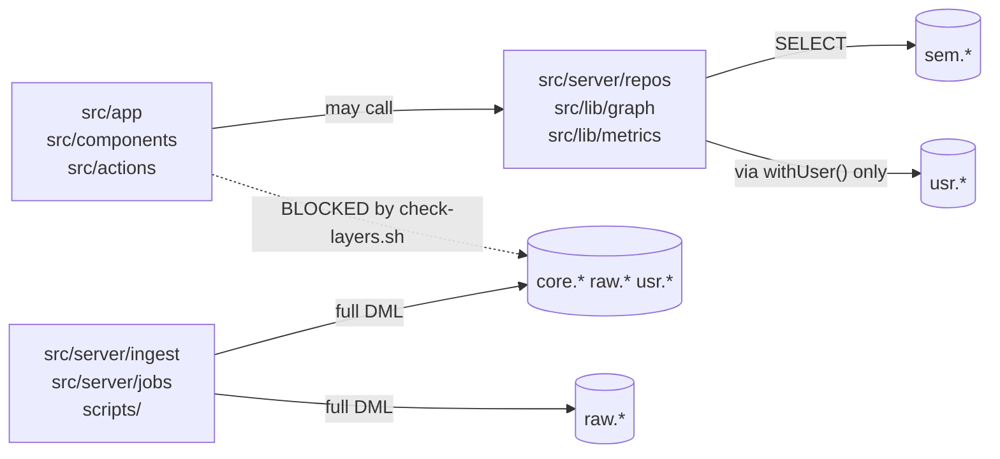

[`scripts/check-layers.sh`](scripts/check-layers.sh) greps `src/app`, `src/components`, and
`src/actions` for `core.`, `raw.`, and `usr.` and fails the build on a match. The escape hatch is
a `layers-ok:` comment with a written reason — used, for example, in
[`src/app/s/[slug]/page.tsx`](src/app/s/%5Bslug%5D/page.tsx) where the word "usr.share" appears in
a comment rather than a query.

**Why this matters more than it looks.** A semantic layer that the application is merely
_encouraged_ to use erodes in about three sprints — someone needs one column that isn't in a view,
reaches into `core`, and now the view is optional. Making it a build failure is what keeps the
abstraction real.

---

## 2. File structure

```
throughline/
├── ARCHITECTURE.md              ← this file
├── CLAUDE.md                    agent contract: hard rules, current phase
├── README.md
├── next.config.ts               images.unoptimized, typedRoutes
├── vercel.json                  four daily cron entries
├── drizzle.config.ts            migration generation config
│
├── ontology/                    ← THE SOURCE OF TRUTH
│   ├── ontology.yaml            21 predicates, 9 entity types, path ranking
│   ├── metrics.yaml             9 metric definitions
│   ├── themes.yaml              curated theme vocabulary
│   ├── moods.yaml               curated mood vocabulary
│   ├── crosswalk.yaml           TMDB keyword → theme mapping
│   └── codegen.ts               compiles the above into 5 artifacts
│
├── drizzle/
│   ├── schema/
│   │   ├── _shared.ts           shared column helpers
│   │   ├── raw.ts               raw.tmdb_payload, raw.wikidata_payload
│   │   ├── core.ts              23 tables — the canonical model
│   │   ├── usr.ts               11 tables — user data
│   │   └── index.ts             re-exports
│   ├── sql/                     hand-written SQL, applied in filename order
│   │   ├── 00-bootstrap.sql     extensions, schemas, uuid_generate_v7()
│   │   ├── 10-functions.sql     claim_jobs, rate_limit_hit, admin functions
│   │   ├── 20-views.sql         ALL of sem.* — 14 views
│   │   ├── 30-rls.sql           row-level security policies
│   │   ├── 40-roles.sql         app_web / app_ingest / app_auth grants
│   │   └── 50-matviews.sql      core.node_degree
│   ├── migrations/              drizzle-kit generated, committed
│   └── generated/ontology.sql   ← GENERATED. Never hand-edit.
│
├── src/
│   ├── middleware.ts            CSP nonce, session gate, whats-new cookie
│   ├── app/                     routes (see §8 for the full map)
│   │   ├── layout.tsx           <html>, theme, skip link, SW registration
│   │   ├── (app)/               authenticated shell — bottom nav
│   │   ├── (auth)/              sign-in — deliberately NOT in the app shell
│   │   ├── api/                 route handlers
│   │   ├── s/[slug]/            PUBLIC share page + OG image
│   │   └── explore/             PUBLIC ontology browse
│   ├── actions/                 'use server' mutations, 6 files
│   ├── server/
│   │   ├── db/
│   │   │   ├── client.ts        globalDb + withUser() ← read this first
│   │   │   └── resolve-url.ts   which env var holds which connection
│   │   ├── auth/                Better Auth config + session helpers
│   │   ├── repos/               13 files — the ONLY place sem/usr are queried
│   │   ├── providers/tmdb/      rate-limited, circuit-broken TMDB client
│   │   ├── ingest/              resolve, normalize, derive, enrich
│   │   ├── jobs/                handlers.ts (10 kinds) + drain.ts
│   │   └── rate-limit.ts        fail-open / fail-closed policy
│   ├── lib/
│   │   ├── ontology/            ← GENERATED. generated.ts, vocabulary.ts, metrics.ts
│   │   ├── graph/               engine interface + PostgresGraphEngine
│   │   ├── metrics/resolve.ts   compiles metrics.yaml into account-scoped SQL
│   │   ├── route-access.ts      which paths bypass the session gate
│   │   ├── color/accent.ts      poster accent extraction
│   │   └── theme.ts             light/dark/system cookie handling
│   ├── components/              ui · media · tracking · graph · charts · pwa
│   ├── content/releases.ts      the /whats-new changelog
│   ├── assets/fonts/            .ttf files, loaded as ArrayBuffer for Satori
│   └── styles/globals.css       Tailwind v4 + CSS custom properties
│
├── scripts/                     seed, migrate, backfills, CI checks
├── tests/
│   ├── unit/                    Vitest — no database
│   ├── integration/             Vitest — against a real Postgres
│   └── e2e/                     Playwright — Chromium desktop + WebKit iPhone
└── public/
    ├── sw.js                    hand-written service worker
    └── icon-*.png, favicon-*    app icons
```

### The three directories you must not hand-edit

| Path                             | Regenerated by | Guarded by               |
| -------------------------------- | -------------- | ------------------------ |
| `src/lib/ontology/`              | `pnpm codegen` | `scripts/check-drift.ts` |
| `drizzle/generated/ontology.sql` | `pnpm codegen` | `scripts/check-drift.ts` |
| `docs/ontology-reference.md`     | `pnpm codegen` | `scripts/check-drift.ts` |

`pnpm check-drift` regenerates them in memory and compares against what is committed. A mismatch
fails CI. **This is what makes "the database is generated from the ontology" a fact rather than an
aspiration** — you cannot edit the generated types to add a predicate without the build noticing
that `ontology.yaml` disagrees.

### Route groups: `(app)` and `(auth)`

**Framework behavior:** a directory whose name is wrapped in parentheses is a _route group_. It
organizes files and lets you give them a shared `layout.tsx`, but it contributes **nothing to the
URL**. `src/app/(app)/library/page.tsx` serves `/library`, not `/app/library`.

Why two groups here: [`src/app/(app)/layout.tsx`](src/app/%28app%29/layout.tsx) renders the bottom
navigation and reserves `5.5rem` of bottom padding for it. The sign-in page must not inherit that
padding — its own comment records what happened when it did:

> The auth pages previously rendered INSIDE this shell, inheriting `pb-28` reserved for a nav that
> was hidden on those routes — which made a page that should fit exactly 128px taller than the
> viewport, and the resulting rubber-band overscroll showed the browser canvas as bands behind the
> form.

---

## 3. Startup lifecycle

There are four distinct "startups" and they are easy to conflate. They are not the same thing.

### 3.1 Build time (`pnpm build` / `pnpm vercel-build`)

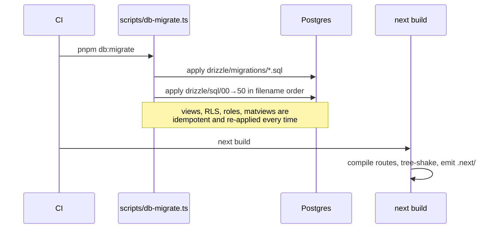

`vercel-build` is `pnpm db:migrate && next build` — migrations run **before** the build, using the
**direct (unpooled)** connection. [`drizzle.config.ts`](drizzle.config.ts) states why:

> DDL and advisory locks are unreliable through a connection pooler.

The `drizzle/sql/*.sql` files are applied in filename order on every migrate. They are written to
be idempotent (`CREATE OR REPLACE VIEW`, `DROP POLICY IF EXISTS`, guarded `CREATE ROLE`). **Likely
rationale:** views and policies change far more often than table shapes, and re-applying them
unconditionally is simpler and safer than generating a migration for each edit.

### 3.2 Cold start of a serverless function

**Framework behavior:** Vercel runs each route as a Node.js serverless function. The first request
to an idle function pays a cold start: the module graph is imported, top-level code runs, then the
handler is invoked. Subsequent requests reuse the warm instance and skip the imports.

What runs at module scope here — and therefore once per cold start, not once per request:

| Module                                                                     | Top-level work                                                                                                       |
| -------------------------------------------------------------------------- | -------------------------------------------------------------------------------------------------------------------- |
| [`src/server/db/client.ts`](src/server/db/client.ts)                       | `postgres(connectionString, { max: 10, prepare: false })` — creates the pool. **Throws if `DATABASE_URL` is unset.** |
| [`src/server/auth/auth.ts`](src/server/auth/auth.ts)                       | Builds the Better Auth instance and its separate `app_auth` connection                                               |
| [`src/server/repos/tracking-hooks.ts`](src/server/repos/tracking-hooks.ts) | A second small pool (`max: 2`) for `core.job` writes                                                                 |
| [`src/lib/ontology/generated.ts`](src/lib/ontology/generated.ts)           | Const objects — `PREDICATE_SPECS`, `PATH_RANKING`, `ENTITY_TABLES`                                                   |

`prepare: false` is not optional. The pooled `DATABASE_URL` is **pgbouncer in transaction mode**,
which does not support named prepared statements — postgres.js would create one on a backend that
the next query might not be routed to.

### 3.3 A single request

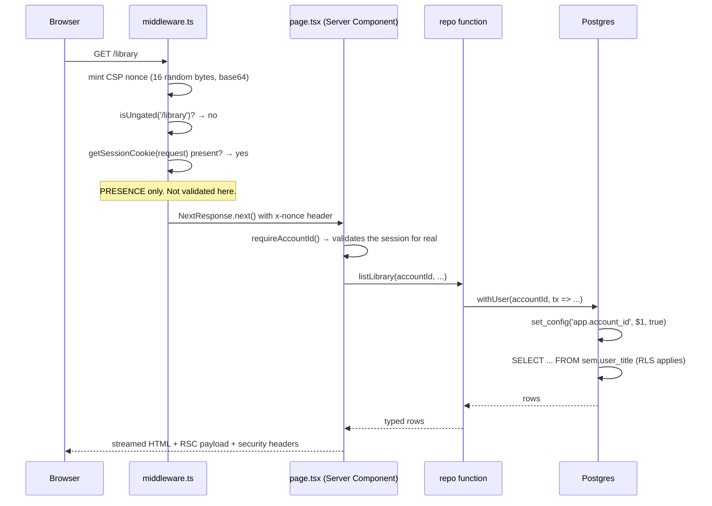

The division of labor in that diagram is deliberate and is stated in the middleware's own comment:

> This checks only for the PRESENCE of a session cookie, not its validity. Validating here would
> mean a database round-trip in middleware on every request including static assets. A forged
> cookie gets past this and then hits the two real layers, which is the correct division of labor:
> middleware is a redirect convenience, not a security boundary.

### 3.4 Browser startup

1. HTML arrives, already containing the rendered page. The `data-theme` attribute is already on
   `<html>` because [`src/app/layout.tsx`](src/app/layout.tsx) read the theme cookie during render —
   there is no flash of the wrong theme.
2. React **hydrates**: it attaches event handlers to the existing DOM rather than rebuilding it.
   Only client components participate.
3. [`ServiceWorkerRegistrar`](src/components/pwa/service-worker.tsx) registers `/sw.js`.
4. `/sw.js` `install` precaches `/offline` and `/icon-192.png`; `activate` deletes caches whose
   key does not end in the current `VERSION` (`v2`).

---

## 4. User-interaction lifecycles

### 4.1 Search (the only keystroke-driven path)

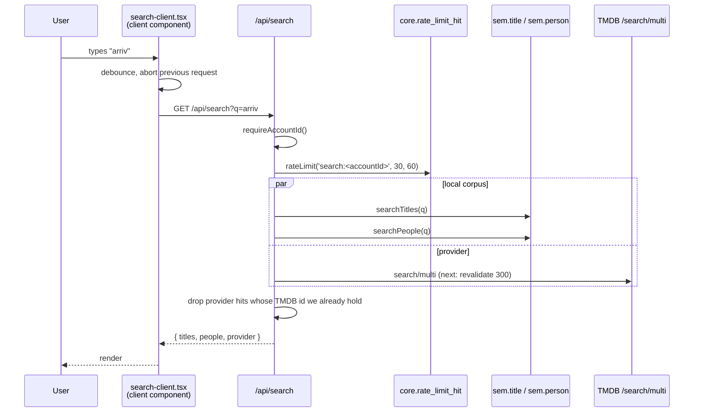

Three things worth understanding here:

- **`Promise.all` for the two local queries.** They are independent, so they run concurrently. In a
  server component or route handler this is the difference between two sequential round trips and
  one.
- **Provider results are filtered against local ids.** Without that, a title already in `core`
  appears twice: once from our corpus with a status chip, once from TMDB without one.
- **People are corpus-only.** [`src/app/api/search/route.ts`](src/app/api/search/route.ts) does not
  merge TMDB person results. **Likely rationale:** a person we do not hold has no page to open, so
  offering them would be a dead link.

### 4.2 Marking something watched (the highest-frequency mutation)

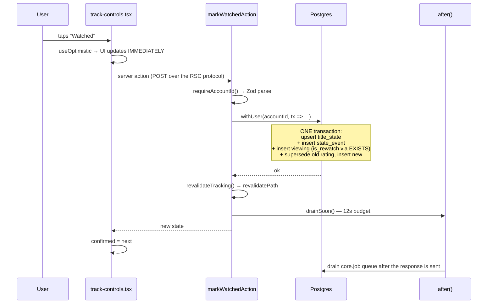

**`useOptimistic` explained.** It is a React hook that lets you render a _provisional_ state while
a server action is in flight. [`track-controls.tsx`](src/components/tracking/track-controls.tsx)
keeps three things: `confirmed` (what the server last told us), an optimistic override, and a
`useTransition` pending flag. On failure it reverts to `confirmed`. Without this, every status tap
would show nothing for the 200–400 ms round trip.

**`after()` explained.** **Framework behavior:** `after()` from `next/server` schedules work to run
_after the response has been flushed to the client_. The user does not wait for it.
[`src/actions/tracking.ts`](src/actions/tracking.ts) uses it to drain the job queue with a 12-second
budget, so hydrating a newly-tracked show's episodes starts immediately rather than waiting for the
next daily cron.

### 4.3 Opening a title we do not hold

`hydrateOnDemand(tmdbId, kind)` in
[`src/server/ingest/on-demand.ts`](src/server/ingest/on-demand.ts) runs **synchronously**, in the
request. Its own comment notes the divergence from `docs/api.md`, which describes a queued job:

> Hobby cron is daily.

A queued job that runs tomorrow does not render a page today. This is the correct call for the
deployment target, and the comment says so rather than leaving the doc silently wrong.

### 4.4 Finding a path between two entities

`/universe/connect?a=&b=` → [`postgres-engine.ts:findPaths`](src/lib/graph/postgres-engine.ts#L266)
→ one large SQL statement with explicit depth-1/2/3 joins (not a recursive CTE) → cost, hub
penalty, and diversity filtering → narration composed from ontology templates. Rate-limited at
20/60s per account, because it is the most expensive query in the app. See [§6.3](#63-path-finding).

---

## 5. Database architecture

### The four schemas

| Schema | Holds                                       | Written by      | App may read?         |
| ------ | ------------------------------------------- | --------------- | --------------------- |
| `raw`  | Verbatim provider JSON + fetch metadata     | Ingest only     | **Never**             |
| `core` | Canonical entities, edges, crosswalks, jobs | Ingest only     | **Never directly**    |
| `sem`  | Views expressing business concepts          | _(views)_       | **Yes — exclusively** |
| `usr`  | Accounts, state, events, ratings, shares    | App, RLS-scoped | Through `sem.user_*`  |

**Why `raw` exists.** Two concrete reasons, both stated in the schema comments:
_replayability_ (when the keyword→theme crosswalk changes, re-derive from stored payloads instead
of re-crawling TMDB) and _debuggability_ (diff the stored payload against `core` to explain a wrong
director).

### Entity–relationship diagram

This covers the structural core. It omits the ~10 supporting tables (`external_id`, `merge_log`,
`er_review`, `job`, `rate_limit`, aliases, crosswalks) for legibility; those are described below it.

```mermaid
erDiagram
    TITLE ||--o{ SEASON : "has"
    SEASON ||--o{ EPISODE : "has"
    TITLE ||--o{ EPISODE : "denormalized FK"
    TITLE ||--o{ CREDIT : "is credited in"
    PERSON ||--o{ CREDIT : "holds"
    CHARACTER |o--o{ CREDIT : "played as"
    TITLE ||--o{ TITLE_KEYWORD : "tagged"
    CONCEPT ||--o{ CROSSWALK_KEYWORD_THEME : "mapped to"
    TITLE ||--o{ AVAILABILITY : "streams on"
    ORGANIZATION ||--o{ AVAILABILITY : "offers"
    CONCEPT ||--o{ CONCEPT : "broader_than"

    TITLE {
        uuid id PK
        text slug UK
        text kind "movie | show"
        text title
        text sort_title "normalized, pg_trgm indexed"
        date release_date
        int runtime_minutes
        text poster_path
        text accent_color "extracted from poster"
        numeric popularity
        timestamptz popularity_as_of "volatile — stamped"
        timestamptz synced_at
    }
    PERSON {
        uuid id PK
        text slug UK
        text name
        text sort_name
        text known_for_department
    }
    CREDIT {
        uuid id PK
        uuid person_id FK
        uuid title_id FK
        uuid episode_id FK "nullable"
        text predicate "acted_in | directed | wrote | ..."
        uuid character_id FK "nullable — honest partial ER"
        text character_name_raw
        smallint billing_order
    }
    EDGE {
        uuid id PK
        text subject_type "polymorphic"
        uuid subject_id
        text predicate "CHECK generated from ontology.yaml"
        text object_type
        uuid object_id
        jsonb attributes
        text provenance "asserted | curated"
        numeric confidence
    }
    EDGE_DERIVED {
        uuid id PK
        text subject_type
        uuid subject_id
        text predicate
        text object_type
        uuid object_id
        text method
        numeric score
    }

    ACCOUNT ||--o{ TITLE_STATE : "tracks"
    ACCOUNT ||--o{ STATE_EVENT : "appends"
    ACCOUNT ||--o{ RATING : "judges"
    ACCOUNT ||--o{ VIEWING : "logs"
    ACCOUNT ||--o{ EPISODE_PROGRESS : "ticks"
    ACCOUNT ||--o{ SHARE : "creates"
    TITLE ||--o{ TITLE_STATE : "is tracked as"
    TITLE ||--o{ SHARE : "is shared"

    ACCOUNT {
        uuid id PK
        citext email UK
        text display_name
        bool is_admin
        char region
    }
    TITLE_STATE {
        uuid account_id PK_FK
        uuid title_id PK_FK
        text status "watchlist|watching|watched|abandoned"
        bool is_favorite "orthogonal to status"
        timestamptz added_at
    }
    STATE_EVENT {
        uuid id PK
        uuid account_id FK
        text from_status
        text to_status
        timestamptz occurred_at
    }
    RATING {
        uuid id PK
        uuid account_id FK
        smallint value "1..10 = 0.5..5.0 stars"
        timestamptz superseded_at "NULL = current"
    }
    VIEWING {
        uuid id PK
        uuid account_id FK
        date watched_on
        text date_precision "exact|day|month|year|unknown"
        bool is_rewatch
    }
    SHARE {
        text slug PK "21-char nanoid"
        uuid account_id FK
        smallint rating_snapshot "frozen at creation"
        text note_snapshot
        timestamptz revoked_at
    }
```

### Table inventory

**`core` — 23 tables.** Nine entity tables (`title`, `season`, `episode`, `person`, `character`,
`concept`, `collection`, `organization`, `work`), three relationship tables (`credit`, `edge`,
`edge_derived`), and eleven supporting (`external_id`, `entity_alias`, `merge_log`, `er_review`,
`availability`, `title_keyword`, `crosswalk_keyword_theme`, `job`, `path_cache`, `person_bacon`,
`rate_limit`).

> **Not implemented:** `core.path_cache` and `core.person_bacon` exist in the schema and in the
> migrations, but **nothing in `src/` reads or writes either one**. Path results are computed fresh
> on every request. Bacon numbers were a Phase 2 item that was never built. Similarly,
> `raw.wikidata_payload` exists and is never written — `enrich-wikidata.ts` applies SPARQL results
> directly without capturing the payload.

**`usr` — 12 tables.** `account`, `auth_session`, `oauth_account`, `auth_verification` (the four
Better Auth needs — note the physical names are prefixed, while the Drizzle exports are `session`
and `verification`), `invite`, `note`, plus the six user-data tables in the ER diagram.

### Why two relationship tables

`core.credit` is the high-volume typed table — roughly 85% of all edges. It gets its own shape
because it needs `billing_order`, `character_id`, `department`/`job` strings, and episode-level
granularity. Putting those in a generic `attributes jsonb` would make the hottest query in the app
(cast list, ordered by billing) an unindexable jsonb sort.

`core.edge` is the generic, low-volume table for everything else: franchise membership, themes,
genres, `based_on`, `produced_by`, `sequel_to`.

`core.edge_derived` has the same shape but is **separately truncatable**. `TRUNCATE
core.edge_derived` and recompute is always safe — provider facts and human curation cannot be
destroyed by a bad inference run.

`sem.edge` unions all three into one surface, so the graph engine sees a single table.

### Key constraints that carry real weight

| Constraint                                         | Where             | What it prevents                                                       |
| -------------------------------------------------- | ----------------- | ---------------------------------------------------------------------- |
| `CHECK (predicate IN (...))`                       | `core.edge`       | A predicate not declared in `ontology.yaml`                            |
| `core.assert_edge_valid()` trigger                 | `core.edge`       | Domain/range violations — a `person` as the object of `explores_theme` |
| Partial unique index `WHERE superseded_at IS NULL` | `usr.rating`      | Two "current" ratings for one title                                    |
| `viewing_date_present_ck`                          | `usr.viewing`     | A viewing with no date and no precision marker                         |
| `CHECK (status IN (...))`                          | `usr.title_state` | An invalid lifecycle state                                             |
| Composite PK `(account_id, title_id)`              | `usr.title_state` | Duplicate tracking rows                                                |
| Three `CHECK`s incl. shape                         | `usr.state_event` | Malformed append-only events                                           |

### Indexes that are load-bearing

```sql
core.credit  (title_id, predicate, billing_order)   -- ordered cast list
             (person_id, predicate)                 -- filmography
core.edge    (subject_type, subject_id, predicate)  -- forward traversal
             (object_type, object_id, predicate)    -- REVERSE traversal
core.title   GIN (sort_title gin_trgm_ops)          -- fuzzy ER + search
```

The reverse-traversal index is the one people forget. Bidirectional path search expands from both
endpoints; without an index on the object side, half of every search is a sequential scan.

`core.node_degree` is a materialized view refreshed by the `refresh_degree` cron. It feeds the hub
penalty in path ranking — see [§6.3](#63-path-finding).

---

## 6. Database queries

### 6.1 Two query mechanisms, used for different things

The app uses **Drizzle ORM** and the **raw `postgres.js` driver** side by side. This is deliberate,
and the difference between them has bitten before.

|              | Drizzle (`drizzle-orm/postgres-js`)                               | Raw `postgres.js`                               |
| ------------ | ----------------------------------------------------------------- | ----------------------------------------------- |
| Created in   | [`src/server/db/client.ts`](src/server/db/client.ts) → `globalDb` | `postgres(url, {...})` in jobs, ingest, scripts |
| Used by      | Repositories, all request-path reads and writes                   | Job handlers, ingest, `drain.ts`, CLI scripts   |
| Transactions | `globalDb.transaction(tx => ...)` — the basis of `withUser()`     | `sql.begin(...)`                                |

**The array gotcha.** Both expose a `sql` tagged template, and they interpolate arrays
differently:

```ts
// drizzle's sql`` — expands an array into a PARAMETER LIST: ($1, $2, $3)
sql`WHERE id IN ${ids}`; // works
sql`WHERE id = ANY(${ids})`; // BROKEN — ANY receives a tuple, not an array

// postgres.js sql`` — sends a REAL Postgres array
sql`WHERE id = ANY(${ids}::text[])`; // works
sql`WHERE id IN ${ids}`; // BROKEN
```

They are not interchangeable. If you copy a query between a repository and a job handler, this is
the line that breaks, and it breaks at runtime rather than at typecheck.

### 6.2 `withUser()` — the only path to user data

```ts
// src/server/db/client.ts
export async function withUser<T>(accountId: string, fn: (tx: Tx) => Promise<T>): Promise<T> {
  if (!accountId) throw new Error('withUser: accountId is required');
  return globalDb.transaction(async (tx) => {
    await tx.execute(sql`select set_config('app.account_id', ${accountId}, true)`);
    return fn(tx);
  });
}
```

Three things are doing work in those five lines:

1. **`globalDb.transaction(...)`** opens a real transaction. The RLS policies read
   `current_setting('app.account_id')`, and `SET LOCAL` only persists _inside a transaction_.
   Outside one, the setting evaporates and every policy matches nothing — **the query returns zero
   rows, silently.** Not an error. Zero rows.
2. **`set_config(..., true)`** is the parameterized form of `SET LOCAL`. The `true` is the
   `is_local` flag. Using the parameterized function rather than interpolating into `SET LOCAL`
   means the account id is a bound parameter and cannot be injected.
3. **The `true` is not optional for a second, independent reason.** `DATABASE_URL` is pgbouncer in
   transaction mode: a backend connection is handed to a different request the moment a transaction
   ends. A plain `SET` would persist on that backend and be inherited by the next request that
   borrows it — a cross-tenant leak that would pass every test written against a single user.

Every repository function that touches user data takes `accountId` as its **first parameter**. It
is never read from ambient context. That makes "did we scope this query?" visible at the call site
and greppable in review — belt and braces alongside RLS.

### 6.3 Path finding

`findPaths(a, b, { limit })` in
[`src/lib/graph/postgres-engine.ts:266`](src/lib/graph/postgres-engine.ts#L266) is the most
interesting query in the application. The naive version of this feature is worthless, and
understanding _why_ is understanding the feature.

**The problem.** The shortest path between almost any two films is length 2 through a hub: both are
`Drama`, both were distributed by Warner Bros. Those paths are _true_ and _useless_. Meaningful
path-finding is a **ranking** problem, not a search problem.

**The cost function**, from `PATH_RANKING` in
[`src/lib/ontology/generated.ts:396`](src/lib/ontology/generated.ts#L396):

```
cost(path) = Σ cost(edge_i)
cost(edge) = predicate_weight(p) × hub_penalty(intermediate) × (1 / confidence)
hub_penalty(n) = 1 + 0.45 × ln(1 + degree(n))
```

| Parameter               | Value | Why                                                                  |
| ----------------------- | ----- | -------------------------------------------------------------------- |
| `maxDepthPerSide`       | 3     | Bidirectional — up to 6 hops total                                   |
| `frontierCap`           | 4000  | Bounds combinatorial blowup                                          |
| `hubDegreeBan`          | 2000  | Nodes above this degree are **banned** from intermediate positions   |
| `hubPenaltyCoefficient` | 0.45  | The `ln` coefficient above                                           |
| `maxPathsReturned`      | 3     | More than three is noise                                             |
| `diversityMaxOverlap`   | 0.5   | Reject a path sharing >50% of intermediates with one already emitted |

**Genre edges are dropped entirely**, not merely penalized. The query's own comment explains why
position-based filtering is not enough:

> Genre edges are dropped ENTIRELY rather than only from intermediate slots: in a two-hop path both
> edges touch the intermediate, so there is no position where "both are Drama" is worth saying.

**Explicit joins, not a recursive CTE.** The query unions fixed depth-1, depth-2 and depth-3 joins
against `sem.edge_bidirectional`. **Likely rationale** (consistent with `docs/graph.md`): fixed-depth
joins let Postgres use the covering index and are far easier to `EXPLAIN` than a recursive CTE with
array-based cycle detection.

**Narration** is composed left-to-right from templates in `ontology.yaml`. No language model is
involved. `PathStep.canonical` exists because an inverse step carries a predicate name
(`directed_by`) that does not exist in the ontology — weights and templates must be looked up by
the canonical name.

### 6.4 The `::int` discipline

`sem.user_title` casts every `count(*)` to `::int`, and the comment explains a real bug:

> `count(*)` is bigint, which the driver hands back as a STRING to protect precision it will never
> need here — and a string that looks like a number is worse than either, because `view_count + 1`
> silently becomes `"11"`.

This is a JavaScript-specific hazard: `bigint` exceeds `Number.MAX_SAFE_INTEGER`, so postgres.js
returns it as a string, and `+` on a string concatenates.

### 6.5 Caching

**Framework behavior:** Next.js provides `unstable_cache` (memoize a server function, keyed by
arguments and tags) and `revalidatePath` / `revalidateTag` (invalidate). The `fetch` call also takes
`next: { revalidate }` to cache an HTTP response.

| What                   | Strategy                                  |
| ---------------------- | ----------------------------------------- |
| TMDB search            | `next: { revalidate: 300 }`               |
| TMDB title/credits     | 86400s                                    |
| TMDB watch providers   | 43200s                                    |
| Anything under `usr.*` | **Never cached.** Per-request, always.    |
| After a mutation       | `revalidateTracking()` → `revalidatePath` |

---

## 7. External APIs

### 7.1 TMDB — the spine

Every canonical title, person, credit, season and episode originates from TMDB. The client lives in
[`src/server/providers/tmdb/client.ts`](src/server/providers/tmdb/client.ts) and is the only place
`TMDB_READ_ACCESS_TOKEN` is read. **The key never reaches the browser** — all TMDB traffic is
server-side.

**Four layers, in order, on every call:**

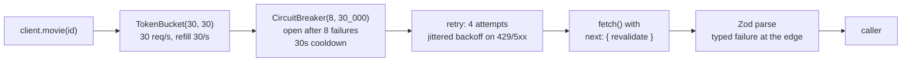

- **Token bucket at 30/s** sits below TMDB's ~50/s, leaving headroom.
- **Circuit breaker** opens after 8 consecutive failures and stays open for 30 seconds. While open,
  calls fail fast rather than piling onto a struggling upstream.
- **Zod parsing at the boundary** means a TMDB field change produces a typed failure _here_ rather
  than an `undefined` three layers in.

**Methods:** `movie` (appends `credits,keywords,external_ids`), `show` (appends
`aggregate_credits,…`), `person`, `season`, `watchProviders`, `list`, `personCredits`, `collection`,
`discover`, `trending`, `discoverCached`.

**Search is a separate module.** [`src/server/providers/tmdb/search.ts`](src/server/providers/tmdb/search.ts)
hits `search/multi` with a 6-second timeout and returns the top 12 by popularity. It deliberately
does **not** go through `TmdbClient`: search is latency-critical and user-facing, and it does not
capture to `raw` — a keystroke is not an ingest.

**Raw capture.** `watchProviders` is explicitly _not_ captured to `raw.tmdb_payload` — availability
is volatile and replaying it has no value. Everything else that ingests writes the verbatim payload
first.

### 7.2 Wikidata — the ontology enricher

[`src/server/ingest/enrich-wikidata.ts`](src/server/ingest/enrich-wikidata.ts) runs SPARQL in
batches of 60 (`SPARQL_BATCH`) to pull the relationships TMDB does not model: `based_on`,
`part_of_franchise`, `influenced_by`. CC0 licensed, no key.

**Why both sources.** TMDB gives excellent _catalog_ data and a weak _ontology_ — its keywords are a
folksonomy, and it has no notion of adaptation source or influence. Wikidata supplies exactly what
TMDB lacks. They join through the IMDb id that both carry.

> **Not implemented:** `raw.wikidata_payload` is declared in
> [`drizzle/schema/raw.ts`](drizzle/schema/raw.ts) and never written. SPARQL results are applied
> directly, so the replayability argument that justifies `raw` does not currently extend to
> Wikidata.

### 7.3 Resend — email OTP delivery

The only other outbound service. Used by Better Auth to send six-digit sign-in codes.

[`src/server/repos/health.ts`](src/server/repos/health.ts) checks something subtle here: whether
`EMAIL_FROM` ends in `@resend.dev`. Resend's shared sender **only delivers to the Resend account
owner's own address**; every other recipient gets a 403 before a message leaves. So the app can
report email as configured, pass every check, and still be unable to admit a single invited
person — and the failure lands on _their_ screen, as a code that never arrives, where the owner
never sees it.

### 7.4 image.tmdb.org — posters, deliberately unoptimized

[`next.config.ts`](next.config.ts) sets `images.unoptimized: true` with `image.tmdb.org` in
`remotePatterns`. TMDB already serves pre-sized variants (`w92`/`w185`/`w342`/`w500`/`w780`) from a
CDN. Routing them through Next's image optimizer would burn Vercel optimization units re-optimizing
already-optimized assets and add a cold-start latency class for no benefit. See
[ADR 0012](docs/adr/0012-tmdb-images-bypass-next-optimizer.md).

---

## 8. API and client architecture

### 8.1 Three server-side entry points

| Kind                 | Where                     | Used for                                          |
| -------------------- | ------------------------- | ------------------------------------------------- |
| **Server Component** | `src/app/**/page.tsx`     | All reads. Calls repositories directly — no HTTP. |
| **Server Action**    | `src/actions/*.ts`        | All mutations.                                    |
| **Route Handler**    | `src/app/api/**/route.ts` | Only where a real HTTP endpoint is required.      |

**Server Actions explained.** A function marked `'use server'` is callable from a client component
as if it were local. **Framework behavior:** React and Next.js generate an RPC endpoint, serialize
the arguments, POST them over the RSC protocol, run the function on the server, and return the
result. You never write the endpoint, the route, or the fetch.

Every action follows the same four steps:

```ts
// src/actions/tracking.ts — the shape, every time
export async function setStatusAction(input: unknown) {
  const accountId = await requireAccountId(); // 1. authenticate — throws if absent
  const parsed = Schema.parse(input); // 2. validate with Zod
  await setStatus(accountId, parsed.titleId, parsed.status); // 3. repository
  revalidateTracking(); // 4. invalidate the cache
}
```

**Why route handlers exist at all**, given actions cover mutations — there are exactly four reasons
in this codebase:

| Route                                            | Why it must be HTTP                                                |
| ------------------------------------------------ | ------------------------------------------------------------------ |
| `/api/search`, `/api/graph/search`               | Typeahead. Needs abort-on-keystroke, which actions do not support. |
| `/api/persona/card`, `/s/[slug]/opengraph-image` | Must return an image with content-type headers.                    |
| `/api/cron/*`                                    | Invoked by Vercel Cron with an `Authorization` header.             |
| `/api/health`, `/api/me/export`, `/api/admin/*`  | Consumed by external tooling or return a file.                     |

### 8.2 Full route map

| Route                                                                 | Auth                  | Rendering                                    |
| --------------------------------------------------------------------- | --------------------- | -------------------------------------------- |
| `/`                                                                   | session               | RSC — Continue Watching, suggestions, recent |
| `/search`                                                             | session               | RSC shell + client search component          |
| `/library`                                                            | session               | RSC                                          |
| `/title/[slug]`, `/title/[slug]/s/[n]`                                | session               | RSC                                          |
| `/person/[slug]`                                                      | session               | RSC                                          |
| `/universe`, `/universe/explore`, `/universe/connect`, `/universe/me` | session               | RSC + client canvas                          |
| `/me`, `/whats-new`                                                   | session               | RSC                                          |
| `/auth/signin`                                                        | **public**            | RSC + client form                            |
| `/s/[slug]`                                                           | **public**            | RSC, `force-dynamic`, no client JS needed    |
| `/s/[slug]/opengraph-image`                                           | **public**            | Satori `ImageResponse`                       |
| `/explore`, `/explore/[type]/[slug]`                                  | **public**            | RSC — the portfolio surface                  |
| `/offline`                                                            | **public**            | Static fallback for the service worker       |
| `/api/search`, `/api/graph/search`, `/api/me/export`                  | session               | Route handler                                |
| `/api/cron/{drain,housekeeping,refresh-degree,refresh-stale}`         | `CRON_SECRET`         | Route handler                                |
| `/api/admin/*`                                                        | `CRON_SECRET` + admin | Route handler                                |
| `/api/health`                                                         | **public**            | Route handler                                |

Which paths bypass the session gate is **data, not code** —
[`src/lib/route-access.ts`](src/lib/route-access.ts) exports `PUBLIC_PREFIXES`,
`SELF_AUTHENTICATING_PREFIXES`, and `SESSION_GATED_API_ROUTES`, and a unit test asserts against the
real exported value. Its comment records two bugs this shape fixed:

- `/api/admin/invite` was redirected to sign-in _before_ its own `CRON_SECRET` check could run, so a
  valid request got a 307 to HTML and an **invalid** one got the same 307 rather than the 401 it
  deserved.
- `PUBLIC_PREFIXES` lists both `/explore` **and** `/explore/`, because `isUngated` matches on
  equality or prefix — `/explore/` alone did not cover the bare `/explore`, which is precisely the
  URL a stranger gets handed.

### 8.3 The job queue

There is no queue service. There is a table.

```
core.job  (id, kind, payload jsonb, status, attempts, run_after, locked_at, locked_by, last_error)
```

Three SQL functions form the API: `core.claim_jobs(n, worker)` uses `FOR UPDATE SKIP LOCKED` so two
concurrent drains never claim the same row; `core.finish_job(id)`; `core.fail_job(id, error)`.
`core.enqueue_job(kind, payload)` dedupes on `(kind, payload)` while a job is still pending.

Ten handler kinds live in [`src/server/jobs/handlers.ts`](src/server/jobs/handlers.ts):
`hydrate_title`, `hydrate_episodes`, `hydrate_people`, `derive_themes`, `enrich_wikidata`,
`recompute_similar`, `refresh_stale`, `refresh_availability`, `refresh_degree`, `housekeeping`.

[`drain.ts`](src/server/jobs/drain.ts) is bounded by **wall clock (45s), not job count** — job
durations vary by two orders of magnitude, and a serverless function killed mid-write is worse than
one that stops early. When the budget runs out mid-batch it releases the job _and refunds the
attempt_:

```ts
await sql`UPDATE core.job SET status = 'queued', locked_at = NULL,
          attempts = greatest(0, attempts - 1) WHERE id = ${job.id}`;
```

Without the refund, a job that keeps landing at the end of a budget would exhaust its retries
without ever having been genuinely attempted.

**Self-chaining walks.** Several handlers enqueue their own next batch from _inside_ the drain.
That means the final link waits for the next drain window — up to ~22 hours on a daily cron. This
is the design working, not failing, and the health thresholds are set accordingly
([§15.4](#154-health-not-liveness)).

---

## 9. React architecture

### 9.1 Server Components vs. Client Components

This is the concept most worth internalizing, because it governs every file in `src/components/`.

**Framework behavior:** in the Next.js App Router, **every component is a Server Component by
default.** A Server Component runs _only_ on the server. It can be `async`, can `await` a database
query directly, and its JavaScript is **never sent to the browser** — only its rendered output is.

A file that starts with `'use client'` is a Client Component. It is server-rendered once for the
initial HTML, then **hydrated** in the browser, and its code _is_ in the bundle. Only client
components can use `useState`, `useEffect`, event handlers, or browser APIs.

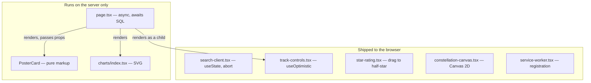

**The rule that follows:** a Server Component may render a Client Component, but not the reverse —
a client component can only receive server-rendered children as props. So the boundary is pushed as
far _down_ the tree as possible. `page.tsx` for a title is a server component; only the small
interactive island (`track-controls.tsx`) is a client component.

**Why this matters for the bundle.** The charts in
[`src/components/charts/index.tsx`](src/components/charts/index.tsx) — `Donut`, `RankedList`,
`Histogram`, `Sparkline`, `BucketBar`, `Stat` — are hand-rolled SVG **server** components. They ship
zero JavaScript. A charting library would have shipped tens of kilobytes to draw six static shapes.

### 9.2 The client components, and why each one must be

All eighteen, and why each one must be:

| Component                                                                         | Why it cannot be a server component          |
| --------------------------------------------------------------------------------- | -------------------------------------------- |
| [`media/search-client.tsx`](src/components/media/search-client.tsx)               | Debounce, `AbortController`, keystroke state |
| [`media/discovery-rail.tsx`](src/components/media/discovery-rail.tsx)             | Scroll/selection state                       |
| [`tracking/track-controls.tsx`](src/components/tracking/track-controls.tsx)       | `useOptimistic` + `useTransition`            |
| [`tracking/star-rating.tsx`](src/components/tracking/star-rating.tsx)             | Pointer drag for half-star precision         |
| [`tracking/episode-list.tsx`](src/components/tracking/episode-list.tsx)           | Per-row optimistic ticks                     |
| [`tracking/share-button.tsx`](src/components/tracking/share-button.tsx)           | `navigator.share()` needs a user gesture     |
| [`tracking/share-list.tsx`](src/components/tracking/share-list.tsx)               | Revoke actions with pending state            |
| [`tracking/persona-card.tsx`](src/components/tracking/persona-card.tsx)           | Image load + share interaction               |
| [`graph/constellation-canvas.tsx`](src/components/graph/constellation-canvas.tsx) | Canvas 2D drawing + force simulation         |
| [`graph/connect-form.tsx`](src/components/graph/connect-form.tsx)                 | Two linked typeaheads                        |
| [`graph/node-picker.tsx`](src/components/graph/node-picker.tsx)                   | Typeahead against `/api/graph/search`        |
| [`pwa/service-worker.tsx`](src/components/pwa/service-worker.tsx)                 | `navigator.serviceWorker.register`           |
| [`pwa/offline-banner.tsx`](src/components/pwa/offline-banner.tsx)                 | `online`/`offline` events                    |
| [`ui/bottom-nav.tsx`](src/components/ui/bottom-nav.tsx)                           | `usePathname` for the active indicator       |
| [`auth/sign-in-form.tsx`](src/components/auth/sign-in-form.tsx)                   | OTP entry state                              |
| [`auth/sign-out-button.tsx`](src/components/auth/sign-out-button.tsx)             | Client-side auth call                        |
| [`account/data-section.tsx`](src/components/account/data-section.tsx)             | Export/delete confirmation state             |
| [`admin/admin-panel.tsx`](src/components/admin/admin-panel.tsx)                   | Admin actions with pending state             |

Plus [`src/app/error.tsx`](src/app/error.tsx), which **must** be a client component —
**framework behavior:** an error boundary receives a `reset()` callback and therefore cannot be
server-only.

### 9.3 The optimistic update pattern, concretely

```ts
// src/components/tracking/track-controls.tsx (shape)
const [confirmed, setConfirmed] = useState(initial);
const [optimistic, applyOptimistic] = useOptimistic(confirmed);
const [pending, startTransition] = useTransition();

function run(next, action) {
  startTransition(async () => {
    applyOptimistic(next); // UI moves NOW
    try {
      await action();
      setConfirmed(next); // promote to truth
    } catch {
      // optimistic value is discarded automatically; `confirmed` wins
      toast('That did not save.');
    }
  });
}
```

**Framework behavior:** `useOptimistic` discards its override automatically when the surrounding
transition settles. You do not write the rollback; you write the _truth_ (`confirmed`), and React
falls back to it.

### 9.4 The constellation renderer

Not a graph library. [`constellation-canvas.tsx`](src/components/graph/constellation-canvas.tsx)
implements **Fruchterman–Reingold** force-directed layout against a **Canvas 2D** context, with a
`fitToFrame` pass and a separation pass to stop labels colliding.

> **Not implemented:** the spec called for Sigma.js + graphology. Neither is a dependency. The
> hand-rolled canvas is what exists, and it is why the app has **nine runtime dependencies total**.

---

## 10. Rendering

### 10.1 What actually goes over the wire

For `/library`, the browser receives:

1. **Streamed HTML** — the page, already rendered, including data. Readable with JavaScript off.
2. **The RSC payload** — a compact serialized description of the server component tree, used on
   subsequent client-side navigations so React can reconcile without a full reload.
3. **Client component chunks** — only for the islands listed in [§9.2](#92-the-client-components-and-why-each-one-must-be).

### 10.2 Every authenticated route is dynamic

Both [`src/app/layout.tsx`](src/app/layout.tsx) and
[`src/app/(app)/layout.tsx`](src/app/%28app%29/layout.tsx) call `cookies()`.

**Framework behavior:** reading `cookies()` or `headers()` in a layout or page opts that subtree out
of static generation. Both layouts note this explicitly — "Every route here is force-dynamic
already, so reading a cookie here costs no cacheability." That is a true statement _given_ the
session gate; it would be a significant cost in an app with public cacheable pages.

The theme is read server-side and stamped onto `<html data-theme="...">` during render. That is why
there is no flash of the wrong theme on load: the correct value is in the first byte of HTML, not
patched in by a script afterwards.

### 10.3 Suspense and streaming

**Framework behavior:** a `loading.tsx` beside a `page.tsx` becomes an automatic Suspense boundary.
Next streams the fallback immediately and swaps in the real content when the server component's
promises resolve.

[`src/app/(app)/universe/loading.tsx`](src/app/%28app%29/universe/loading.tsx) exists for exactly
this — the universe hub runs several graph aggregates, and the skeleton is dimensioned to match the
final layout so nothing shifts when it lands.

### 10.4 Image rendering — Satori

Two routes generate PNGs server-side with `ImageResponse` from `next/og`:
[`/s/[slug]/opengraph-image`](src/app/s/%5Bslug%5D/opengraph-image.tsx) and
[`/api/persona/card`](src/app/api/persona/card/route.tsx).

**Framework behavior:** `ImageResponse` uses Satori, which renders a **subset of CSS** — flexbox
only, no grid, no float. Fonts must be supplied as `ArrayBuffer`, which is why
[`src/assets/fonts/`](src/assets/fonts/) contains `.ttf` files rather than relying on a webfont.

### 10.5 Theme, three-state

`light` / `dark` / `system`, stored in a cookie by
[`src/actions/theme.ts`](src/actions/theme.ts). `system` stamps **no** attribute, leaving
`prefers-color-scheme` to decide. `generateViewport()` in the root layout mirrors the choice into
`themeColor`, because that paints the iOS status bar — and the media-query form answers to
`prefers-color-scheme` alone, so choosing Light on a dark phone would leave the bar near-black above
a warm-paper page.

---

## 11. Ontology architecture

### 11.1 `ontology.yaml` is a build input, not documentation

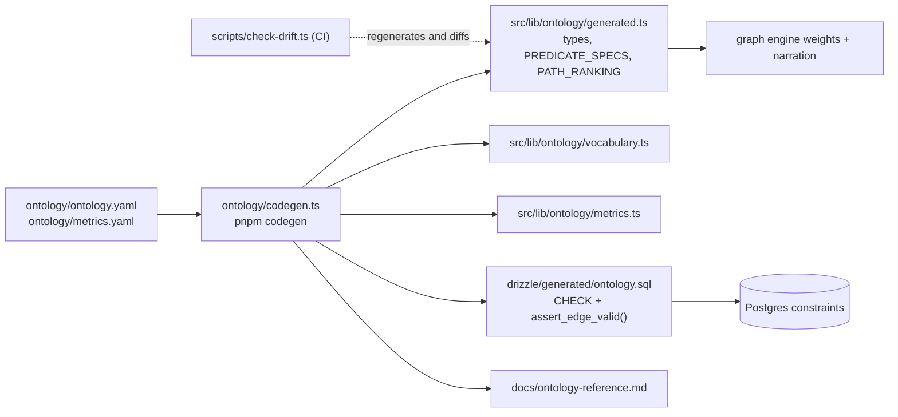

Edit the YAML, run `pnpm codegen`, commit the artifacts. Skip the codegen and CI fails. **If a
reviewer asks how the ontology and the database stay in sync, the answer is that they don't — the
database is generated from the ontology, and CI fails if they diverge.**

### 11.2 The six categories

Every concept in the domain resolves to exactly one of these, and the category determines the
implementation. This is the part of the model that is genuinely an ontology rather than a schema:

| Category         | Implementation                                    | Examples                                                 |
| ---------------- | ------------------------------------------------- | -------------------------------------------------------- |
| **Entity**       | Own table + UUID + external ids                   | Title, Person, Character, Organization, Collection, Work |
| **Part**         | Table with mandatory FK; not a graph node         | Season, Episode                                          |
| **Concept**      | Rows in `core.concept`, discriminated by `scheme` | Genre, Theme, Mood                                       |
| **Role**         | The **predicate** on an edge                      | Actor, Director, Writer, Composer                        |
| **Attribute**    | A column                                          | runtime, release_date, budget                            |
| **Relationship** | A row in `core.credit` / `core.edge`              | directed, part_of_franchise                              |

### 11.3 The decision that carries the most weight

**Actor, Director, and Writer are roles, not entity types.** Modeling them as entity types is the
classic novice ontology error, and it would cause three concrete harms here:

1. Denis Villeneuve would exist as both a Director and a Writer with no guarantee they are the same
   human — his filmography would fragment.
2. A path crossing "acted in, and later directed" becomes a cross-type join.
3. Every new role (composer, cinematographer, showrunner) needs a schema migration instead of a
   vocabulary addition.

**Person is the entity. Role is the predicate.** The same principle is applied a second time to
`organization`: Warner Bros. produces, distributes, and streams, and the role lives on the edge
(`produced_by` / `distributed_by` / `aired_on`) rather than in three tables.

### 11.4 The 21 predicates

`directed`, `acted_in`, `wrote`, `composed_for`, `shot`, `portrayed_by`, `features_character`,
`belongs_to_genre`, `explores_theme`, `broader_than`, `part_of_franchise`, `based_on`, `sequel_to`,
`remake_of`, `influenced_by`, `similar_to`, `produced_by`, `distributed_by`, `aired_on`,
`season_of`, `episode_of`.

Each declares: `inverse`, `domain`, `range`, `storage`, `provenance`, `path_weight`, and narration
templates. The `path_weight` is the interesting field — it encodes editorial judgment as data:

| Predicate           | Weight | Reading                                               |
| ------------------- | ------ | ----------------------------------------------------- |
| `sequel_to`         | 1.0    | The strongest possible statement                      |
| `directed`          | 1.0    |                                                       |
| `part_of_franchise` | 1.1    |                                                       |
| `explores_theme`    | 2.6    | Curated, meaningful, but looser                       |
| `produced_by`       | 3.8    | Weak                                                  |
| `belongs_to_genre`  | 4.5    | Deliberately near-useless for explaining a connection |

**Nine entity types**, of which seven are graph nodes: `title`, `person`, `character`, `concept`,
`collection`, `organization`, `work`. `season` and `episode` are _parts_ — their structural
predicates (`season_of`, `episode_of`) are excluded from `sem.edge` so the path-finder cannot
produce "Arrival → Drama → Breaking Bad S3E7".

### 11.5 Genre vs. Theme — same shape, different provenance

Both live in `core.concept`, discriminated by `scheme`. They behave identically _structurally_
(hierarchical, many-to-many with titles, tappable) and differ completely in _provenance_: genre is
19 provider-supplied values; theme is a curated vocabulary in
[`ontology/themes.yaml`](ontology/themes.yaml), derived through
[`ontology/crosswalk.yaml`](ontology/crosswalk.yaml) from TMDB keywords.

The difference is expressed as **weight**, not as table structure — which is exactly why weight
belongs in `ontology.yaml`.

**The crosswalk is the curation artifact.** TMDB keywords are a folksonomy mixing settings ("new
york city"), objects ("robot"), plot devices ("time loop"), and noise. A serious ontology does not
adopt one wholesale. `core.crosswalk_keyword_theme` maps keywords to themes with a `salience`
weight; most keywords map to **zero** themes, correctly. `deriveThemes` in
[`derive-themes.ts`](src/server/ingest/derive-themes.ts) aggregates a title's keywords' mapped
themes, sums salience, keeps those above `SALIENCE_THRESHOLD = 0.5`, and caps at
`MAX_THEMES_PER_TITLE = 6`.

Because `raw.tmdb_payload` retains the keywords, revising the vocabulary re-derives every theme edge
in one command. **That replayability is the reason `raw` exists.**

### 11.6 Honest partial resolution

`core.credit` has both `character_id` (nullable) and `character_name_raw`. Characters resolve to an
entity only on strong evidence; otherwise the raw string is displayed and `character_id` stays
null. The UI is identical either way — the user cannot tell.

**Partial resolution with an honest flag beats fake completeness.** The coverage number is surfaced
rather than hidden.

---

## 12. Semantic layer

### 12.1 What it actually is

Three concrete things, not a metrics catalog in a BI tool:

1. **A vocabulary boundary.** There is no `tmdb_id` in `src/app/**`. Grep-enforced.
2. **Fourteen SQL views** in [`drizzle/sql/20-views.sql`](drizzle/sql/20-views.sql), each a stable
   contract. Provider schema changes are absorbed in `core` ingest; the views do not move.
3. **A declarative metric layer** — `metrics.yaml` plus a resolver — so a metric is a _definition_,
   not a query hardcoded in a React component.

### 12.2 `security_invoker = true` — the bug that justifies the whole line

Every `sem.*` view carries `security_invoker = true`, set by an explicit `ALTER VIEW` after
creation. The file's header comment records what happened without it:

> Postgres views execute with the privileges and RLS context of the view OWNER by default. Our views
> are owned by the migration role, which bypasses RLS. Without `security_invoker`, `sem.user_title`
> happily returned one user's ratings, history and notes to any other user — **while every
> base-table RLS test passed, because the base tables were never the problem.** The authz suite
> caught it; nothing else would have.

This is the single most instructive security finding in the codebase. RLS on the tables was
correct. The _view_ was the leak. The lesson generalizes: a test that only exercises the base tables
proves nothing about the surface the application actually reads.

`ALTER VIEW ... SET` is used rather than `CREATE OR REPLACE VIEW ... WITH (...)` because
`CREATE OR REPLACE VIEW` cannot carry the option, and it also cannot rename a column, change a type,
or insert a column anywhere but the end — which is why the file drops and recreates.

### 12.3 The view catalog

| View                                                                  | What it resolves                                                                                |
| --------------------------------------------------------------------- | ----------------------------------------------------------------------------------------------- |
| `sem.edge`                                                            | `core.credit` ∪ `core.edge` ∪ `core.edge_derived` as one surface                                |
| `sem.edge_bidirectional`                                              | `sem.edge` plus every inverse row, with the inverse label and `canonical_predicate`             |
| `sem.node`                                                            | Polymorphic `(type, id, label, sublabel, image, degree)` — powers typeahead and graph rendering |
| `sem.title`, `sem.person`, `sem.concept`, `sem.season`, `sem.episode` | Entity surfaces with labels resolved                                                            |
| `sem.title_credit`, `sem.title_full`                                  | Detail-page hydration, cast/crew nested                                                         |
| `sem.availability`                                                    | Region-filtered, current-only                                                                   |
| `sem.user_title`                                                      | **The one the whole app reads** — see below                                                     |
| `sem.user_viewing`                                                    | Viewing events                                                                                  |
| `sem.user_taste_affinity`                                             | Volume × rating lift × recency, per node                                                        |

### 12.4 `sem.user_title` — where the layering pays for itself

One row per account × title. It joins `usr.title_state`, the _current_ rating (`superseded_at IS
NULL`), aggregated `usr.viewing`, and derived episode progress. **Every list screen, every card,
every status chip in the app reads this one view.** Without it, "show the watchlist with progress
and ratings" is a four-table join repeated in a dozen components.

Two computations in it are worth reading closely:

```sql
-- Aired, not total: a show mid-season must not read 40% when you are caught up.
CASE WHEN prog.episodes_aired > 0
     THEN round(100.0 * prog.episodes_watched / prog.episodes_aired)::int
     ELSE NULL END AS progress_pct
```

```sql
-- next_episode: lowest-numbered episode with no progress row. LATERAL + LIMIT 1.
LEFT JOIN LATERAL (
  SELECT ep.id, s.season_number, ep.episode_number, ep.name, ep.air_date
  FROM core.episode ep JOIN core.season s ON s.id = ep.season_id
  WHERE ep.title_id = ts.title_id
    AND NOT EXISTS (SELECT 1 FROM usr.episode_progress pr
                    WHERE pr.episode_id = ep.id AND pr.account_id = ts.account_id)
  ORDER BY s.season_number, ep.episode_number LIMIT 1
) nxt ON true
```

`LATERAL` lets the subquery reference `ts.title_id` from the outer row — a correlated subquery that
can return multiple columns. Both of these are computed **in SQL, never in TypeScript**, which is
what makes "Continue Watching" a single query rather than a fetch-then-loop.

### 12.5 The metric resolver

[`ontology/metrics.yaml`](ontology/metrics.yaml) defines nine metrics: `genre_distribution`,
`top_directors`, `rating_distribution`, `viewing_over_time`, `watchlist_aging`,
`theme_distribution`, `franchise_coverage`, `completion_rate`, `under_watched_genres`. Five are
active (`PHASE_1_METRICS` in [`resolve.ts`](src/lib/metrics/resolve.ts#L178)).

`resolveMetric(name, accountId)` compiles a definition into account-scoped SQL. Two safety
properties:

- **`assertSemanticSource`** requires the `source` to start with `sem.` — a metric definition cannot
  reach into `core` or `usr` directly.
- **The account id is always a bound parameter.** Identifiers are interpolated, but only from a
  committed YAML file that goes through code review, never from user input. The module documents
  this explicitly rather than leaving it to be rediscovered.

Adding a metric is a YAML entry plus a chart binding. No resolver change.

**Deliberate scope limit:** the resolver supports a fixed set of transforms and is explicitly not a
dbt or Cube clone. Overbuilding it is the trap; the value is that metrics are defined once,
declaratively, next to the ontology.

---

## 13. Data modeling

### 13.1 The three user↔title tables, and why they are three

This is the modeling decision that most distinguishes the app from a list-keeping tracker:

| Table             | Cardinality                          | Answers                                                      |
| ----------------- | ------------------------------------ | ------------------------------------------------------------ |
| `usr.title_state` | **Exactly one** per (account, title) | "Do I care about this, and where am I with it?"              |
| `usr.viewing`     | **Zero to many**                     | "When did I actually watch it, with whom, where?"            |
| `usr.rating`      | **Zero to many, one current**        | "What do I think of it — and what did I think of it _then_?" |

Watching _Blade Runner 2049_ three times is **1** `title_state`, **3** `viewing` rows, and **1–3**
`rating` rows. Collapsing these into one row with a `watched_on` and a `rating` column loses
rewatches entirely and makes "I rated it 3★ in 2019 and 5★ on rewatch in 2026" unrepresentable.

`usr.rating` uses a **partial unique index** `WHERE superseded_at IS NULL` — the database enforces
"at most one current rating" while keeping every historical one. Re-rating supersedes; it does not
update.

### 13.2 Ratings are stored as `smallint` 1..10

Half-stars. `1` = 0.5 stars, `10` = 5.0. `sem.user_title` exposes `(r.value::numeric / 2)` so the
application never does the arithmetic. Storing a decimal would invite floating-point comparison
bugs in a domain where the values are genuinely discrete.

### 13.3 Favorites is a flag, not a status

`is_favorite` + `favorited_at` on `usr.title_state`, orthogonal to `status`. Three reasons, from
[ADR 0005](docs/adr/0005-favorites-as-relationship-not-status.md):

1. You can favorite a show you are still watching, or a film on your watchlist you loved as a kid.
   Making it a status forces a false exclusive choice.
2. It has different semantics from a rating. A 5★ documentary you will never rewatch is not a
   favorite; a 4★ comfort film you have seen nine times is. **Favorite means affinity; rating means
   judgment.**
3. The UI can still present it as a list. The user experiences a list; the model knows it is a flag.

### 13.4 Append-only, enforced three ways

`usr.state_event` is never updated and never deleted, and that is guaranteed at three levels:

1. **No grant.** `REVOKE UPDATE, DELETE ON usr.state_event FROM app_web` in
   [`40-roles.sql`](drizzle/sql/40-roles.sql).
2. **No policy.** With `FORCE ROW LEVEL SECURITY` on and no UPDATE or DELETE policy defined, those
   operations match nothing and affect zero rows **even for the table owner**.
3. **Three `CHECK` constraints** including one on the event shape.

### 13.5 Date precision is modeled, not assumed

`usr.viewing.date_precision` is one of `exact | day | month | year | unknown`, with a
`viewing_date_present_ck` constraint tying it to `watched_on`. This lets the analytics layer
distinguish "watched, date unknown" (a retroactive "I've seen this") from "watched on 2026-03-14".
Without it, a retroactive entry either fabricates today's date or produces a null that every
time-series query has to special-case.

### 13.6 Volatile facts are quarantined

| Fact                                  | Where                                        | Why                                     |
| ------------------------------------- | -------------------------------------------- | --------------------------------------- |
| "Villeneuve directed Arrival"         | `core.credit`                                | True forever, everywhere                |
| "Arrival explores Language"           | `core.edge`, `curated`                       | Our editorial assertion, stable         |
| "Arrival is similar to BR2049"        | `core.edge_derived`                          | Recomputable, droppable                 |
| "Arrival streams on Paramount+ in US" | `core.availability`                          | Regional, weekly, has a validity window |
| "Arrival popularity = 41.2"           | `core.title.popularity` + `popularity_as_of` | Volatile scalar                         |

Putting availability in the edge store would mean **the graph changes shape by territory and by
week** — path-finding would stop being deterministic. See
[ADR 0007](docs/adr/0007-availability-is-not-ontology.md).

### 13.7 Entity resolution

Identity architecture: **one canonical UUID per real-world thing, many external ids pointing at
it.** `core.external_id` is the crosswalk, keyed `(source, source_id, entity_type)`. TMDB is the
spine, so `is_primary = true` on TMDB rows.

`resolveTitle` in [`src/server/ingest/resolve.ts:100`](src/server/ingest/resolve.ts#L100) is a
short-circuiting cascade:

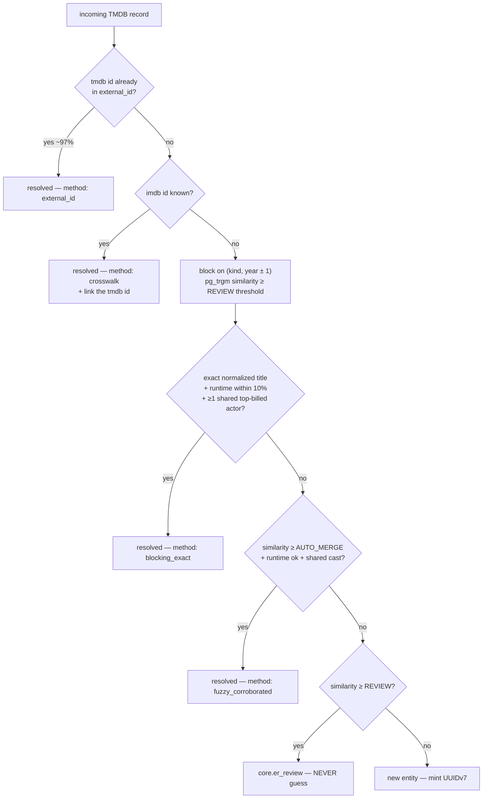

**The shared-cast requirement is what makes fuzzy matching safe.** Title similarity alone produces
disasters: _The Office_ UK vs. US, the six _Pinocchio_ films, _Dune_ 1984 vs. 2021.
`countSharedCast` checks the incoming top-5 billed cast against the candidate's `acted_in` credits
through `core.external_id`. The review-queue branch's own reason string names the case:
`'identical normalized title but no shared cast'`.

**People are never fuzzy-matched on name alone.** Names collide heavily and TMDB itself has
duplicate person records. The strong signal is _filmography overlap_; the name is the weak one.

**Merges are reversible.** `mergeEntities` writes `core.merge_log` with an evidence bundle;
`revertMerge(mergeId)` exists and is tested.

**Normalization** ([`normalize.ts`](src/server/ingest/normalize.ts)): `stripDiacritics` (NFKD),
`normalizeTitle`, `normalizePersonName`, `personSortName`, `slugify`, `trigramSimilarity`. The
normalized form is stored as `sort_title` with a `pg_trgm` GIN index, so blocking is an index scan
rather than a full-table similarity computation.

---

## 14. Authentication and authorization

### 14.1 Better Auth, configured in one file

[`src/server/auth/auth.ts`](src/server/auth/auth.ts). Email OTP only — six digits, ten-minute
expiry, delivered through Resend.

> **Not implemented:** passkeys and Google OAuth, both of which the spec called for. `usr.oauth_account`
> exists as a table because Better Auth's schema requires it; nothing populates it.

**The schema map** is the piece worth understanding. Better Auth expects tables named `user`,
`session`, `account`, `verification`. Ours are named for our domain, so the config maps them:

```ts
schema: { user: account, session, account: oauthAccount, verification }
```

Note the collision that map resolves: **Better Auth's `account` means an OAuth provider link**,
while **our `account` means a person**. Reading the config without noticing that inverts the whole
model in your head.

`database: { generateId: false }` hands id generation to Postgres — `core.uuid_generate_v7()` —
rather than letting the library mint one. Time-sortable ids are index-friendly and need no
coordination.

### 14.2 The invite gate

Sign-up is invite-only, enforced **server-side in a hook**, not in the UI. It lives in
`hooks.before` on `/email-otp/send-verification-otp` rather than in `databaseHooks.user.create`,
and the file explains why: the OTP send happens _before_ any user row exists, so a create-hook would
mail a code to someone who can never complete sign-up.

The flow is deliberately two-phase:

| Phase         | Where                              | What                                                                  |
| ------------- | ---------------------------------- | --------------------------------------------------------------------- |
| **Reserve**   | `hooks.before`                     | Verify an unredeemed, unexpired invite exists. Do **not** consume it. |
| **Redeem**    | `databaseHooks.user.create.before` | Mark redeemed; seed `display_name` from the invite.                   |
| **Attribute** | `databaseHooks.user.create.after`  | Write `redeemed_by` now that the account id exists.                   |

Reserving rather than consuming means a mistyped code, an abandoned sign-in, or an undelivered email
does not burn the invite.

### 14.3 Sessions

30-day rolling expiry (`expiresIn`), refreshed if older than 7 days (`updateAge`). Sessions live in
`usr.session` in our own database, which is what makes "sign out everywhere" a `DELETE`.

Cookies are `httpOnly`, `Secure`, `SameSite=Lax`. The cookie value is
`token.base64(hmac-sha256(token, secret))` — the signature is what `getSessionCookie` in middleware
checks the _shape_ of; the token is validated against the database only in `getSession`.

### 14.4 The session helpers

[`src/server/auth/session.ts`](src/server/auth/session.ts):

```ts
export const getSession = cache(async () => {
  /* ... */
}); // React cache
export async function getAccountId(): Promise<string | null>;
export async function requireAccountId(): Promise<string>; // THROWS
```

`cache()` is React's request-scoped memoization: several server components in one render can each
call `getSession()` and only one database round-trip happens.

`requireAccountId()` **throws** rather than returning null. That is the important choice. A helper
that returns `null` invites `const id = await getAccountId()` followed by a query that silently
scopes to nothing. Throwing makes the failure loud at the exact line where the assumption was made.

### 14.5 Three concentric authorization layers

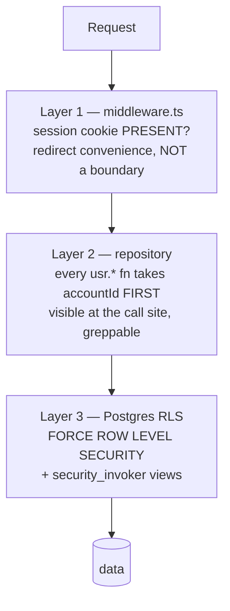

Layer 3 is the only one that is structurally sufficient. Layers 1 and 2 exist so that mistakes are
caught early and read obviously, not because layer 3 needs help.

### 14.6 Three database roles

All three are `NOLOGIN` — they are grant bundles, not identities. `app_web` and `app_ingest` are
created in [`40-roles.sql`](drizzle/sql/40-roles.sql); `app_auth` is created earlier, in
[`30-rls.sql`](drizzle/sql/30-rls.sql), because the RLS bootstrap needs it to exist.

| Role         | Grants                                                                                                              | Cannot                                                                   |
| ------------ | ------------------------------------------------------------------------------------------------------------------- | ------------------------------------------------------------------------ |
| `app_web`    | `SELECT` on `core`+`sem`; full DML on `usr` (RLS on)                                                                | **Write `core`. Touch `raw` at all.** No UPDATE/DELETE on `state_event`. |
| `app_ingest` | Full DML on `raw`+`core`; `SELECT` on `sem`                                                                         | **See `usr` at all**                                                     |
| `app_auth`   | `usr.account`, `usr.auth_session`, `usr.oauth_account`, `usr.auth_verification`, plus SELECT/UPDATE on `usr.invite` | Ratings, viewing history, notes, the global model — explicitly `REVOKE`d |

> **Note:** the spec described a fourth role, `app_migrate`, for DDL. **It does not exist.**
> Migrations run as whatever role the direct connection string carries — in practice the database
> owner.

`app_web` having **no write grant on `core`** is the structural guarantee behind "a user can never
contaminate the global model." It is not a code-review convention; it is a missing privilege.

**How the roles are actually attached.** `app_web` and friends are `NOLOGIN` roles — grant bundles.
A login role acquires them with `GRANT app_web TO <login>`. In tests,
[`scripts/db-test-role.ts`](scripts/db-test-role.ts) creates `throughline_app` with
`NOSUPERUSER NOBYPASSRLS` and grants it `app_web`, so "the test harness and production differ only
in hostname."

That script's header records why it had to exist:

> Superusers (and any role with `BYPASSRLS`) ignore row-level security entirely — even with `FORCE
ROW LEVEL SECURITY` set. Running the authorization suite as the migration owner made every
> isolation test pass **vacuously**: Bob could read Alice's rows, and the assertions that caught it
> were the only reason we noticed.

**What the repository does not determine:** which login role production's `DATABASE_URL` carries.
That is a Vercel environment value. [`health.ts`](src/server/repos/health.ts) checks and reports
least-privilege for the **auth** connection (`AUTH_DB_PASSWORD` / `AUTH_DATABASE_URL`), flagging a
problem in production when it falls back — because "the fallback is SILENT by nature: everything
works either way, and the only difference is that the owner connection can read every rating,
viewing record and note in the database." There is no equivalent check for the web connection.

### 14.7 SECURITY DEFINER as a capability boundary

Several functions run with the definer's privileges and enforce their own check inside:

| Function                                                            | Capability                                                                                                                                |
| ------------------------------------------------------------------- | ----------------------------------------------------------------------------------------------------------------------------------------- |
| `usr.share_by_slug(text)`                                           | Read **exactly one** share row by slug. This is how the public share page reads user data without ever opening a user-scoped transaction. |
| `usr.assert_admin()`, `usr.admin_users()`, `usr.admin_invites()`, … | Admin surfaces. Granting `EXECUTE` broadly is safe because the check is inside.                                                           |
| `core.rate_limit_hit(text, int, interval)`                          | Counter increment. `app_web` has **no table grant** on `core.rate_limit`, so it keeps zero write privileges anywhere in `core`.           |
| `usr.delete_account(uuid)`                                          | Hard-deletes `usr.*` and leaves `core.*` untouched.                                                                                       |

That last one is the cleanest demonstration of the layer separation the whole architecture is built
around: deleting a person removes everything they asserted and nothing the world knows.

### 14.8 Rate limiting

One implementation, in Postgres, with a per-surface policy:

| Bucket                                 | Limit     | Behavior on limiter failure |
| -------------------------------------- | --------- | --------------------------- |
| `auth:*` (Better Auth `customStorage`) | per-rule  | **fail-closed**             |
| `search:<accountId>`                   | 30 / 60s  | fail-open                   |
| `nodes:<accountId>`                    | 30 / 60s  | fail-open                   |
| `paths:<accountId>`                    | 20 / 60s  | fail-open                   |
| `share:<accountId>`                    | 20 / hour | fail-open                   |

[`src/server/rate-limit.ts`](src/server/rate-limit.ts) states the reasoning, and it is the right
way to think about this class of decision:

> **fail-closed on authentication.** If the limiter is down, an attacker gets unlimited attempts at
> a six-digit code, which is the one place here where unlimited attempts actually wins something.
> Refusing sign-in during a database outage costs nothing extra — sign-in needs the database anyway.
>
> **fail-open everywhere else.** The limiter exists to protect TMDB's quota and our own CPU, not to
> protect a secret. Turning a database hiccup into a dead search box is a worse outcome than briefly
> unbounded searching.

Better Auth points at the same table via `customStorage` because its default limiter is in-memory —
useless across serverless instances, where an attacker simply spreads attempts across however many
they can reach.

> **Not implemented:** Upstash Redis. `.env.example` still lists `UPSTASH_REDIS_REST_URL` and
> `UPSTASH_REDIS_REST_TOKEN`; **nothing in `src/` references either.** See [§25](#25-documentation-vs-implementation-discrepancies).

---

## 15. Error handling

### 15.1 Silent vs. loud — the policy

| Condition                                             | Behavior                                            | User sees                      |
| ----------------------------------------------------- | --------------------------------------------------- | ------------------------------ |
| Zod parse failure on a TMDB response                  | Throw; circuit breaker counts it                    | No — degrade to cached/partial |
| Edge insert violating domain/range                    | **Raise at the DB level.** Never coerce, never skip | No — job fails and retries     |
| ER cascade lands in the ambiguous band                | Route to `core.er_review`. **Never guess.**         | No                             |
| Job exceeds its attempt cap                           | Mark `failed`, surface in admin + health            | No                             |
| `withUser` returns zero rows where a row was asserted | **Throw**                                           | Yes — error boundary           |
| TMDB circuit breaker open                             | Serve cache                                         | Yes — a banner, on search only |
| Mutation fails after an optimistic update             | Revert + toast                                      | Yes                            |

The fifth row is the one that matters most in _this_ architecture. A misconfigured `withUser`
yields **empty results, not an error**. Treating "expected a row, got none" as an exception is what
makes that failure mode loud instead of looking like an empty state.

### 15.2 Error boundaries

**Framework behavior:** an `error.tsx` in a route segment becomes a React error boundary for that
segment. It must be a client component and receives a `reset()` function.

[`src/app/error.tsx`](src/app/error.tsx) is four lines of substance, and its comment states the
rule:

> Every error boundary offers a real recovery action, never a bare apology.

It renders "That did not load." and a **Try again** button wired to `reset()`. It deliberately does
not render `error.message` — an exception string is not a user-facing sentence, and it can leak
internals.

### 15.3 Job failure

`core.fail_job(id, error)` records `last_error` (truncated to 2000 chars) and increments `attempts`.
Failures surface in `/api/admin/jobs` and are counted in `/api/health`. `requeueJobs` in
[`health.ts`](src/server/repos/health.ts) exists for manual recovery.

### 15.4 Health, not liveness

This is the most transferable idea in the codebase, and it was learned from a real failure. The
`/api/health` endpoint does not ask "did this run recently?" It asks "is this doing its job?"

The distinction appears twice, in opposite directions:

**Scheduled work** is judged by freshness. `MAX_AGE_S` sets a **two-day** bound for everything the
daily cron drives — not one day, because Vercel Hobby cron is daily and a one-day bound fires on
ordinary jitter.

**On-demand work is judged by undone work, not by elapsed time.** Five job kinds
(`hydrate_title`, `hydrate_episodes`, `derive_themes`, `enrich_wikidata`, `recompute_similar`) have
no schedule — they fire when someone opens an unknown title, or by hand. Their last-run time only
ever decays. The comment in [`health.ts`](src/server/repos/health.ts) records what that produced:

> Two had already tripped when this was found (`derive_themes` and `hydrate_title`, both at 48.2
> hours against a 48-hour bound), `enrich_wikidata` was hours away, and `recompute_similar` was days
> away. The endpoint was on its way to permanently red for a system doing exactly what it should —
> which is the same failure as an alert that never fires, arrived at from the opposite direction.
> **Nobody reads either.**
>
> The honest question for work that happens on demand is not "did it run lately" but "is there work
> of this kind sitting undone". Nothing queued is healthy however long it has been. Something queued
> past a drain window is broken however recently the kind last succeeded.

Every threshold in the file is annotated with why it is _that_ number:

| Threshold                | Value          | Why not tighter                                                                                                                                                                                               |
| ------------------------ | -------------- | ------------------------------------------------------------------------------------------------------------------------------------------------------------------------------------------------------------- |
| `QUEUE_STALL_S`          | 26 hours       | Self-chaining walks put their next link on the queue from inside a drain; waiting ~22h for the next daily window is the design working. Six hours reported "degraded" every single day.                       |
| `MIN_THEME_COVERAGE_PCT` | 70             | An **alert** threshold, not the target. The 80% goal lives in `docs/ontology.md`, "where a goal belongs." An alert that fires permanently because a backlog item is unfinished is one people learn to ignore. |
| `MIN_FRESH_PCT`          | 80 over 7 days | A weekly refresh cadence cannot satisfy a 48-hour window. "A threshold that can never be met is noise, not a signal."                                                                                         |

A dead entry cannot be re-added: `tests/unit/health-cron` asserts every key in `MAX_AGE_S` against
the real `HANDLERS` map. The map previously monitored two kinds that did not exist — an endpoint
health-checking nothing, while looking like coverage.

### 15.5 Validation at every boundary

Zod parses: server action inputs, route handler query strings, TMDB responses, and cron payloads.
The principle is that a provider's shape is never trusted — a changed TMDB field should produce a
typed failure at the edge, not an `undefined` three layers in.

---

## 16. Environment variables

Verified by cross-referencing every `process.env.*` reference in `src/`, `scripts/`, `drizzle/` and
`ontology/` against [`.env.example`](.env.example).

| Variable                                             | Required         | Scope      | What it does                                                                                                                                          | Read by                                                                                     |
| ---------------------------------------------------- | ---------------- | ---------- | ----------------------------------------------------------------------------------------------------------------------------------------------------- | ------------------------------------------------------------------------------------------- |
| `DATABASE_URL`                                       | **Yes**          | Server     | Pooled connection (pgbouncer, transaction mode). Everything in the request path.                                                                      | [`db/client.ts`](src/server/db/client.ts), [`resolve-url.ts`](src/server/db/resolve-url.ts) |
| `DATABASE_URL_UNPOOLED`                              | For migrations   | Server     | Direct connection. DDL and advisory locks are unreliable through a pooler.                                                                            | [`drizzle.config.ts`](drizzle.config.ts), `directClient()`                                  |
| `BETTER_AUTH_SECRET`                                 | **Yes**          | Server     | Signs session cookies. Rotating it invalidates every session.                                                                                         | [`auth.ts`](src/server/auth/auth.ts)                                                        |
| `BETTER_AUTH_URL`                                    | Yes in prod      | Server     | Canonical origin for auth callbacks                                                                                                                   | `auth.ts`                                                                                   |
| `AUTH_DB_PASSWORD`                                   | Recommended      | Server     | Password for the `app_auth` login role. The URL is **derived** from `DATABASE_URL` with credentials swapped — one secret, not two copies of one fact. | [`resolve-url.ts`](src/server/db/resolve-url.ts)                                            |
| `AUTH_DATABASE_URL`                                  | Optional         | Server     | Explicit override for the above                                                                                                                       | `resolve-url.ts`                                                                            |
| `TMDB_READ_ACCESS_TOKEN`                             | **Yes**          | Server     | TMDB v4 bearer token. **Never reaches the browser.**                                                                                                  | [`tmdb/client.ts`](src/server/providers/tmdb/client.ts)                                     |
| `RESEND_API_KEY`                                     | Yes in prod      | Server     | Delivers sign-in codes                                                                                                                                | `auth.ts`                                                                                   |
| `EMAIL_FROM`                                         | Yes in prod      | Server     | Sender address. A `@resend.dev` value only delivers to the Resend account owner — health flags it.                                                    | `auth.ts`, `health.ts`                                                                      |
| `EMAIL_DEV_DELIVER`                                  | No               | Server     | Forces real delivery in development                                                                                                                   | `auth.ts`                                                                                   |
| `CRON_SECRET`                                        | **Yes**          | Server     | Bearer secret for `/api/cron/*` and `/api/admin/*`                                                                                                    | [`jobs/cron-auth.ts`](src/server/jobs/cron-auth.ts)                                         |
| `NEXT_PUBLIC_SITE_URL`                               | Yes in prod      | **Public** | `metadataBase`. Without it, `og:image` is built from the per-_deployment_ hostname, which changes every push — a share link that unfurls as nothing.  | [`app/layout.tsx`](src/app/layout.tsx)                                                      |
| `DRAIN_CONCURRENCY`                                  | No               | Server     | Overrides the drain batch size                                                                                                                        | `drain.ts`                                                                                  |
| `NODE_ENV`                                           | (set by runtime) | Server     | Gates dev-only CSP `'unsafe-eval'` and production-only warnings                                                                                       | `middleware.ts`, `health.ts`                                                                |
| `VERCEL_PLAN`                                        | No               | CI         | Lets `check-vercel` validate cron cadence against the plan                                                                                            | [`check-vercel.ts`](scripts/check-vercel.ts)                                                |
| `TEST_DB_ROLE`, `TEST_DB_PASSWORD`, `TEST_AUTH_ROLE` | Tests only       | Local/CI   | The non-superuser role the authz suite connects as                                                                                                    | [`db-test-role.ts`](scripts/db-test-role.ts)                                                |
| `SITE`                                               | Tests only       | Local/CI   | Target origin for the Playwright suite                                                                                                                | `tests/e2e`                                                                                 |

**`NEXT_PUBLIC_` explained.** **Framework behavior:** Next.js inlines any variable prefixed
`NEXT_PUBLIC_` into the client bundle at build time. It is therefore public, permanently, to anyone
who opens devtools. Only `NEXT_PUBLIC_SITE_URL` carries the prefix here, and it is a URL. No secret
may ever take it.

> **Discrepancy:** `.env.example` lists `UPSTASH_REDIS_REST_URL` and `UPSTASH_REDIS_REST_TOKEN`.
> **Nothing in the codebase reads either.** Rate limiting is entirely Postgres-based. This matters
> beyond tidiness: `pnpm check-env` asserts name parity between production and `.env.example`, and
> stale entries are exactly how dead config accumulates.

---

## 17. Deployment

### 17.1 The pipeline

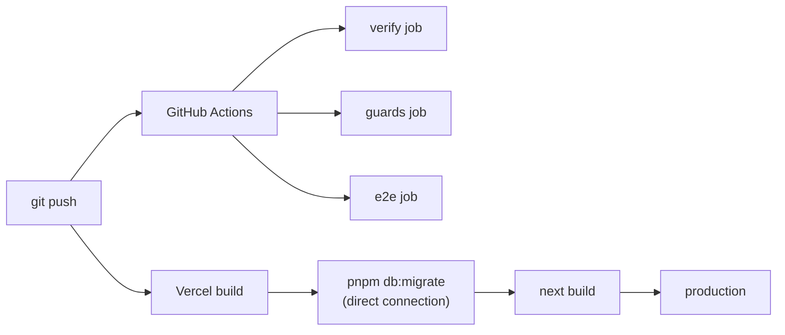

`vercel-build` = `pnpm db:migrate && next build`. Migrations run before the build, so a deploy never
serves code against a schema it has not seen.

### 17.2 CI

[`.github/workflows/`](.github/workflows/) defines three jobs:

**`verify`** — in order: `check-drift` → `typecheck` → `lint` → `format:check` → `check-locale` →
`check-spelling` → `check-layers` → `check-vercel` → `db:migrate` → `db:test-role` → `test` →
`test:strict` → `build`.

**`guards`** — the invariants that are not type errors.

**`e2e`** — Playwright against Chromium (`desktop`) and WebKit (`iphone`), after migrating a real
database. `retries: 0`, deliberately. Retries mask exactly the race conditions this app is most
likely to have: optimistic updates and job-queue concurrency.

Four checks are worth calling out because they are not standard:

| Check                     | Catches                                                                                                                     |
| ------------------------- | --------------------------------------------------------------------------------------------------------------------------- |
| `check-drift`             | `ontology.yaml` edited without `pnpm codegen`                                                                               |
| `check-layers`            | `core.` / `raw.` / `usr.` appearing in `src/app`, `src/components`, `src/actions`                                           |
| `check-locale` + `cspell` | British spellings. `cspell` alone will not catch them — they are valid dictionary words — so there is a denylist regex too. |
| `check-vercel`            | Cron paths with no route, and sub-daily schedules Vercel's Hobby plan rejects outright                                      |

`check-vercel` exists because of two deployment failures that produced no local signal:
`pnpm build` passes and the error only appears in Vercel's build log.

`test:strict` runs Vitest with JSON output and then `scripts/assert-no-skips.ts` — a skipped test is
not a passing test, and the suite will not quietly shrink.

### 17.3 Cron

[`vercel.json`](vercel.json) — four entries, all daily, because the Hobby plan permits nothing
finer:

| Schedule    | Path                       | Job                                          |
| ----------- | -------------------------- | -------------------------------------------- |
| `0 2 * * *` | `/api/cron/housekeeping`   | Prune `raw`, expire shares, vacuum           |
| `0 3 * * *` | `/api/cron/refresh-stale`  | Re-sync titles past their freshness window   |
| `0 4 * * *` | `/api/cron/drain`          | Process the job queue                        |
| `0 5 * * *` | `/api/cron/refresh-degree` | `REFRESH MATERIALIZED VIEW core.node_degree` |

Daily cron is the constraint that shaped several designs: on-demand hydration is synchronous rather
than queued; the health thresholds are days rather than hours; `after()` drains the queue on
mutation so tracking does not wait for 4 a.m.

### 17.4 Seeding production

Production credentials are write-only from a developer machine by design, so the corpus cannot be
pushed directly. [`drain.ts`](src/server/jobs/drain.ts) explains the workaround and why it is
better anyway:

> Seeding runs through the queue instead. That is a better design regardless: resumable after any
> failure, and it exercises the queue at real scale rather than on five test rows.

`enqueue_job` dedupes on `(kind, payload)` while a job is pending, so resending a batch after a
timeout costs nothing.

### 17.5 Migration discipline

Schema changes are **expand-then-contract**: add the new column, deploy code that writes both, then
remove the old one in a later deploy. No destructive migration ships in the same deploy as the code
that stops using the column — otherwise rolling back the application meets a schema it cannot read.

---

## 18. Security

### 18.1 Content Security Policy

Minted per request in [`src/middleware.ts`](src/middleware.ts). A fresh 16-byte nonce is generated,
set as `x-nonce` on the request headers (Next reads it and stamps its own inline scripts), and
embedded in the policy.

```
default-src 'self'
script-src 'self' 'nonce-<per-request>' 'strict-dynamic'   [+ 'unsafe-eval' in DEV ONLY]
style-src 'self' 'unsafe-inline'                            ← documented concession
img-src 'self' data: blob: https://image.tmdb.org
font-src 'self' data:
connect-src 'self'
form-action 'self'
base-uri 'self'
frame-ancestors 'none'
object-src 'none'
worker-src 'self'
upgrade-insecure-requests                                   [PRODUCTION ONLY]
```

Four of those lines have a story:

- **`'strict-dynamic'`** lets scripts we vouch for load their own chunks, so the allowlist does not
  have to enumerate Next's build output.
- **`'unsafe-eval'` in dev only.** React Refresh compiles with `eval`; without it hot reload dies.
  It is never sent in production.
- **`style-src 'unsafe-inline'` is a deliberate concession**, and the comment says so. Every
  component styles through React's `style` prop, which server-renders as a `style=""` _attribute_ —
  exactly what a strict `style-src` blocks. Moving to classes is a rewrite of the entire UI, and
  style injection is a far narrower risk than script injection, which stays nonce-locked.
- **`upgrade-insecure-requests` in production only.** On `http://localhost` it rewrites every
  subresource to `https://` — to a port with no TLS listener. The page renders unstyled with **no
  CSP violation logged anywhere**: it fails as a TLS error, not a policy one.

Plus: `X-Content-Type-Options: nosniff`, `X-Frame-Options: DENY`,
`Referrer-Policy: strict-origin-when-cross-origin`, and
`Permissions-Policy: camera=(), microphone=(), geolocation=(), interest-cohort=()`.

**The Referrer-Policy is load-bearing, not boilerplate.** Share slugs are capability URLs. Sending a
full path to a third party in a `Referer` header would hand over the capability itself.

### 18.2 Share links as capabilities

A share is a 21-character nanoid — roughly 126 bits of entropy. Unguessable.

The security property is not the entropy; it is the **shape of the read path**. The share page
fetches one row through `usr.share_by_slug(text)`, a `SECURITY DEFINER` function that takes a slug
and returns at most one row. It **never opens a user-scoped transaction**, so there is no code path
from a share page to anyone's live data — only the snapshot taken when the link was made.

The payload is a **snapshot**, not a live reference (`rating_snapshot`, `note_snapshot`). You sent a
friend "I gave it 4½ stars"; if you later re-rate it 3, the message you sent should not silently
rewrite itself. `revoked_at` kills a link instantly. `robots: { index: false }` — a personal
message is not content.

### 18.3 The threat model, sized honestly

**Primary attacker:** an opportunistic internet scanner, plus a curious recipient of a share link.
Not a targeted adversary — this is a private, invite-only app. Controls are sized accordingly, and
that sizing is a recorded decision rather than an oversight.

| STRIDE                 | Vector                               | Control                                                                                  |
| ---------------------- | ------------------------------------ | ---------------------------------------------------------------------------------------- |
| Spoofing               | Credential stuffing, invite guessing | OTP rate-limited **fail-closed**; single-use expiring invites                            |
| Tampering              | A user writing to `core`             | `app_web` has **no write grant on `core`** — structural                                  |
| Repudiation            | "I didn't rate that"                 | Append-only `state_event`; rating history with timestamps                                |
| Info disclosure        | Cross-tenant read; share enumeration | RLS + `security_invoker` + explicit `accountId`; 126-bit slugs; generic error boundaries |
| Denial of service      | Path-finder abuse                    | 20/60s per account on the most expensive query                                           |
| Elevation of privilege | Cron invocation; admin routes        | `CRON_SECRET`; `usr.assert_admin()` **inside** SECURITY DEFINER functions                |

### 18.4 Secrets

Server-scoped Vercel environment variables. No secret carries `NEXT_PUBLIC_`. `.env*` is never
committed; `.env.example` documents names only. The TMDB token never reaches the browser because
all TMDB traffic is proxied server-side.

### 18.5 XSS

React escapes by default. There is no `dangerouslySetInnerHTML` anywhere. User notes render as
**plain text, not markdown** — which removes the entire class of "markdown renderer allows raw
HTML" vulnerabilities rather than mitigating it.

### 18.6 Dependency surface as a security posture

Eight runtime dependencies, in full: `next`, `react`, `react-dom`, `drizzle-orm`, `postgres`,
`better-auth`, `zod`, `@neondatabase/serverless`. No charting library, no graph library, no PWA framework, no UI
kit, no date library.

> **Finding:** `@neondatabase/serverless` is declared and **never imported**. All database access is
> through `postgres.js`. It is an unused dependency — harmless, but it is supply-chain surface for
> nothing.

---

## 19. Performance

### 19.1 Budgets

| Metric                             | Budget           | Status                              |
| ---------------------------------- | ---------------- | ----------------------------------- |
| LCP (4G, mid-tier Android)         | < 2.0s           |                                     |
| INP                                | < 200ms          |                                     |
| CLS                                | < 0.05           |                                     |
| First-load JS, non-Universe routes | < 130 KB gzipped | **currently ~182 KB — over budget** |
| Path-finder p95                    | < 150ms warm     |                                     |

The bundle overage is a known, recorded gap, not a discovery of this document.

### 19.2 The decisions that buy the most

| Decision                                          | Effect                                                                 |
| ------------------------------------------------- | ---------------------------------------------------------------------- |
| Charts are server-rendered SVG                    | Zero JS for six chart types                                            |
| Hand-rolled canvas instead of Sigma + graphology  | No graph library in the bundle                                         |
| Hand-written service worker instead of Serwist    | No PWA framework                                                       |
| TMDB images bypass the Next optimizer             | No optimization units, no cold-start class                             |
| `Promise.all` for independent reads               | Concurrent round trips                                                 |
| `sem.user_title`                                  | One query where there would be a four-table join in a dozen components |
| `progress_pct` and `next_episode` computed in SQL | "Continue Watching" is one query, not fetch-then-loop                  |
| `React.cache` on `getSession`                     | One session lookup per render, not per component                       |

### 19.3 Indexes that matter

`pg_trgm` GIN on `core.title.sort_title` turns entity-resolution blocking and fuzzy search into
index scans. `core.node_degree` is a materialized view so the hub penalty is a lookup rather than a
`count(*)` per candidate node during path ranking.

### 19.4 The service worker

[`public/sw.js`](public/sw.js), hand-written. Its header explains why not Serwist:

> The usual reason to reach for Serwist or next-pwa is precaching the build manifest, and this app
> has nothing static to precache: every page is force-dynamic and behind a session.

Three caches, three strategies:

| Cache         | Strategy                                  | Limit       |
| ------------- | ----------------------------------------- | ----------- |
| `tl-shell-v2` | Precache `/offline` + `/icon-192.png`     | —           |
| `tl-img-v2`   | Cache-first                               | 200 entries |
| `tl-pages-v2` | Stale-while-revalidate, 24h staleness cap | 40 entries  |

The 24-hour `STALE_LIMIT_MS` "bounds the worst case rather than the normal one: opening the app
after a month should not flash a month-old Library before correcting itself."

**Scope is read-only, deliberately.** Mutations are never intercepted; they fail offline and the UI
says so. Offline writes need conflict resolution and a sync log, and a half-built version of that
loses data silently — worse than refusing to write at all.

`isOffLimits` excludes `/api/auth/`, `/api/admin/`, `/api/cron/`. A failed precache is caught so it
cannot wedge the worker permanently.

### 19.5 Perceived performance

Skeletons dimensioned to match final layout (prevents CLS). Optimistic mutations. Theme resolved
server-side so there is no flash. Suspense boundaries stream below-fold content.

---

## 20. Follow the data: one complete walkthrough

**Scenario.** You are signed in on your phone. You search for a film the corpus has never seen, open
it, and mark it watched with a rating. This single flow touches every layer in the system.

### Step 0 — The request reaches the edge

```
GET /search
```

[`src/middleware.ts`](src/middleware.ts) runs first.

1. `crypto.getRandomValues(new Uint8Array(16))` → base64 → the CSP nonce.
2. `securityHeaders(nonce)` builds the policy string.
3. `isUngated('/search')` → `false` (not in `PUBLIC_PREFIXES` or `SELF_AUTHENTICATING_PREFIXES`).
4. `getSessionCookie(request)` → a cookie is present. **Not validated** — presence only.
5. `NextResponse.next({ request: { headers } })` with `x-nonce` set, headers applied.

### Step 1 — The search page renders

`src/app/(app)/search/page.tsx` is a Server Component. It runs on the server, renders the shell, and
embeds one Client Component: [`search-client.tsx`](src/components/media/search-client.tsx). Only
that island's JavaScript ships.

### Step 2 — You type

`search-client.tsx` debounces, aborts any in-flight request, and issues:

```
GET /api/search?q=arriv
```

### Step 3 — The route handler

[`src/app/api/search/route.ts`](src/app/api/search/route.ts):

```ts
const accountId = await requireAccountId(); // throws if no valid session
const gate = await rateLimit(`search:${accountId}`, 30, 60);
if (!gate.allowed) return 429;

const [titles, people] = await Promise.all([searchTitles(q), searchPeople(q)]);
const provider = await tmdbSearch(q); // search/multi, 6s timeout, top 12
const merged = provider.filter((p) => !localTmdbIds.has(p.id));
```

- `requireAccountId()` → `getSession()` (React-`cache`d) → validates the cookie against
  `usr.session`.
- `rateLimit` calls `core.rate_limit_hit('search:<uuid>', 30, interval '60 seconds')`, a
  `SECURITY DEFINER` function. `app_web` has **no table grant** on `core.rate_limit` — the function
  is the only way in.
- `searchTitles` and `searchPeople` are repository functions. They query **`sem.title` and
  `sem.person`**, not `core.title`. `check-layers.sh` would fail the build otherwise.
- The provider results are filtered against ids we already hold, so a known title does not appear
  twice.

### Step 4 — You tap a result the corpus does not have

```
GET /title/arrival-2016
```

Middleware again. Then `src/app/(app)/title/[slug]/page.tsx` — a Server Component. The slug does not
resolve in `sem.title`, so the page calls:

```ts
await hydrateOnDemand(tmdbId, 'movie'); // src/server/ingest/on-demand.ts
```

**Synchronously.** The comment records the deviation from `docs/api.md` and the reason: Hobby cron
is daily, and a job that runs tomorrow does not render a page today.

### Step 5 — Ingest

Inside `hydrateOnDemand`:

**5a. Fetch.** `TmdbClient.movie(id)` with `append_to_response=credits,keywords,external_ids`. The
call passes through:

```
TokenBucket(30/s) → CircuitBreaker(8 failures, 30s) → retry(4, jittered) → fetch → Zod.parse
```

If Zod fails, it throws _here_ rather than producing `undefined` three layers down.

**5b. Capture raw.**

```sql
INSERT INTO raw.tmdb_payload (resource, source_id, variant, payload, http_status) VALUES (...)
```

The verbatim JSON. This is what makes re-deriving themes possible later without re-crawling.

**5c. Resolve.** `resolveTitle(sql, candidate)` runs the cascade from
[§13.7](#137-entity-resolution):

- TMDB id not in `core.external_id` → not step 1.
- `imdb_id` not known → not step 2.
- Block on `(kind='movie', year 2015–2017)`, `similarity(sort_title, 'arrival') >= REVIEW` → no
  candidate clears both the runtime check and `countSharedCast >= 1`.
- Returns `{ created: true }`. The caller mints a UUIDv7 via `core.uuid_generate_v7()` and inserts
  into `core.title`, then `core.external_id` rows for `tmdb` (`is_primary = true`) and `imdb`.

**5d. Write the graph.** Each cast and crew member resolves through `resolvePerson` (external id →
IMDb crosswalk → name + **filmography overlap ≥ 2** + non-conflicting birthday → else review queue),
and a `core.credit` row is written per credit with `predicate`, `department`, `job`,
`billing_order`, and either a resolved `character_id` or a raw `character_name_raw`.

The person cascade's middle band is worth reading. Zero filmography overlap is **not** ambiguity —
it is positive evidence of two different people, so it does not queue. Only _exactly one_ shared
title queues for review: too little to merge on, too much to dismiss.

Genres and franchise membership go to `core.edge` as `belongs_to_genre` and `part_of_franchise`.
**Every one of those inserts hits the generated `CHECK` constraint and the
`core.assert_edge_valid()` trigger** — both emitted by `pnpm codegen` from `ontology.yaml`. An edge
whose `(subject_type, predicate, object_type)` is not declared **cannot be written**. The database
refuses it.

Keywords land in `core.title_keyword`. Themes are _not_ derived here — that is the `derive_themes`
job, which aggregates mapped salience from `core.crosswalk_keyword_theme`.

### Step 6 — The page renders

Now `sem.title_full` resolves. The Server Component `await`s it and renders. Below-fold sections
(cast, connections, similar) sit behind Suspense boundaries and stream.

The poster URL points at `https://image.tmdb.org/t/p/w342/...` — **directly**, not through Next's
optimizer (`images.unoptimized: true`), and `img-src` in the CSP allows exactly that host.

`track-controls.tsx` is rendered as a Client Component island with the current state as props.

### Step 7 — You tap "Watched"

```ts
// src/components/tracking/track-controls.tsx
startTransition(async () => {
  applyOptimistic('watched'); // the pill changes NOW
  await markWatchedAction({ titleId });
  setConfirmed('watched');
});
```

The UI has already moved. The network request is still in flight.

### Step 8 — The Server Action

[`src/actions/tracking.ts`](src/actions/tracking.ts). **Framework behavior:** React POSTs the
serialized arguments over the RSC protocol to a generated endpoint; you wrote no route.

```ts
const accountId = await requireAccountId();
const { titleId } = Schema.parse(input);
await markWatched(accountId, titleId);
revalidateTracking();
drainSoon(); // after(), 12s budget
```

### Step 9 — The repository, inside one transaction

[`src/server/repos/user.ts`](src/server/repos/user.ts) → `withUser(accountId, async tx => { … })`:

```sql
BEGIN;
  SELECT set_config('app.account_id', '<uuid>', true);   -- transaction-scoped

  INSERT INTO usr.title_state (...) VALUES (...)
    ON CONFLICT (account_id, title_id) DO UPDATE SET status = 'watched', completed_at = now();

  INSERT INTO usr.state_event (account_id, title_id, event_kind, from_status, to_status, source)
    VALUES (...);                                        -- append-only

  INSERT INTO usr.viewing (account_id, title_id, watched_on, date_precision, ..., is_rewatch)
    VALUES (..., EXISTS (SELECT 1 FROM usr.viewing v2
                         WHERE v2.account_id = $1 AND v2.title_id = $2))
    RETURNING id, is_rewatch;                            -- id is used below

  -- only when a rating was supplied
  UPDATE usr.rating SET superseded_at = now()
    WHERE account_id = $1 AND title_id = $2 AND superseded_at IS NULL;
  INSERT INTO usr.rating (account_id, title_id, value, viewing_id)
    VALUES ($1, $2, 9, <the id returned above>);
COMMIT;
```

Note `event_kind` on the event row: one log covers status changes _and_ favorite/unfavorite, which
is why favoriting does not need a second table. And note `viewing_id` on the rating — that is what
makes "I rated it 3★ in 2019 and 5★ on rewatch in 2026" a representable fact rather than two
disconnected rows.

Every statement is checked by RLS: `FORCE ROW LEVEL SECURITY` is on, and the `own_rows` policy's
`WITH CHECK` clause means an insert carrying someone else's `account_id` is **rejected**, not
silently written.

`is_rewatch` is computed by `EXISTS` **in SQL**. Doing it in TypeScript would be a second round trip
and a race.

The partial unique index on `usr.rating WHERE superseded_at IS NULL` guarantees the supersede-then-
insert leaves exactly one current rating. If the supersede were omitted, the _database_ would reject
the insert.

### Step 10 — Invalidation and background work

`revalidateTracking()` calls `revalidatePath` so the next render of Library and Home reflects the
change.

`drainSoon()` uses **`after()`** — **framework behavior:** work scheduled with `after()` runs once
the response has been flushed. The user is not waiting. It claims up to a batch from `core.job` with
`FOR UPDATE SKIP LOCKED` and processes what fits in 12 seconds. If the title is a show, the
`enqueueEpisodeHydration` hook has already placed a `hydrate_episodes` job, and it starts now
instead of at 4 a.m.

### Step 11 — What the browser sees

The server action returns; `setConfirmed('watched')` promotes the optimistic value to truth. If it
had thrown, `useOptimistic` would have discarded the override and the pill would have snapped back
to `confirmed`, with a toast.

### The layers, counted

| Layer                            | What it did                                             |
| -------------------------------- | ------------------------------------------------------- |
| Middleware                       | CSP nonce, presence gate                                |
| Route handler / Server Component | Session validation, rate limit, orchestration           |
| Repository                       | The only place `sem.*` and `usr.*` are touched          |
| `withUser`                       | Transaction + `set_config` — the sole path to user data |
| RLS + `security_invoker`         | Structural isolation, on tables _and_ views             |
| Generated constraints            | An undeclared edge cannot exist                         |
| `raw`                            | Verbatim payload retained for replay                    |
| Job queue                        | Follow-up work, drained after the response              |

---

## 21. If I changed this…

A practical guide to blast radius. Each row lists what you must touch _and_ what will fail if you
do not.

### Adding a predicate to the ontology

1. Edit [`ontology/ontology.yaml`](ontology/ontology.yaml): `inverse`, `domain`, `range`, `storage`,
   `provenance`, `path_weight`, narration templates.
2. `pnpm codegen` — regenerates `generated.ts`, `vocabulary.ts`, `metrics.ts`,
   `drizzle/generated/ontology.sql`, `docs/ontology-reference.md`.
3. `pnpm db:migrate` to apply the new `CHECK` constraint and trigger.
4. Populate it in ingest, or it is a declared predicate with zero rows.

**If you skip step 2:** `pnpm check-drift` fails CI.
**If you skip step 3:** every insert of the new predicate is rejected by the old `CHECK`.
**If you hand-edit `generated.ts` instead:** `check-drift` fails — it regenerates and diffs.

### Adding a metric

1. Add an entry to [`ontology/metrics.yaml`](ontology/metrics.yaml). The `source` **must** start
   with `sem.` — `assertSemanticSource` rejects anything else.
2. Add it to `PHASE_1_METRICS` in [`resolve.ts`](src/lib/metrics/resolve.ts) if it should render.
3. Bind a chart from [`src/components/charts/index.tsx`](src/components/charts/index.tsx).

**No resolver change is required.** If you find yourself editing the resolver to support one metric,
that is the signal the resolver is growing into a dbt clone — the scope ceiling is deliberate.

### Adding a `usr.*` table

1. Define it in [`drizzle/schema/usr.ts`](drizzle/schema/usr.ts); `pnpm db:generate`.
2. **Add it to the `owned` array in [`30-rls.sql`](drizzle/sql/30-rls.sql).** Without this it has no
   RLS and no policy — every account reads every row.
3. Grants in [`40-roles.sql`](drizzle/sql/40-roles.sql) are covered by `ALTER DEFAULT PRIVILEGES`,
   but check whether the table should be append-only (`REVOKE UPDATE, DELETE`).
4. Repository functions take `accountId` first and wrap in `withUser`.
5. If it is exposed through a view: **`ALTER VIEW ... SET (security_invoker = true)`.** Forgetting
   this is the exact bug §12.2 documents — base-table RLS tests will still pass.
6. Add an authorization test. It is the only thing that catches 2 and 5.

### Adding a `sem.*` view

1. Add it to [`20-views.sql`](drizzle/sql/20-views.sql).
2. Add the matching `ALTER VIEW ... SET (security_invoker = true)` at the bottom of the file.
3. If you are _changing_ an existing view's column names, types, or column order, you must drop and
   recreate — `CREATE OR REPLACE VIEW` cannot rename a column, change its type, or insert one
   anywhere but the end.

### Changing the path-ranking weights

Edit `path_weight` in `ontology.yaml`, or `PATH_RANKING` (also generated from it). Then
`pnpm codegen`. The path unit tests assert _relative_ ordering — that the director path outranks the
genre path, and that a high-degree node never appears as an intermediate — so they will catch a
weight change that inverts a documented expectation.

### Adding a route

- **Public?** Add the prefix to `PUBLIC_PREFIXES` in
  [`src/lib/route-access.ts`](src/lib/route-access.ts). Add **both** the bare and trailing-slash
  forms if a bare path is reachable.
- **Self-authenticating (bearer secret)?** `SELF_AUTHENTICATING_PREFIXES` — otherwise middleware
  redirects it to sign-in before its own check runs, and an _invalid_ request gets a 307 instead of
  the 401 it deserves.
- **A new `/api/*` route that is neither?** Add it to `SESSION_GATED_API_ROUTES`. A unit test fails
  otherwise — "this route requires a session" is a decision on the record, not a consequence of
  nobody having thought about it.

### Changing a TMDB response shape

Update the Zod schema in [`src/server/providers/tmdb/`](src/server/providers/tmdb/). The parse is
the contract boundary; changing the mapper without the schema produces a runtime throw at the edge,
which is the designed behavior.

### Adding a job kind

1. Add the handler to `HANDLERS` in [`src/server/jobs/handlers.ts`](src/server/jobs/handlers.ts).
   The map is an allowlist — an unregistered kind can never be enqueued.
2. Decide whether it is **scheduled** (add to `MAX_AGE_S` in `health.ts` _and_ to `vercel.json`) or
   **on-demand** (add to `ON_DEMAND_KINDS`). Getting this wrong produces either a permanently red
   health endpoint or a check that monitors nothing. `tests/unit/health-cron` asserts every
   `MAX_AGE_S` key against the real `HANDLERS` map.

### Changing the theme vocabulary

Edit [`ontology/themes.yaml`](ontology/themes.yaml) and
[`ontology/crosswalk.yaml`](ontology/crosswalk.yaml), then re-run `derive_themes`. **You do not need
to re-crawl TMDB** — `core.title_keyword` and `raw.tmdb_payload` hold everything needed. This
replayability is the entire justification for the `raw` schema.

### Rotating a secret

| Secret                   | Consequence                                                                                                   |
| ------------------------ | ------------------------------------------------------------------------------------------------------------- |
| `BETTER_AUTH_SECRET`     | **Invalidates every session.** Everyone signs in again. Schedule it.                                          |
| `DATABASE_URL`           | Redeploy — a running deployment holds its env snapshot and will 503 against the old credentials until you do. |
| `TMDB_READ_ACCESS_TOKEN` | Ingest and search fail until updated.                                                                         |
| `CRON_SECRET`            | Cron 401s until updated.                                                                                      |

### Changing the color palette

[`src/styles/globals.css`](src/styles/globals.css) holds the CSS custom properties. The contrast
matrix test asserts every documented token pair against its WCAG threshold — a token change cannot
silently regress contrast. Note that `--text-faint` is a **non-text** token (hairlines, disabled
icons) and `--accent` in light mode is a **non-text UI** token; using either for body text fails the
test on purpose.

### Moving off Postgres for the graph

The interface is [`src/lib/graph/types.ts`](src/lib/graph/types.ts) — `node()`, `neighbors()`,
`findPaths()`. Swapping `PostgresGraphEngine` for another implementation is a single-file change.
[ADR 0003](docs/adr/0003-no-graph-database.md) records the trigger conditions: p95 `findPaths` above
250 ms, more than 5M edges, or a feature that genuinely needs unbounded variable-length pattern
matching. None currently hold.

---

## 22. Glossary

**App Router** — Next.js's file-system routing under `src/app/`. A directory is a URL segment; a
`page.tsx` makes it addressable; `layout.tsx` wraps its subtree.

**Route group** — a directory in parentheses, e.g. `(app)`. Groups files and gives them a shared
layout without contributing anything to the URL.

**Server Component** — the default. Runs only on the server, may be `async`, may query the database
directly, ships **no JavaScript** to the browser.

**Client Component** — a file starting with `'use client'`. Server-rendered once, then hydrated.
Required for state, effects, event handlers, and browser APIs. Its code **is** in the bundle.

**Hydration** — React attaching event handlers to server-rendered DOM rather than recreating it.

**RSC payload** — the serialized server-component tree sent alongside HTML so client-side
navigations can reconcile without a full page load.

**Server Action** — a `'use server'` function callable from a client component. The framework
generates the endpoint and the serialization; you write neither.

**`after()`** — schedules work to run after the response is flushed. The user does not wait.

**`useOptimistic`** — renders a provisional value while a transition is in flight, discarding it
automatically when the transition settles.

**`revalidatePath` / `revalidateTag`** — invalidate Next's cache for a path or tag so the next
render refetches.

**Suspense boundary** — a point in the tree where React renders a fallback while a child's promise
is pending. A `loading.tsx` creates one automatically.

**RLS (Row-Level Security)** — Postgres policies restricting which _rows_ a query sees, evaluated
inside the database.

**`FORCE ROW LEVEL SECURITY`** — makes RLS apply to the table **owner** too. Without it, the owner
bypasses every policy.

**`security_invoker = true`** — makes a view execute with the _caller's_ privileges and RLS context
rather than the view owner's. Postgres 15+. Omitting it on a view over RLS-protected tables is a
data leak that base-table tests will not catch.

**`SET LOCAL` / `set_config(k, v, true)`** — a transaction-scoped setting. Evaporates on commit,
which is exactly why it is safe under a transaction-mode pooler.

**`SECURITY DEFINER`** — a function that runs with the privileges of whoever _defined_ it. Used here
as a deliberate capability boundary: `app_web` cannot write `core.rate_limit`, but it can call
`core.rate_limit_hit`.

**pgbouncer transaction mode** — a pooler that returns a backend connection to the pool at the end
of each transaction. Means named prepared statements are unusable (`prepare: false`) and a plain
`SET` would leak to the next request.

**`FOR UPDATE SKIP LOCKED`** — lets concurrent workers claim distinct rows from a queue table
without blocking each other.

**`LATERAL` join** — a subquery that may reference columns from the outer row. A correlated
subquery that can return several columns.

**Materialized view** — a view whose results are stored on disk and refreshed explicitly.
`core.node_degree` is one.

**`pg_trgm`** — a Postgres extension providing trigram similarity and a GIN index for it. Powers
fuzzy matching in entity resolution and search.

**UUIDv7** — a time-sortable UUID. Index-friendly (new rows append rather than scatter) and needs no
coordination.

**Drizzle ORM** — a SQL-first TypeScript ORM. Maps views cleanly and its generated SQL is
inspectable. Its `sql` template expands arrays into a parameter list.

**postgres.js** — the underlying driver. Its `sql` template sends real Postgres arrays. **Not
interchangeable with Drizzle's.**

**Zod** — a runtime schema validator that also produces a TypeScript type. Used at every trust
boundary.

**Predicate** — a typed, directed relationship in the ontology (`directed`, `explores_theme`).
Declared in `ontology.yaml`; enforced by a generated `CHECK` and trigger.

**Provenance** — where a fact came from: `asserted` (provider), `curated` (us), `derived` (computed).

**Semantic layer** — the `sem.*` views. The only database surface the application may read.

**Entity resolution (ER)** — deciding whether two records describe the same real-world thing.

**Satori** — the renderer behind `next/og`'s `ImageResponse`. Supports a CSS subset: flexbox only,
no grid, fonts as `ArrayBuffer`.

**Capability URL** — a URL whose secrecy _is_ its authorization. Share slugs are these, which is why
`Referrer-Policy` matters here.

**Circuit breaker** — fails fast after N consecutive upstream failures, for a cooldown, rather than
piling requests onto a struggling service.

**Token bucket** — a rate limiter that refills at a fixed rate and allows a burst up to its capacity.

---

## 23. Architecture decisions

Thirteen ADRs live in [`docs/adr/`](docs/adr/). Summarized, with the load-bearing reason:

| ADR                                                           | Decision                                            | The reason that carries it                                                                                                              |
| ------------------------------------------------------------- | --------------------------------------------------- | --------------------------------------------------------------------------------------------------------------------------------------- |
| [0001](docs/adr/0001-postgres-four-schema-separation.md)      | Four schemas: `raw`→`core`→`sem`→`usr`              | Without a _mechanical_ boundary the semantic layer erodes in about three sprints                                                        |
| [0002](docs/adr/0002-person-entity-roles-as-predicates.md)    | Person is an entity; roles are predicates           | Villeneuve directs _and_ writes; three entity types fragment one identity                                                               |
| [0003](docs/adr/0003-no-graph-database.md)                    | No graph database                                   | **The user layer must join to the graph.** Across two stores that becomes application-level join code — the code you'd write most often |
| [0004](docs/adr/0004-credit-table-vs-generic-edge.md)         | `core.credit` typed + `core.edge` generic           | An ordered cast list from `attributes jsonb` is an unindexable sort                                                                     |
| [0005](docs/adr/0005-favorites-as-relationship-not-status.md) | Favorites is a flag, not a status                   | Favorite means affinity; rating means judgment; status means lifecycle. Three axes                                                      |
| [0006](docs/adr/0006-tmdb-spine-wikidata-enrichment.md)       | TMDB spine + Wikidata enricher                      | TMDB has catalog data and a weak ontology; Wikidata has exactly what it lacks, CC0                                                      |
| [0007](docs/adr/0007-availability-is-not-ontology.md)         | Availability is not an edge                         | Otherwise the graph changes shape by territory and by week                                                                              |
| [0008](docs/adr/0008-share-snapshot-not-live.md)              | Shares snapshot, not reference                      | A message you sent should not silently rewrite itself                                                                                   |
| [0009](docs/adr/0009-better-auth.md)                          | Better Auth over Auth.js / Clerk                    | Users live in _our_ Postgres alongside `usr.*`; Clerk would put them in someone else's database, contradicting the thesis               |
| [0010](docs/adr/0010-hub-penalized-path-ranking.md)           | Hub-penalized, weighted, diversity-filtered ranking | Naive BFS always returns "both are Drama"                                                                                               |
| [0011](docs/adr/0011-job-table-over-queue-service.md)         | A job table, not a queue service                    | A job in the same transaction as the data it produces gives semantics an external queue cannot                                          |
| [0012](docs/adr/0012-tmdb-images-bypass-next-optimizer.md)    | TMDB images bypass the optimizer                    | They are already optimized and already on a CDN                                                                                         |
| [0013](docs/adr/0013-en-us-locale-enforcement.md)             | en-US, machine-enforced                             | A convention that lives only in prose gets violated by the next session                                                                 |

### Decisions the code makes that are not (yet) ADRs

These are visible in the implementation and worth recording:

- **Hand-rolled Canvas 2D instead of Sigma + graphology.** Keeps the runtime dependency count at
  eight and keeps the graph out of the shared bundle.
- **Hand-written service worker instead of Serwist.** There is nothing static to precache — every
  page is force-dynamic and behind a session.
- **Postgres rate limiting instead of Upstash Redis.** One fewer vendor; the limiter lives in the
  same transaction boundary as everything else.
- **Hand-rolled SVG charts instead of a charting library.** Six server-rendered shapes, zero JS.
- **`security_invoker` on every view, set by `ALTER VIEW`.** Forced by `CREATE OR REPLACE VIEW`
  being unable to carry the option.
- **Synchronous on-demand hydration instead of a queued job.** Forced by daily-only Hobby cron.
- **`requireAccountId()` throws rather than returning null.** Makes the failure loud at the line
  where the assumption was made.
- **`retries: 0` in Playwright.** Retries mask precisely the races this app is most likely to have.

---

## 24. What I should understand now

If the document worked, each of these should now read as obvious rather than as a claim:

1. **The "backend" and the "web app" are the same process.** A Server Component calls a repository
   function that runs SQL. There is no internal HTTP hop, and `/api/*` exists only where something
   genuinely needs to be an HTTP endpoint.

2. **A Server Component's code never reaches the browser.** That is why six chart types, every
   poster card, and every page shell cost zero kilobytes, and why only eighteen components in the
   whole app carry `'use client'` — everything else is server-only.

3. **`sem.*` is not a convention — it is a build failure.** `scripts/check-layers.sh` fails the
   build if `core.`, `raw.`, or `usr.` appears in `src/app`, `src/components`, or `src/actions`.

4. **The database schema is generated from `ontology.yaml`, and CI proves it.** `check-drift`
   regenerates the artifacts and diffs them against what is committed. The ontology and the database
   cannot silently disagree.

5. **An edge that is not declared in the ontology cannot be written.** Not "should not" — the
   generated `CHECK` constraint and `assert_edge_valid()` trigger reject it at the database level.

6. **`withUser()` is the only path to user data, and skipping it fails silently.** `SET LOCAL`
   outside a transaction evaporates, RLS matches nothing, and you get **zero rows, not an error**.

7. **RLS on tables was not enough.** Views execute as their _owner_ by default, and the owner
   bypasses RLS. `security_invoker = true` on every `sem.*` view is what closed a real cross-tenant
   leak that every base-table test passed through.

8. **`app_web` cannot write `core`.** "A user can never contaminate the global model" is a missing
   database privilege, not a code-review rule.

9. **Roles only bind if the connecting login role has them granted.** `app_web` is `NOLOGIN` — a
   grant bundle. Tests connect as `throughline_app` with `NOSUPERUSER NOBYPASSRLS`, because running
   the authz suite as the owner made every isolation test pass _vacuously_.

10. **Path-finding is a ranking problem, not a search problem.** The shortest path between any two
    films is almost always a useless hub hop. The value is in `hubDegreeBan`, the log-degree penalty,
    predicate weights, and the 50% diversity filter.

11. **Weights are data, not code.** `belongs_to_genre` at 4.5 versus `directed` at 1.0 is editorial
    judgment expressed in `ontology.yaml` and compiled into the ranker.

12. **`raw` exists for replay, and it has already paid off.** Revising the theme vocabulary
    re-derives every `explores_theme` edge from stored payloads with no re-crawl.

13. **One `title` table for movies and shows is a graph decision, not a convenience.** They share
    100% of their edges; splitting them would put a `UNION ALL` inside every traversal query.

14. **Three tables model the user↔title relationship because they answer three different
    questions** — standing relationship, discrete event, versioned judgment. One row cannot hold a
    rewatch.

15. **Drizzle's `sql` and postgres.js's `sql` interpolate arrays differently.** `= ANY(${arr})`
    works in one and silently breaks in the other. Copying a query between a repository and a job
    handler is how you find out.

16. **Optimistic UI needs a notion of "confirmed."** `useOptimistic` discards its override when the
    transition settles; you write the truth, not the rollback.

17. **Health is not liveness.** Scheduled work is judged by freshness; on-demand work is judged by
    _undone work_. Every threshold here is set to the point where it means something, because an
    alert that is always on and an alert that never fires fail identically — nobody reads either.

18. **Most of the interesting comments in this codebase are about a bug that already happened.**
    The `style-src` concession, the `upgrade-insecure-requests` dev exclusion, the `::int` casts,
    the two `/explore` prefixes, the attempt refund in the drain, the 26-hour stall threshold — each
    is a scar with the reasoning attached.

19. **Eight runtime dependencies is a security and performance posture.** No graph library, no chart
    library, no PWA framework, no UI kit. Each absence is a decision with a written reason.

20. **The seams are where the value is.** Postgres views, the ontology compiler, the layer check,
    `withUser`, the role grants. Every one is a place where a mistake becomes _impossible_ rather
    than merely _discouraged_ — and that is the difference between an architecture and a folder
    structure.

---

## 25. Documentation vs. implementation discrepancies

Found during the two verification passes over the codebase. **The implementation is treated as
correct**; these are places the committed documentation, config, or schema describes something that
does not exist.

### Configuration

| #   | Discrepancy                                                                                                                                                                                                                                                                                                | Evidence                                                              |
| --- | ---------------------------------------------------------------------------------------------------------------------------------------------------------------------------------------------------------------------------------------------------------------------------------------------------------- | --------------------------------------------------------------------- |
| 1   | **`.env.example` lists `UPSTASH_REDIS_REST_URL` and `UPSTASH_REDIS_REST_TOKEN`.** Nothing in `src/`, `scripts/`, or `drizzle/` reads either. Rate limiting is entirely Postgres (`core.rate_limit_hit`). This is not cosmetic: `pnpm check-env` asserts name parity between production and `.env.example`. | `grep -r upstash src` → no matches                                    |
| 2   | **`@neondatabase/serverless` is a declared dependency and is never imported.** All database access is via `postgres.js`.                                                                                                                                                                                   | `grep -r '@neondatabase/serverless' src scripts drizzle` → no matches |

### Schema

| #   | Discrepancy                                                                                                                                                                                                                                          | Evidence                                                |
| --- | ---------------------------------------------------------------------------------------------------------------------------------------------------------------------------------------------------------------------------------------------------- | ------------------------------------------------------- |
| 3   | **`core.path_cache` exists and is never read or written.** The spec described a 7-day path cache; path results are computed fresh on every request.                                                                                                  | No `path_cache` reference anywhere in `src/`            |
| 4   | **`core.person_bacon` exists and is never read or written.** Bacon numbers were a Phase 2 item; `/universe/bacon` does not exist.                                                                                                                    | No reference in `src/`; no route file                   |
| 5   | **`raw.wikidata_payload` exists and is never written.** `enrich-wikidata.ts` applies SPARQL results directly. The replayability argument that justifies `raw` therefore does not currently extend to Wikidata.                                       | Only `raw.tmdb_payload` appears in INSERT statements    |
| 6   | **There is no `drizzle/schema/sem.ts`.** The spec's layout listed one. `sem.*` is hand-written SQL in `drizzle/sql/20-views.sql` and queried through raw `sql` templates. This is the better arrangement for views; the layout doc is what is stale. | `ls drizzle/schema/` → `_shared, core, index, raw, usr` |

### Features described but not built

| #   | Discrepancy                                                                                                                                                                    |
| --- | ------------------------------------------------------------------------------------------------------------------------------------------------------------------------------ |
| 7   | **Passkeys and Google OAuth.** Only email OTP is configured. `usr.oauth_account` exists because Better Auth's schema requires it; nothing populates it.                        |
| 8   | **Sigma.js + graphology.** The constellation is a hand-written Fruchterman–Reingold layout on Canvas 2D.                                                                       |
| 9   | **Serwist.** `public/sw.js` is hand-written, and its header explains why a generated worker would be "configuration without a library's worth of behavior behind it."          |
| 10  | **Sentry.** No error-reporting service is wired up. Errors surface through `error.tsx` and Vercel's own logs.                                                                  |
| 11  | **pgvector / embeddings.** Phase 3 material; nothing exists.                                                                                                                   |
| 12  | **`docs/api.md` describes on-demand hydration as a queued job.** It is synchronous. `on-demand.ts` documents the divergence in place, with the reason (daily-only Hobby cron). |
| 13  | **Per-minute `drain` cron.** `vercel.json` has four daily crons. Hobby plan forbids sub-daily, and `check-vercel` enforces it. Mutation-time `after()` drains compensate.      |
| 14  | **`tmdb_changes` job.** Named in the spec's cron table; no handler exists. `refresh_stale` covers the need differently.                                                        |

### Known gaps, already tracked

| #   | Gap                                                                                                                                                                                                                                                                                                                                                                                                                                                                                                                                      |
| --- | ---------------------------------------------------------------------------------------------------------------------------------------------------------------------------------------------------------------------------------------------------------------------------------------------------------------------------------------------------------------------------------------------------------------------------------------------------------------------------------------------------------------------------------------- |
| 15  | First-load JS is ~182 KB against the 130 KB budget (AC-27).                                                                                                                                                                                                                                                                                                                                                                                                                                                                              |
| 16  | `enrich_wikidata` re-scans rather than tracking per-title progress — it needs a marker column to know what it has already enriched.                                                                                                                                                                                                                                                                                                                                                                                                      |
| 17  | ~~`usr.auth_session` is not covered by an RLS policy.~~ **Corrected:** this is deliberate, not a gap. [`drizzle/schema/usr.ts`](drizzle/schema/usr.ts) states that RLS is intentionally off on the `usr.auth_*` tables because Better Auth queries them **before a session exists**, so there is no `app.account_id` to filter by; they are reachable only through the library's own server-side handlers on the least-privilege `app_auth` connection. See [DATA_MODEL.md §36](DATA_MODEL.md#36-discrepancies-declared-vs-implemented). |
| 18  | The `/api/health` least-privilege check covers the **auth** connection only. There is no equivalent assertion that the web connection is not the database owner.                                                                                                                                                                                                                                                                                                                                                                         |
| 19  | The WebKit e2e run skips one cached-paint test ("Blocked by Web Inspector"); the coverage gap is recorded rather than papered over.                                                                                                                                                                                                                                                                                                                                                                                                      |

---

_Verified against the working tree on 2026-09-26. Every file path, symbol name, constant, and quoted
comment in this document was read from the code, not inferred. Where something was inferred, it is
labeled **Likely rationale**._
