<!-- cspell:words neondatabase folksonomy Fruchterman Reingold arriv lifecycles upsert upserts upserted precaching precached refetches inspectable Recomputable typeaheads Villeneuve Krasinski tmdb unpop rdfs RDFS overclaiming unticking Unticking bypassable wathced Heisserer Jóhann Jóhannsson -->

# Throughline — Data Model

**What this document answers.** For any piece of data in this application:

> Where did it come from, where is it stored, what does it mean, what is it related to, how is
> that relationship represented, how does it become part of the ontology and semantic layer, and
> how does it eventually appear in the UI?

Written for someone fluent in analytics, SQL and dimensional modeling who wants to see how those
instincts translate into a modern application. Companion to [ARCHITECTURE.md](ARCHITECTURE.md),
which covers the runtime; this one covers the data.

**The code is the source of truth.** Statements are labeled:

| Label                 | Meaning                                                                        |
| --------------------- | ------------------------------------------------------------------------------ |
| (unlabeled)           | Verified in the code, with a file path                                         |
| **Likely rationale:** | Inference. The code does not state a reason; this is a reading of it.          |
| **Not implemented:**  | Declared somewhere — schema, ontology, docs — with no code path that writes it |

Discrepancies are collected in [§36](#36-discrepancies-declared-vs-implemented). There are more
than you might expect, and several are interesting rather than sloppy.

---

## Table of contents

| §                                         | Section                        | §                                                                | Section                      |
| ----------------------------------------- | ------------------------------ | ---------------------------------------------------------------- | ---------------------------- |
| [1](#1-the-data-architecture-at-a-glance) | Data architecture at a glance  | [19](#19-semantic-layer-visualization)                           | Semantic-layer visualization |
| [2](#2-source-systems)                    | Source systems                 | [20](#20-data-lineage)                                           | Data lineage                 |
| [3](#3-core-domain-model)                 | Core domain model              | [21](#21-crud-lifecycle)                                         | CRUD lifecycle               |
| [4](#4-entity-relationship-model)         | Entity relationship model      | [22](#22-data-integrity)                                         | Data integrity               |
| [5](#5-tables-in-detail)                  | Tables in detail               | [23](#23-data-consistency)                                       | Data consistency             |
| [6](#6-normalization)                     | Normalization                  | [24](#24-caching-and-freshness)                                  | Caching and freshness        |
| [7](#7-external-data--internal-data)      | External data → internal data  | [25](#25-data-access-patterns)                                   | Data access patterns         |
| [8](#8-identity-and-entity-resolution)    | Identity and entity resolution | [26](#26-query-patterns)                                         | Query patterns               |
| [9](#9-user-data-model)                   | User data model                | [27](#27-data-architecture-tradeoffs)                            | Tradeoffs                    |
| [10](#10-state-modeling)                  | State modeling                 | [28](#28-why-a-relational-database-can-represent-an-ontology)    | Relational DB as ontology    |
| [11](#11-relationships-are-data)          | Relationships are data         | [29](#29-if-throughline-became-a-true-semantic-platform)         | A true semantic platform     |
| [12](#12-ontology)                        | Ontology                       | [30](#30-example-follow-one-movie-through-the-entire-data-model) | Follow one movie             |
| [13](#13-ontology-vs-database-schema)     | Ontology vs. schema            | [31](#31-example-follow-one-user-action)                         | Follow one user action       |
| [14](#14-semantic-layer)                  | Semantic layer                 | [32](#32-what-is-actually-semantic-vs-just-data)                 | Semantic vs. just data       |
| [15](#15-semantic-layer-vs-ontology)      | Semantic layer vs. ontology    | [33](#33-future-data-model-opportunities)                        | Future opportunities         |
| [16](#16-derived-data)                    | Derived data                   | [34](#34-developer-reference)                                    | Developer reference          |
| [17](#17-graph-representation)            | Graph representation           | [35](#35-the-mental-model-i-should-have)                         | The mental model             |
| [18](#18-ontology-visualization)          | Ontology visualization         | [36](#36-discrepancies-declared-vs-implemented)                  | Discrepancies                |

---

## 1. The data architecture at a glance

### The journey, in one diagram

```mermaid
flowchart TB
    subgraph ext["EXTERNAL"]
        tmdb["TMDB API<br/>catalog + credits + images"]
        wd["Wikidata SPARQL<br/>adaptations, franchises, influence"]
    end

    subgraph raw["raw — verbatim, never read by the app"]
        rp[("raw.tmdb_payload<br/>jsonb, keyed by resource+id+variant")]
    end

    subgraph core["core — canonical model, app has SELECT only"]
        ent[("Entities<br/>title · person · concept · collection<br/>organization · work · character")]
        cred[("core.credit<br/>~85% of all edges")]
        edge[("core.edge<br/>asserted + curated")]
        der[("core.edge_derived<br/>similar_to, truncatable")]
        meta[("core.predicate_meta<br/>THE ONTOLOGY, as data")]
        kw[("core.title_keyword<br/>folksonomy input")]
        xw[("core.crosswalk_keyword_theme<br/>our curation")]
    end

    subgraph usr["usr — user-owned, RLS-protected"]
        ts[("title_state · rating · viewing<br/>episode_progress · state_event · share")]
    end

    subgraph sem["sem — views. The ONLY surface the app queries"]
        vt[("sem.title · sem.person · sem.node")]
        ve[("sem.edge · sem.edge_bidirectional")]
        vu[("sem.user_title · sem.user_taste_affinity")]
    end

    subgraph app["APPLICATION"]
        repos["repositories"]
        graph["graph engine"]
        metrics["metric resolver"]
    end

    ui["UI — poster grids, detail pages,<br/>constellation canvas, charts"]

    tmdb -->|"Zod parse"| rp
    tmdb -->|"map + resolve"| ent
    tmdb --> cred
    tmdb --> kw
    wd --> edge
    ent --> edge
    kw -->|"deriveThemes"| xw
    xw -->|"explores_theme"| edge
    cred -->|"deriveSimilar, IDF"| der
    meta -.->|"CHECK + trigger"| edge
    meta -.->|"CHECK"| cred
    cred --> ve
    edge --> ve
    der --> ve
    ent --> vt
    ts --> vu
    ve --> vu
    vt --> repos
    ve --> graph
    vu --> repos
    vu --> metrics
    repos --> ui
    graph --> ui
    metrics --> ui
    ui -->|"mark watched, rate, favorite"| ts
```

### The nine stages, in plain English

**1. External data.** Two providers. [TMDB](https://www.themoviedb.org) supplies the catalog —
every title, person, credit, season, episode, genre, poster. Wikidata supplies the relationships
TMDB does not model: what a film was adapted from, what franchise it belongs to, what influenced it.

**2. Ingestion.** [`src/server/providers/tmdb/client.ts`](src/server/providers/tmdb/client.ts)
fetches through a rate limiter, a circuit breaker, a retry loop and a Zod parse. The verbatim JSON
is written to `raw.tmdb_payload` **before** anything interprets it.

**3. Transformation.** [`src/server/ingest/ingest.ts`](src/server/ingest/ingest.ts) maps the
provider payload onto canonical entities. This is where a TMDB movie stops being a TMDB movie and
becomes a `core.title` row with a UUID of our own.

**4. Application entities.** Nine entity tables in `core`. Identity is a UUIDv7 we mint;
`core.external_id` is the crosswalk back to TMDB and IMDb ids.

**5. Database.** Four schemas with different owners and different privileges: `raw` (never read by
the app), `core` (app has `SELECT` only), `sem` (views — the only thing the app queries), `usr`
(user-owned, row-level-security protected).

**6. User relationships.** What a person does to a title lives in `usr`, entirely separate from
what the world knows about that title. Marking something watched writes four rows across four
tables and does not touch `core` at all.

**7. Derived relationships.** Two derivation passes. `deriveThemes` turns TMDB's keyword folksonomy
into curated `explores_theme` edges through a mapping we authored. `deriveSimilar` computes
`similar_to` edges using inverse document frequency — sharing "Drama" is worth almost nothing,
sharing "Artificial Personhood" is worth a great deal.

**8. Ontology.** `core.predicate_meta` holds the declared relationship types with their domains,
ranges, inverses and weights. A database trigger reads that table and rejects any edge that
violates it. The ontology is not a diagram — it is a table that enforces itself.

**9. Semantic layer → visualization → UI.** Fourteen `sem.*` views translate the physical model
into business concepts. `sem.node` and `sem.edge_bidirectional` are what the graph renderer reads;
`sem.user_title` is what every list screen reads; `sem.user_taste_affinity` powers both the charts
and the recommendations.

### The one-sentence version

> TMDB says what exists; Wikidata says what it relates to; we say what it _means_ (themes) and how
> much each relationship is _worth_ (path weights); and the user says what they did about it —
> and those four kinds of claim live in four separate schemas so none can corrupt another.

---

## 2. Source systems

### 2.1 TMDB — the spine

| Property               | Value                                                                                                                                                                                          |
| ---------------------- | ---------------------------------------------------------------------------------------------------------------------------------------------------------------------------------------------- |
| **What it is**         | The Movie Database — a community-maintained catalog with a free non-commercial API                                                                                                             |
| **What comes from it** | Titles, people, credits, characters (as raw strings), seasons, episodes, genres, keywords, collections, production companies, networks, images, `imdb_id`, watch providers, trending, discover |
| **Why used**           | Nothing else covers film _and_ TV _and_ credits _and_ images under one free key with stable ids. It also carries `imdb_id`, which gives a free second identity key.                            |
| **Authoritative?**     | Yes, for catalog facts. `core.external_id` marks TMDB rows `is_primary = true` for titles and people.                                                                                          |
| **Stored locally?**    | Yes, twice: verbatim in `raw.tmdb_payload`, and mapped into `core.*`                                                                                                                           |
| **Transformed?**       | Yes — see [§7](#7-external-data--internal-data)                                                                                                                                                |
| **Refresh**            | Both. On demand via `hydrateOnDemand`; scheduled via the `refresh_stale` daily cron                                                                                                            |
| **If unavailable**     | Circuit breaker opens after 8 consecutive failures, 30s cooldown. Already-ingested titles serve normally from `core`; search degrades to corpus-only results; new titles cannot be ingested.   |

### 2.2 Wikidata — the ontology enricher

| Property               | Value                                                                                                                                                                            |
| ---------------------- | -------------------------------------------------------------------------------------------------------------------------------------------------------------------------------- |
| **What it is**         | A CC0 structured knowledge base, queried over SPARQL. No API key.                                                                                                                |
| **What comes from it** | `based_on` (adaptation source works), `part_of_franchise`, `influenced_by`                                                                                                       |
| **Why used**           | TMDB has excellent catalog data and a weak ontology — no notion of adaptation source or influence. Wikidata has exactly what it lacks. They join through the IMDb id both carry. |
| **Authoritative?**     | For those three relationships, yes. It is never the source of a title or a person.                                                                                               |
| **Stored locally?**    | The _edges_ are stored in `core.edge` with `source = 'wikidata'`. **The payload is not** — see below.                                                                            |
| **Transformed?**       | Qids are resolved to existing `core` entities; unmatched adaptations create `core.work` rows                                                                                     |
| **Refresh**            | Manual / job-triggered only (`enrich_wikidata`). Nothing schedules it.                                                                                                           |
| **If unavailable**     | The job fails and retries. No user-facing impact — the edges already written stay.                                                                                               |

> **Not implemented:** `raw.wikidata_payload` is declared in
> [`drizzle/schema/raw.ts`](drizzle/schema/raw.ts) and **never written**. SPARQL results are applied
> straight to `core.edge`. The replayability argument that justifies the `raw` schema therefore
> covers TMDB but not Wikidata — re-deriving a Wikidata-sourced edge means re-querying Wikidata.

### 2.3 Resend — transactional email

Sends six-digit sign-in codes. Stores nothing. Not a data source in the modeling sense, but it is
the only other outbound service, and [`health.ts`](src/server/repos/health.ts) checks a subtle
failure: a `@resend.dev` sender only delivers to the Resend account owner, so sign-in can look
configured and still be unable to admit anyone.

### 2.4 The user

The most important source, and easy to overlook when cataloguing "data sources." Everything in
`usr.*` originates from a person clicking something. It has no external provenance, cannot be
re-fetched, and is the only data in the system that is genuinely irreplaceable.

### 2.5 The application itself

Three kinds of fact originate here and exist nowhere upstream:

| What                                                           | Where                                 | Created by                                                                           |
| -------------------------------------------------------------- | ------------------------------------- | ------------------------------------------------------------------------------------ |
| **Theme assignments** (`explores_theme`)                       | `core.edge`, `provenance = 'curated'` | [`derive-themes.ts`](src/server/ingest/derive-themes.ts) from our authored crosswalk |
| **Similarity** (`similar_to`)                                  | `core.edge_derived`                   | [`derive-similar.ts`](src/server/ingest/derive-similar.ts), IDF over shared signals  |
| **The ontology itself** — predicates, weights, domains, ranges | `core.predicate_meta`                 | `pnpm codegen` from `ontology/ontology.yaml`                                         |
| **Poster accent color**                                        | `core.title.accent_color`             | [`scripts/extract-accents.ts`](scripts/extract-accents.ts)                           |
| **Slugs, normalized sort keys**                                | `core.title.slug`, `sort_title`       | [`normalize.ts`](src/server/ingest/normalize.ts)                                     |

The theme layer is the most significant. TMDB keywords are a ~40k-term folksonomy mixing settings
("new york city"), objects ("robot"), plot devices ("time loop") and tone ("dystopia").
[`ontology/themes.yaml`](ontology/themes.yaml) says so explicitly: _"A serious ontology does not
adopt a folksonomy wholesale."_ The curated vocabulary and the keyword→theme crosswalk are
editorial positions, not provider data — and they carry `provenance = 'curated'` to say so.

### 2.6 Source-of-truth table

| Data                                              | Source of truth                               | Stored locally?                                                | Can user modify?                       |
| ------------------------------------------------- | --------------------------------------------- | -------------------------------------------------------------- | -------------------------------------- |
| Title name, release date, runtime, overview       | TMDB                                          | Yes — `core.title`                                             | No                                     |
| Poster / backdrop paths                           | TMDB                                          | Yes — path only; image served from TMDB CDN                    | No                                     |
| Popularity, vote average, vote count              | TMDB (volatile)                               | Yes, with `popularity_as_of` stamp                             | No                                     |
| Cast, crew, billing order                         | TMDB                                          | Yes — `core.credit`                                            | No                                     |
| Character name                                    | TMDB                                          | Yes — as `character_name_raw` **string**                       | No                                     |
| Genres                                            | TMDB                                          | Yes — `core.concept` scheme `genre` + `belongs_to_genre` edges | No                                     |
| Keywords                                          | TMDB                                          | Yes — `core.title_keyword` (not concepts, not edges)           | No                                     |
| Seasons, episodes, air dates                      | TMDB                                          | Yes — `core.season`, `core.episode`                            | No                                     |
| Production companies, networks                    | TMDB                                          | Yes — `core.organization`                                      | No                                     |
| Franchise membership                              | TMDB `belongs_to_collection` **and** Wikidata | Yes — `part_of_franchise` edges                                | No                                     |
| Adaptation source (`based_on`)                    | Wikidata                                      | Yes — `core.work` + edges                                      | No                                     |
| Influence (`influenced_by`)                       | Wikidata                                      | Yes — `core.edge`, `provenance = 'curated'`                    | No                                     |
| Streaming availability                            | TMDB → JustWatch                              | Yes — `core.availability`, volatile with `valid_to`            | No                                     |
| **Themes**                                        | **Throughline** (`themes.yaml` + crosswalk)   | Yes — curated edges                                            | No                                     |
| **Similarity**                                    | **Throughline** (IDF over shared signals)     | Yes — `core.edge_derived`                                      | No                                     |
| **Path weights, predicates, domains**             | **Throughline** (`ontology.yaml`)             | Yes — `core.predicate_meta`                                    | No                                     |
| **Accent color**                                  | **Throughline** (extracted from poster)       | Yes — `core.title.accent_color`                                | No                                     |
| **Status** (watchlist/watching/watched/abandoned) | **The user**                                  | Yes — `usr.title_state`                                        | **Yes**                                |
| **Favorite**                                      | **The user**                                  | Yes — `usr.title_state.is_favorite`                            | **Yes**                                |
| **Rating**                                        | **The user**                                  | Yes — `usr.rating`, versioned                                  | **Yes** (supersedes, never overwrites) |
| **Viewing events**                                | **The user**                                  | Yes — `usr.viewing`                                            | **Yes**                                |
| **Episode progress**                              | **The user**                                  | Yes — `usr.episode_progress`                                   | **Yes**                                |
| **Notes**                                         | **The user**                                  | Yes — `usr.note`                                               | **Yes**                                |
| **Shares**                                        | **The user**                                  | Yes — `usr.share`, snapshotted                                 | Create/revoke only                     |
| Display name, region, theme preference            | The user                                      | Yes — `usr.account`                                            | **Yes**                                |

The pattern worth noticing: **the user can modify everything in `usr` and nothing in `core`.** That
is not a UI convention — the application's database role has no write grant on `core` at all.

---

## 3. Core domain model

Nine entity types exist in `core`, of which **seven are graph nodes**. `season` and `episode` are
_parts_ — they have identity only inside a parent and are deliberately excluded from the graph.

### 3.1 Title

|                    |                                                                                                                                                                                                                             |
| ------------------ | --------------------------------------------------------------------------------------------------------------------------------------------------------------------------------------------------------------------------- |
| **Represents**     | A work: a movie or a TV show. One table for both.                                                                                                                                                                           |
| **Why it exists**  | It is the thing users track and the thing most edges point at                                                                                                                                                               |
| **Stored**         | `core.title`                                                                                                                                                                                                                |
| **PK**             | `id uuid`, default `core.uuid_generate_v7()`                                                                                                                                                                                |
| **Key attributes** | `slug` (unique), `kind` (`movie`\|`show`), `title`, `sort_title`, `release_date`, `end_date`, `runtime_minutes`, `overview`, `poster_path`, `backdrop_path`, `accent_color`, `popularity` + `popularity_as_of`, `synced_at` |
| **Relationships**  | → `season`, `episode` (composition); ← `credit` (people); ← `edge` as subject (genre, theme, franchise, studio, network, source work); ← `usr.title_state`, `rating`, `viewing`, `share`                                    |
| **Origin**         | External — TMDB                                                                                                                                                                                                             |
| **Mutable**        | Yes, by ingest only. `popularity`/`vote_*`/`synced_at` refresh on re-ingest.                                                                                                                                                |
| **Created by**     | `Ingestor.persistMovie` / `persistShow`                                                                                                                                                                                     |
| **Consumed by**    | Essentially everything                                                                                                                                                                                                      |

**Why movies and shows share one table.** They share ~90% of attributes and **100% of their
edges** — both are directed, both have cast, both belong to franchises, both explore themes.
Splitting them would put a `UNION ALL` inside every traversal query. The `kind` discriminator plus
nullable `end_date` handles the difference. See [ADR 0002](docs/adr/0002-person-entity-roles-as-predicates.md).

### 3.2 Person

|                    |                                                                                                                                                                       |
| ------------------ | --------------------------------------------------------------------------------------------------------------------------------------------------------------------- |
| **Represents**     | A human being who worked on something. **One identity, many roles.**                                                                                                  |
| **Stored**         | `core.person`                                                                                                                                                         |
| **PK**             | `id uuid`                                                                                                                                                             |
| **Key attributes** | `slug`, `name`, `sort_name`, `also_known_as text[]`, `birthday`, `deathday`, `biography`, `known_for_department`, `profile_path`, `synced_at`, **`detail_synced_at`** |
| **Relationships**  | → `core.credit` (the role is the predicate); → `core.work.author_person_id`                                                                                           |
| **Origin**         | External — TMDB                                                                                                                                                       |
| **Mutable**        | Yes, by ingest                                                                                                                                                        |
| **Created by**     | `Ingestor.ensurePerson`, from a credits payload                                                                                                                       |

**Two sync timestamps, and the distinction matters.** A credits payload carries only id, name,
photo and department — so a person appears in `core` the moment they are credited, with no
biography. The schema comment records the consequence:

> Without a separate marker there is no way to tell "has no biography" from "nobody ever asked
> TMDB for one", and the page would re-fetch on every view for anyone who genuinely has none.

`synced_at` moves when _any_ payload touches the row; `detail_synced_at` moves only when the
person's own record was fetched. `sem.person` exposes the latter, deliberately.

### 3.3 Concept

|                    |                                                                     |
| ------------------ | ------------------------------------------------------------------- |
| **Represents**     | A term in a controlled vocabulary that classifies titles            |
| **Stored**         | `core.concept`, discriminated by `scheme`                           |
| **PK**             | `id uuid`; natural key `UNIQUE (scheme, slug)`                      |
| **Key attributes** | `scheme`, `slug`, `label`, `description`, `parent_id`, `is_curated` |
| **Origin**         | **Mixed** — this is the interesting one                             |

Two schemes are actually populated:

| Scheme  | `is_curated` | Origin                                            | Written by                           |
| ------- | ------------ | ------------------------------------------------- | ------------------------------------ |
| `genre` | `false`      | TMDB's 19 genres                                  | `Ingestor.upsertConcept('genre', …)` |
| `theme` | `true`       | `ontology/themes.yaml` — our editorial vocabulary | `deriveThemes`                       |

> **Not implemented:** `ontology.yaml` declares two more schemes. `mood` names
> `ontology/moods.yaml` as its source, but [`ontology/codegen.ts`](ontology/codegen.ts) reads only
> `ontology.yaml`, `themes.yaml` and `crosswalk.yaml` — **`moods.yaml` is never loaded and no mood
> concept is ever created.** `format` is explicitly marked `phase: 2` and deferred.
>
> **Not implemented:** `parent_id` is **never populated**. `themes.yaml` declares a two-level
> cluster→theme hierarchy ("Hierarchy is two levels: cluster -> theme"), and `deriveThemes`
> flattens it — clusters become neither concepts nor parents. The `broader_than` predicate that
> would express hierarchy as edges is likewise never written.

Same table, same structure, completely different provenance — and the difference is expressed as
**path weight**, not as table structure: `belongs_to_genre` weighs 4.5 (near-useless for explaining
a connection), `explores_theme` weighs 2.6.

### 3.4 Organization

|                    |                                                                       |
| ------------------ | --------------------------------------------------------------------- |
| **Represents**     | A company: studio, network, distributor, streamer, production company |
| **Stored**         | `core.organization`                                                   |
| **Key attributes** | `slug`, `name`, `kind`, `country`, `logo_path`, `parent_org_id`       |
| **Origin**         | External — TMDB `production_companies` and `networks`                 |

The roles-are-predicates principle applied a second time. Warner Bros. produces, distributes and
streams; the role lives on the edge (`produced_by` / `distributed_by` / `aired_on`), not in three
tables. The schema comment: _"One entity, many roles — Warner Bros. is all of them."_

The external id is composite: `'tmdb'` / `` `${kind}:${tmdbId}` `` — because TMDB numbers companies
and networks in separate spaces.

> **Not implemented:** `parent_org_id` is declared and never populated. Corporate hierarchy is
> modeled and unpopulated.

### 3.5 Collection

|                    |                                                                            |
| ------------------ | -------------------------------------------------------------------------- |
| **Represents**     | A franchise — an ordered or unordered set of related titles                |
| **Stored**         | `core.collection`                                                          |
| **Key attributes** | `slug`, `kind` (default `franchise`), `name`, `poster_path`                |
| **Origin**         | External — TMDB `belongs_to_collection`, **and** Wikidata `part_of_series` |
| **Created by**     | `Ingestor.upsertCollection`; `enrichWikidata`                              |

One of only two entity types with two independent sources.

### 3.6 Work

|                    |                                                                           |
| ------------------ | ------------------------------------------------------------------------- |
| **Represents**     | A source work a title was adapted from — book, comic, play, game, article |
| **Stored**         | `core.work`                                                               |
| **Key attributes** | `slug`, `kind`, `title`, `author_person_id` FK, `first_published`, `isbn` |
| **Origin**         | **Wikidata only.** TMDB does not model adaptation.                        |
| **Created by**     | `enrichWikidata`                                                          |

This entity is the clearest justification for using two providers. Without Wikidata there is no
`based_on` edge, and a path like _film → novel → other adaptation_ cannot exist.

### 3.7 Character

|                    |                                                                   |
| ------------------ | ----------------------------------------------------------------- |
| **Represents**     | A fictional person appearing in works — Rick Deckard, James Bond  |
| **Stored**         | `core.character`                                                  |
| **Key attributes** | `slug`, `name`, `canonical_name`, `collection_id`                 |
| **Origin**         | Intended: TMDB character credits, resolved against a curated list |

> **Not implemented — and this is the largest gap in the model.** `core.character` has **no INSERT
> statement anywhere in the codebase.** `core.credit.character_id` is **never set**. The two
> predicates that would use it — `portrayed_by` and `features_character` — are declared in
> `ontology.yaml`, carried in `core.predicate_meta`, allowed by the `core.edge` CHECK constraint,
> and **never written by any code path**.
>
> What exists instead: `core.credit.character_name_raw`, the verbatim TMDB string. The UI renders
> "as Officer K" from that string, so a user cannot tell. Character is a modeled entity with no
> data path — the schema, the ontology and the UI are all ready for it, and the ingest step that
> would populate it was never built.

### 3.8 Season and Episode — _parts_, not entities

|                 | Season                                                | Episode                                                                     |
| --------------- | ----------------------------------------------------- | --------------------------------------------------------------------------- |
| **Stored**      | `core.season`                                         | `core.episode`                                                              |
| **PK**          | `id uuid`; natural `UNIQUE (title_id, season_number)` | `id uuid`; natural `UNIQUE (season_id, episode_number)`                     |
| **FKs**         | `title_id` → `core.title` CASCADE                     | `season_id` → season CASCADE; **`title_id` → title CASCADE (denormalized)** |
| **Graph node?** | **No**                                                | **No** — credit target only                                                 |

Both are composition, not association: an episode has no identity outside its show. Their
structural predicates `season_of` / `episode_of` are declared with `storage: 'structural'` and
`is_structural: true`, and `sem.edge_bidirectional` filters them out with `WHERE NOT
m.is_structural`.

**Why exclude them.** Including structural edges would let the path finder return _"Arrival →
Drama → Breaking Bad S3E7"_ — technically a path, semantically nonsense.

`episode.title_id` is a **deliberate denormalization**, documented in the schema: _"Denormalized
from season for query speed — episode lists filter by title constantly."_

### 3.9 Account — the user

|                    |                                                                                                   |
| ------------------ | ------------------------------------------------------------------------------------------------- |
| **Represents**     | A person using the app. **Also Better Auth's user model.**                                        |
| **Stored**         | `usr.account`                                                                                     |
| **PK**             | `id uuid`                                                                                         |
| **Key attributes** | `email citext` unique, `display_name`, `region`, `locale`, `theme_pref`, `is_admin`, `deleted_at` |
| **Origin**         | Application-native                                                                                |

The schema comment explains a naming collision worth internalizing:

> Better Auth wants a `user` table and its own `account` table for OAuth links — and its `account`
> means something completely different from ours, which is the human being. […] The payoff is that
> `usr.account.id` IS the session's user id, so `app.account_id` needs no lookup and every RLS
> policy already works.

### 3.10 The user-relationship entities

Covered in depth in [§9](#9-user-data-model). In summary:

| Entity              | Table                  | Cardinality per (account, title) | Represents                |
| ------------------- | ---------------------- | -------------------------------- | ------------------------- |
| **TitleState**      | `usr.title_state`      | Exactly 1                        | The standing relationship |
| **StateEvent**      | `usr.state_event`      | 0..n, append-only                | What changed, and when    |
| **Rating**          | `usr.rating`           | 0..n, at most 1 current          | A versioned judgment      |
| **Viewing**         | `usr.viewing`          | 0..n                             | A discrete watching event |
| **EpisodeProgress** | `usr.episode_progress` | 0..n (per episode)               | An episode tick           |
| **Note**            | `usr.note`             | 0..n, polymorphic subject        | Free text                 |
| **Share**           | `usr.share`            | 0..n                             | A snapshotted public link |

---

## 4. Entity relationship model

### 4.1 The canonical model (`core`)

```mermaid
erDiagram
    TITLE ||--o{ SEASON : "title_id"
    SEASON ||--o{ EPISODE : "season_id"
    TITLE ||--o{ EPISODE : "title_id (denormalized)"
    TITLE ||--o{ CREDIT : "title_id"
    PERSON ||--o{ CREDIT : "person_id"
    EPISODE |o--o{ CREDIT : "episode_id (nullable)"
    CHARACTER |o--o{ CREDIT : "character_id (NEVER SET)"
    TITLE ||--o{ TITLE_KEYWORD : "title_id"
    CONCEPT |o--o{ CROSSWALK : "concept_id (null = excluded)"
    TITLE ||--o{ AVAILABILITY : "title_id"
    ORGANIZATION ||--o{ AVAILABILITY : "organization_id"
    PERSON |o--o{ WORK : "author_person_id"
    TITLE ||--o{ EXTERNAL_ID : "polymorphic entity_id"
    PERSON ||--o{ EXTERNAL_ID : "polymorphic entity_id"

    TITLE {
        uuid id PK
        text slug UK
        text kind "movie|show"
        text title
        text sort_title "pg_trgm GIN"
        date release_date
        date end_date
        int runtime_minutes
        text poster_path
        char accent_color "7 chars"
        numeric popularity
        timestamptz popularity_as_of
        timestamptz synced_at
    }
    PERSON {
        uuid id PK
        text slug UK
        text name
        text sort_name "pg_trgm GIN x2"
        text_array also_known_as
        date birthday
        timestamptz synced_at
        timestamptz detail_synced_at
    }
    CREDIT {
        uuid id PK
        uuid person_id FK
        uuid title_id FK
        uuid episode_id FK "nullable"
        text predicate "CHECK: 5 values"
        text department
        text job
        uuid character_id FK "nullable, never set"
        text character_name_raw
        smallint billing_order
        int episode_count
        numeric confidence
    }
    EDGE {
        uuid id PK
        text subject_type "polymorphic"
        uuid subject_id
        text predicate "CHECK: 13 values"
        text object_type
        uuid object_id
        jsonb attributes
        text provenance "asserted|curated"
        numeric confidence
        date valid_from
        date valid_to
    }
    EDGE_DERIVED {
        uuid id PK
        text subject_type
        uuid subject_id
        text predicate "CHECK: similar_to"
        text object_type
        uuid object_id
        text method "shared_signal_idf_v1"
        numeric score
        timestamptz computed_at
    }
    PREDICATE_META {
        text predicate PK
        text label
        text inverse
        text storage
        text_array domain_types
        text_array range_types
        text_array range_concept_schemes
        text_array range_org_kinds
        numeric path_weight
        bool is_symmetric
        bool is_structural
        bool excluded_from_path_intermediates
    }
    CONCEPT {
        uuid id PK
        text scheme "genre|theme"
        text slug
        text label
        uuid parent_id "never set"
        bool is_curated
    }
    ORGANIZATION {
        uuid id PK
        text slug UK
        text name
        text kind
        uuid parent_org_id "never set"
    }
    COLLECTION {
        uuid id PK
        text slug UK
        text name
    }
    WORK {
        uuid id PK
        text kind
        text title
        uuid author_person_id FK
    }
    CHARACTER {
        uuid id PK
        text slug UK
        text canonical_name
    }
    EXTERNAL_ID {
        text source PK
        text source_id PK
        text entity_type PK
        uuid entity_id
        bool is_primary
    }
    TITLE_KEYWORD {
        uuid title_id PK_FK
        text keyword_source_id PK
        text keyword_label
    }
    CROSSWALK {
        uuid id PK
        text keyword_source_id
        uuid concept_id FK
        numeric salience
        text decided_by
    }
    AVAILABILITY {
        uuid title_id PK_FK
        uuid organization_id PK_FK
        char region PK
        text offer_type PK
        timestamptz valid_to
    }
```

**Note the dashed relationships that are not FKs.** `core.edge.subject_id` and `object_id` are
**polymorphic `uuid` columns with no foreign key**, because the target table varies by
`subject_type` / `object_type`. Postgres cannot express "FK to one of seven tables." What enforces
integrity instead is the `core.assert_edge_valid()` trigger reading `core.predicate_meta` — see
[§22](#22-data-integrity). The same is true of `core.external_id.entity_id` and
`usr.note.subject_id`.

### 4.2 The user model (`usr`)

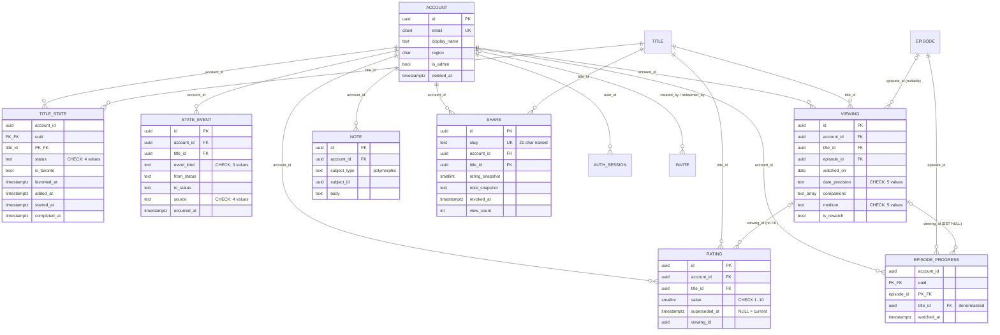

### 4.3 The ER model in plain English

**Account → TitleState.** One account has many title states; each is one row per (account, title),
keyed by a **composite primary key**. This is the join table between a person and a work, and the
status lives _on the join_, not on either side.

**Account → Viewing.** One account has many viewings of the same title. Three rewatches are three
rows. This is what a `Movie.watched_date` column could never express.

**Account → Rating.** One account has many rating rows per title, of which **at most one is
current** — enforced by a partial unique index `WHERE superseded_at IS NULL`. History is preserved.

**Title → Credit ← Person.** A many-to-many between titles and people, reified as `core.credit` so
it can carry the role (`predicate`), the job string, the billing order, and the character name.
This is a classic bridge table that grew attributes — which is exactly when a bridge should become
a first-class table.

**Title → Edge → {Concept, Collection, Organization, Work, Title}.** Also many-to-many, but
polymorphic: one table expresses eight different relationship types to five different target tables.
The `predicate` column says which.

**Title → Season → Episode.** Strict composition, `ON DELETE CASCADE` all the way down. `episode`
carries a redundant `title_id` FK for query speed.

**Rating → Viewing.** `rating.viewing_id` links a judgment to the specific watching that produced
it, which is what makes _"3★ in 2019, 5★ on rewatch in 2026"_ a connected fact rather than two
orphan rows. Note it is a plain `uuid` column with **no FK constraint** — the only intentional
soft reference in `usr`.

---

## 5. Tables in detail

**Inventory first.** `core` holds **24 tables** — the 23 declared in
[`drizzle/schema/core.ts`](drizzle/schema/core.ts) plus **`core.predicate_meta`, which exists only
in the generated [`drizzle/generated/ontology.sql`](drizzle/generated/ontology.sql)** because it is a
codegen artifact rather than a hand-written schema object — plus one materialized view,
`core.node_degree`. `usr` holds **12 tables**. `raw` holds **2**.

Sixteen of those carry the model and are detailed below. The rest (`core.merge_log`,
`core.er_review`, `core.entity_alias`, `core.rate_limit`, `core.path_cache`, `core.person_bacon`,
`usr.auth_*`, `usr.invite`, `usr.note`) are described where they appear in other sections.

### 5.1 `raw.tmdb_payload`

**Purpose.** The verbatim provider response, before anything interprets it. Never read by
application code.

| Column        | Type          | Null | Purpose                                                       | Example                              |
| ------------- | ------------- | ---- | ------------------------------------------------------------- | ------------------------------------ |
| `resource`    | `text`        | no   | Which endpoint family                                         | `movie`, `tv`, `person`, `tv_season` |
| `source_id`   | `text`        | no   | TMDB's id, as text so every resource shares one shape         | `"335984"`                           |
| `variant`     | `text`        | no   | Which `append_to_response` set was requested                  | `credits,keywords,external_ids`      |
| `payload`     | `jsonb`       | no   | The response body, unmodified                                 | `{"id":335984,…}`                    |
| `etag`        | `text`        | yes  | Reserved; not currently set                                   | —                                    |
| `http_status` | `integer`     | no   | Response status                                               | `200`                                |
| `fetched_at`  | `timestamptz` | no   | When                                                          | `2026-09-20T14:02:11Z`               |
| `pruned_at`   | `timestamptz` | yes  | Set by housekeeping after 90d when reduced to consumed fields | —                                    |

**Keys.** PK `(resource, source_id, variant)`. Index on `fetched_at` for pruning.

**Lifecycle.** Created by `hydrateOnDemand`, the `hydrate_title` job, and `scripts/seed.ts`.
Updated on re-fetch (upsert on the PK). Pruned, not deleted, by `housekeeping`. Never deleted while
the entity exists.

**Usage.** Two purposes, both stated in the schema: **replayability** (re-derive themes without
re-crawling) and **debuggability** (diff the payload against `core` to explain a wrong director).

### 5.2 `core.title`

**Purpose.** A work — movie or show. The central entity.

| Column                      | Type            | Null | Purpose                                              | Example               |
| --------------------------- | --------------- | ---- | ---------------------------------------------------- | --------------------- |
| `id`                        | `uuid`          | no   | Application identity, UUIDv7                         | `018f3c…`             |
| `slug`                      | `text`          | no   | Stable human-readable key, **unique**                | `arrival-2016`        |
| `kind`                      | `text`          | no   | Discriminator                                        | `movie` \| `show`     |
| `title`                     | `text`          | no   | Display title                                        | `Arrival`             |
| `original_title`            | `text`          | yes  | Title in the original language                       | `Arrival`             |
| `sort_title`                | `text`          | no   | Normalized for ER blocking and fuzzy search          | `arrival`             |
| `release_date`              | `date`          | yes  | Theatrical / first-air date                          | `2016-11-10`          |
| `end_date`                  | `date`          | yes  | Shows only — last air date                           | `null` for movies     |
| `runtime_minutes`           | `integer`       | yes  | Movies: runtime. Shows: `episode_run_time[0]`        | `116`                 |
| `status`                    | `text`          | yes  | TMDB production status                               | `Released`, `Ended`   |
| `overview`                  | `text`          | yes  | Synopsis                                             | `Taking place after…` |
| `original_language`         | `char(2)`       | yes  | ISO code                                             | `en`                  |
| `certification`             | `text`          | yes  | Age rating — **declared, not populated by ingest**   | —                     |
| `poster_path`               | `text`          | yes  | TMDB path fragment, **not a full URL**               | `/<hash>.jpg`         |
| `backdrop_path`             | `text`          | yes  | Same                                                 | `/<hash>.jpg`         |
| `accent_color`              | `char(7)`       | yes  | Dominant poster hue, clamped for contrast. **Ours.** | `#7A93B8`             |
| `blur_hash`                 | `text`          | yes  | Blur-up placeholder — declared, not populated        | —                     |
| `popularity`                | `numeric(10,4)` | yes  | **Volatile**                                         | `41.2130`             |
| `popularity_as_of`          | `timestamptz`   | yes  | Stamp for the above                                  | `2026-09-20T…`        |
| `vote_average`              | `numeric(4,2)`  | yes  | TMDB score                                           | `7.58`                |
| `vote_count`                | `integer`       | yes  |                                                      | `18342`               |
| `budget` / `revenue`        | `bigint`        | yes  | Movies only                                          | `47000000`            |
| `homepage`                  | `text`          | yes  |                                                      |                       |
| `adult`                     | `boolean`       | no   | Default `false`                                      |                       |
| `created_at` / `updated_at` | `timestamptz`   | no   | Row bookkeeping                                      |                       |
| `synced_at`                 | `timestamptz`   | yes  | Last provider refresh. Drives `refresh_stale`.       |                       |

**Keys.** PK `id`. `UNIQUE (slug)`. Indexes: `(kind, popularity DESC)`, `(release_date)`,
`(sort_title)`, plus a `pg_trgm` GIN index from the bootstrap SQL.

**Relationships.** Parent of `season`, `episode`, `credit`, `availability`, `title_keyword`.
Subject of `core.edge` rows. Referenced by five `usr` tables, all `ON DELETE CASCADE`.

**Lifecycle.** Created by `persistMovie` / `persistShow` when `resolveTitle` returns
`created: true`. Updated on re-ingest — but note **only the volatile fields refresh**:

```sql
UPDATE core.title SET popularity = $1, popularity_as_of = now(),
       vote_average = $2, vote_count = $3, synced_at = now() WHERE id = $4
```

**Never deleted by application code.** There is no delete path for a title.

### 5.3 `core.credit` — the bridge that grew up

**Purpose.** A person's participation in a work. ~85% of all edges in the system.

| Column               | Type           | Null | Purpose                                             | Example        |
| -------------------- | -------------- | ---- | --------------------------------------------------- | -------------- |
| `id`                 | `uuid`         | no   |                                                     |                |
| `person_id`          | `uuid`         | no   | FK → `core.person` CASCADE                          |                |
| `title_id`           | `uuid`         | no   | FK → `core.title` CASCADE                           |                |
| `episode_id`         | `uuid`         | yes  | FK → `core.episode` CASCADE. Episode-level credits. | `null`         |
| `predicate`          | `text`         | no   | **The role.** CHECK: 5 values                       | `directed`     |
| `department`         | `text`         | yes  | TMDB department                                     | `Directing`    |
| `job`                | `text`         | yes  | TMDB job string                                     | `Director`     |
| `character_id`       | `uuid`         | yes  | FK → `core.character`. **Never set.**               | `null`         |
| `character_name_raw` | `text`         | yes  | Verbatim provider string                            | `Louise Banks` |
| `billing_order`      | `smallint`     | yes  | Cast order. `0` is top-billed.                      | `0`            |
| `episode_count`      | `integer`      | yes  | Shows: episodes this credit spans                   | `24`           |
| `source`             | `text`         | no   | Default `tmdb`                                      |                |
| `source_credit_id`   | `text`         | yes  | TMDB's credit id                                    |                |
| `confidence`         | `numeric(3,2)` | no   | Default `1.0`                                       |                |

**Keys and the natural key that makes ingest idempotent:**

```sql
UNIQUE (person_id, title_id, predicate,
        coalesce(episode_id, '00000000-0000-0000-0000-000000000000'::uuid),
        coalesce(job, ''))
```

The two `coalesce` calls matter. `NULL != NULL` in a unique index, so without them a title-level
credit (`episode_id IS NULL`) would never conflict with itself and every re-ingest would insert a
duplicate. Coalescing nulls to sentinels makes the constraint actually bind.

**Indexes.** `(title_id, predicate, billing_order)` — the ordered cast list in one index scan.
`(person_id, predicate)` — filmography. Partial `(character_id) WHERE character_id IS NOT NULL`.

**Why its own table.** From the schema comment: _"shoving that into `attributes jsonb` would make
the hottest query in the app (ordered cast list) an unindexable jsonb sort."_ See
[ADR 0004](docs/adr/0004-credit-table-vs-generic-edge.md).

**Lifecycle.** `Ingestor.upsertCredit`, `ON CONFLICT DO UPDATE` refreshing `billing_order`,
`episode_count`, and `character_name_raw` — the last with `coalesce(excluded.…, existing)` so a
payload that omits a character name does not erase one already known.

### 5.4 `core.edge`

**Purpose.** The long tail of ontology relationships. Asserted by a provider or curated by us —
never derived.

| Column                      | Type           | Null | Purpose                              | Example                                           |
| --------------------------- | -------------- | ---- | ------------------------------------ | ------------------------------------------------- |
| `id`                        | `uuid`         | no   |                                      |                                                   |
| `subject_type`              | `text`         | no   | Polymorphic — no FK possible         | `title`                                           |
| `subject_id`                | `uuid`         | no   |                                      |                                                   |
| `predicate`                 | `text`         | no   | CHECK: 13 values, generated          | `explores_theme`                                  |
| `object_type`               | `text`         | no   |                                      | `concept`                                         |
| `object_id`                 | `uuid`         | no   |                                      |                                                   |
| `attributes`                | `jsonb`        | no   | Per-predicate payload. Default `{}`. | `{"salience":0.9,"derived_from":"tmdb_keywords"}` |
| `provenance`                | `text`         | no   | `asserted` \| `curated`              | `curated`                                         |
| `source`                    | `text`         | yes  | `tmdb`, `wikidata`, `crosswalk`      | `crosswalk`                                       |
| `source_ref`                | `text`         | yes  | Provider's own id for the assertion  | `Q21030411`                                       |
| `confidence`                | `numeric(3,2)` | no   | Default `1.0`                        |                                                   |
| `valid_from` / `valid_to`   | `date`         | yes  | **Declared, never populated**        |                                                   |
| `created_at` / `created_by` |                |      |                                      |                                                   |

**Keys.** PK `id`. `UNIQUE (subject_type, subject_id, predicate, object_type, object_id)` — the
natural key, which is what makes `assertEdge` idempotent. Three indexes: forward traversal
`(subject_type, subject_id, predicate)`, **reverse traversal** `(object_type, object_id,
predicate)`, and a partial `(predicate) WHERE provenance = 'curated'`.

**Lifecycle.** Written by `Ingestor.assertEdge` (genres, studios, networks, franchises),
`enrichWikidata` (`based_on`, `part_of_franchise`, `influenced_by`), and `deriveThemes`
(`explores_theme`). Deleted only by `deriveThemes`, which clears
`WHERE predicate = 'explores_theme' AND source = 'crosswalk'` before recomputing — scoped so a
theme edge from another source would survive.

### 5.5 `core.edge_derived`

Same shape as `core.edge`, plus:

| Column        | Type           | Null | Purpose                     | Example                |
| ------------- | -------------- | ---- | --------------------------- | ---------------------- |
| `method`      | `text`         | no   | Which algorithm produced it | `shared_signal_idf_v1` |
| `score`       | `numeric(6,4)` | yes  | Normalized 0..1             | `0.6412`               |
| `computed_at` | `timestamptz`  | no   |                             |                        |

**The natural key includes `method`**, so a future second algorithm can coexist rather than
clobbering the first. `deriveSimilar` deletes only its own method's rows before recomputing.

**Why a separate table at all.** `TRUNCATE core.edge_derived` is always safe. Provider facts and
human curation cannot be destroyed by a bad inference run. One extra table buys total confidence in
recomputation.

### 5.6 `core.predicate_meta` — the ontology, as a table

**Purpose.** The relationship vocabulary itself, materialized in the database so the validation
trigger is _generic logic over data_ rather than generated branches.

| Column                             | Type      | Purpose                                 | Example                       |
| ---------------------------------- | --------- | --------------------------------------- | ----------------------------- |
| `predicate`                        | `text` PK | Canonical name                          | `explores_theme`              |
| `label`                            | `text`    | Forward narration                       | `explores`                    |
| `inverse`                          | `text`    | Inverse predicate name                  | `explored_by`                 |
| `inverse_label`                    | `text`    | Reverse narration                       | `explored by`                 |
| `storage`                          | `text`    | Which table holds it                    | `core.edge`                   |
| `domain_types`                     | `text[]`  | Allowed subject types                   | `{title}`                     |
| `range_types`                      | `text[]`  | Allowed object types                    | `{concept}`                   |
| `range_concept_schemes`            | `text[]`  | Subtype constraint on concepts          | `{theme}`                     |
| `range_org_kinds`                  | `text[]`  | Subtype constraint on organizations     | `{network}`                   |
| `path_weight`                      | `numeric` | Cost in path ranking. Lower = stronger. | `2.6`                         |
| `is_symmetric`                     | `boolean` | Stored once, read both ways             | `true` for `similar_to`       |
| `is_structural`                    | `boolean` | Excluded from the graph entirely        | `true` for `season_of`        |
| `excluded_from_path_intermediates` | `boolean` | Cannot sit in the middle of a path      | `true` for `belongs_to_genre` |

**Lifecycle.** `TRUNCATE` + full re-`INSERT` on every `pnpm codegen` run, from
[`drizzle/generated/ontology.sql`](drizzle/generated/ontology.sql). It is generated, committed, and
drift-checked in CI — you cannot change it without changing `ontology.yaml`.

**Usage.** Read by `core.assert_edge_valid()` on every edge insert, and joined by
`sem.edge_bidirectional` to supply weights, labels and the structural filter.

### 5.7 `core.external_id` — the crosswalk

**Purpose.** Maps provider identifiers to application identifiers. The seam between external and
internal identity.

| Column          | Type          | Null | Purpose                                              | Example    |
| --------------- | ------------- | ---- | ---------------------------------------------------- | ---------- |
| `source`        | `text`        | no   | `tmdb` \| `imdb` \| `tvmaze` \| `wikidata` \| `omdb` | `tmdb`     |
| `source_id`     | `text`        | no   | Provider's id, as text                               | `"335984"` |
| `entity_type`   | `text`        | no   | Which kind of thing                                  | `title`    |
| `entity_id`     | `uuid`        | no   | Our id. **Polymorphic, no FK.**                      | `018f3c…`  |
| `is_primary`    | `boolean`     | no   | Spine source for this entity                         | `true`     |
| `first_seen`    | `timestamptz` | no   |                                                      |            |
| `last_verified` | `timestamptz` | yes  | Touched on every re-ingest                           |            |

**Keys.** PK `(source, source_id, entity_type)` — a provider id is unique within its source and
type. Index `(entity_type, entity_id)` for the reverse lookup.

The PK direction is the important one: it makes _"have I seen TMDB movie 335984 before?"_ a single
index probe, which is step 1 of entity resolution and ~97% of all resolutions.

### 5.8 `core.concept`

| Column        | Type      | Null | Purpose                               | Example                                   |
| ------------- | --------- | ---- | ------------------------------------- | ----------------------------------------- |
| `id`          | `uuid`    | no   |                                       |                                           |
| `scheme`      | `text`    | no   | Vocabulary partition                  | `genre` \| `theme`                        |
| `slug`        | `text`    | no   | Unique within scheme                  | `artificial-personhood`                   |
| `label`       | `text`    | no   | Display                               | `Artificial Personhood`                   |
| `description` | `text`    | yes  | **Theme definitions only**            | `Whether a made mind counts as a person.` |
| `parent_id`   | `uuid`    | yes  | Hierarchy. **Never set.**             | `null`                                    |
| `is_curated`  | `boolean` | no   | `true` for themes, `false` for genres |                                           |

**Keys.** `UNIQUE (scheme, slug)` — the natural key. Index on `(scheme)`.

That `description` column is worth noting: genres have none, themes have a one-sentence definition
authored in `themes.yaml`. **The semantic layer literally stores the meaning of its own
vocabulary** — for the half of it we authored.

### 5.9 `core.title_keyword` and `core.crosswalk_keyword_theme`

These two are the curation pipeline, and they are easy to mistake for one thing.

**`core.title_keyword`** — raw provider folksonomy. PK `(title_id, keyword_source_id)`.

| Column              | Type      | Purpose                               |
| ------------------- | --------- | ------------------------------------- |
| `title_id`          | `uuid` FK |                                       |
| `keyword_source_id` | `text`    | TMDB keyword id                       |
| `keyword_label`     | `text`    | `time loop`, `new york city`, `robot` |
| `source`            | `text`    | Default `tmdb`                        |

The schema comment is emphatic about what this is _not_:

> NOT concepts and NOT edges. […] putting it in `core.concept` would pollute the vocabulary, and
> putting it in `core.edge` is rejected by the domain/range trigger, correctly.

And the ingest comment records that this was learned the hard way: _"The first draft wrote them as
`belongs_to_genre` edges and the ontology trigger rejected it — correctly, since a keyword is not a
genre."_ **The ontology caught a modeling error at the database level.**

**`core.crosswalk_keyword_theme`** — our authored mapping from folksonomy to vocabulary.

| Column              | Type                    | Purpose                                                                                |
| ------------------- | ----------------------- | -------------------------------------------------------------------------------------- |
| `keyword_source_id` | `text`                  | Keyed by **label**, not TMDB id — the mapping is authored against human-readable names |
| `concept_id`        | `uuid` FK, **nullable** | The theme. **`NULL` means "considered and deliberately excluded."**                    |
| `salience`          | `numeric(3,2)`          | How strongly this keyword implies this theme                                           |
| `decided_by`        | `text`                  | `llm_draft` \| `human`                                                                 |
| `notes`             | `text`                  | `excluded: setting`                                                                    |

Two unique indexes, and the second exists because of a real bug:

```sql
UNIQUE (keyword_source_id, concept_id)                        -- mappings
UNIQUE (keyword_source_id) WHERE concept_id IS NULL           -- exclusions
```

> NULL != NULL in a unique index, so the composite above does NOT dedupe exclusions. Without this
> partial index every reload inserted another copy of every excluded keyword, and the coverage
> metric reported **114% adjudicated** — an impossible number that revealed the bug.

A nullable FK used as a tri-state (`mapped` / `explicitly excluded` / `never seen`) is a genuinely
good modeling choice here: _"considered and deliberately not a theme" is different information from
"never looked at", and the coverage metric needs to tell them apart._

### 5.10 `usr.title_state`

**Purpose.** The user's standing relationship with a work. Exactly one row.

| Column         | Type          | Null | Purpose                                                      | Example   |
| -------------- | ------------- | ---- | ------------------------------------------------------------ | --------- |
| `account_id`   | `uuid`        | no   | PK part, FK CASCADE                                          |           |
| `title_id`     | `uuid`        | no   | PK part, FK CASCADE                                          |           |
| `status`       | `text`        | no   | CHECK: `watchlist` \| `watching` \| `watched` \| `abandoned` | `watched` |
| `is_favorite`  | `boolean`     | no   | **Orthogonal to status**                                     | `true`    |
| `favorited_at` | `timestamptz` | yes  |                                                              |           |
| `added_at`     | `timestamptz` | no   | When it entered the library. Drives `days_on_watchlist`.     |           |
| `started_at`   | `timestamptz` | yes  |                                                              |           |
| `completed_at` | `timestamptz` | yes  |                                                              |           |
| `updated_at`   | `timestamptz` | no   | **What "Continue Watching" orders by**                       |           |

**Keys.** Composite PK `(account_id, title_id)`. `CHECK` built from the `STATUSES` array in
[`src/lib/tracking.ts`](src/lib/tracking.ts). Indexes `(account_id, status)` and a partial
`(account_id) WHERE is_favorite`.

That CHECK has a story in the schema:

> The allowed values used to live only in a comment, so the column would have accepted any string
> at all.

**Lifecycle.** Created and updated by `setStatus`, `markWatched`, `toggleFavorite`. **Deleted** by
`removeFromLibrary` — the only hard delete in the user model. The event log survives it: _"Forget a
title entirely. The event log keeps that it once mattered."_

### 5.11 `usr.state_event` — append-only

| Column                   | Type          | Null | Purpose                                                                   |
| ------------------------ | ------------- | ---- | ------------------------------------------------------------------------- |
| `id`                     | `uuid`        | no   |                                                                           |
| `account_id`, `title_id` | `uuid`        | no   | FKs CASCADE                                                               |
| `event_kind`             | `text`        | no   | CHECK: `status_change` \| `favorited` \| `unfavorited`                    |
| `from_status`            | `text`        | yes  |                                                                           |
| `to_status`              | `text`        | yes  |                                                                           |
| `occurred_at`            | `timestamptz` | no   |                                                                           |
| `source`                 | `text`        | no   | CHECK: `manual` \| `auto_from_viewing` \| `auto_from_episode` \| `import` |

**Three CHECK constraints**, the third being a _shape_ constraint that is unusual and worth copying:

```sql
CHECK ( (event_kind = 'status_change' AND to_status IS NOT NULL)
     OR (event_kind <> 'status_change' AND to_status IS NULL AND from_status IS NULL) )
```

> A `status_change` must say what it changed to; a favorite event must not pretend to be one.
> Without this, a half-written event reads as a real transition to NULL.

**Append-only is enforced three ways**: no `UPDATE`/`DELETE` grant to `app_web`; no RLS policy for
those operations (with `FORCE ROW LEVEL SECURITY`, they affect zero rows even for the owner); and
the shape constraints above.

**Why favoriting shares this log.** From `tracking.ts`: _"the log answers 'what did I do to this
title, and when' — splitting it would mean merging two tables to ask that. Favorite is still NOT a
status."_

### 5.12 `usr.rating` — versioned judgment

| Column          | Type          | Null | Purpose                                        | Example    |
| --------------- | ------------- | ---- | ---------------------------------------------- | ---------- |
| `value`         | `smallint`    | no   | Half-stars as 1..10. CHECK `BETWEEN 1 AND 10`. | `9` = 4.5★ |
| `rated_at`      | `timestamptz` | no   |                                                |            |
| `superseded_at` | `timestamptz` | yes  | **`NULL` = this is the current rating**        |            |
| `viewing_id`    | `uuid`        | yes  | Which watching produced it. **No FK.**         |            |

**The partial unique index is the whole design:**

```sql
UNIQUE (account_id, title_id) WHERE superseded_at IS NULL
```

At most one current rating; unlimited history. Re-rating is `UPDATE … SET superseded_at = now()`
followed by `INSERT` — and if you forgot the update, **the database would reject the insert.**

The CHECK has its own confession in the schema:

> Half-stars, 1..10. Specified in `docs/data-model.md` from the start and never actually applied,
> so a 0 or a 47 would have been stored and then divided by two into `sem.user_title.rating`.

**Why `smallint` and not `numeric(2,1)`.** The values are genuinely discrete — ten of them. Integer
storage removes float comparison hazards entirely; `valueToStars` in `tracking.ts` divides by 2 at
the edge, and `sem.user_title` does the same in SQL.

### 5.13 `usr.viewing` — the discrete event

| Column           | Type      | Null | Purpose                                                   | Example      |
| ---------------- | --------- | ---- | --------------------------------------------------------- | ------------ |
| `title_id`       | `uuid`    | no   | FK CASCADE                                                |              |
| `episode_id`     | `uuid`    | yes  | Set for episode-level viewings                            |              |
| `watched_on`     | `date`    | yes  |                                                           | `2026-03-14` |
| `date_precision` | `text`    | no   | CHECK: `exact`\|`day`\|`month`\|`year`\|`unknown`         | `day`        |
| `companions`     | `text[]`  | yes  | Who you watched with                                      | `{Sarah}`    |
| `location`       | `text`    | yes  |                                                           |              |
| `medium`         | `text`    | yes  | CHECK: `theater`\|`streaming`\|`physical`\|`tv`\|`flight` |              |
| `is_rewatch`     | `boolean` | no   | Computed at insert by `EXISTS`                            |              |
| `note`           | `text`    | yes  |                                                           |              |

**The constraint that models uncertainty properly:**

```sql
CHECK (watched_on IS NOT NULL OR date_precision = 'unknown')
```

> `'unknown'` precision is the ONLY case where a watched date may be absent. Otherwise a missing
> date is a bug that would silently vanish from every time-series metric.

This is the row an analyst should appreciate most. A retroactive _"I've seen this, no idea when"_
is a legitimate fact that must not land on today's date and must not silently disappear from a
monthly count. Modeling precision as a column rather than fudging the date is the correct answer,
and the CHECK keeps the two in agreement.

### 5.14 `usr.episode_progress`

PK `(account_id, episode_id)`. Carries a **denormalized `title_id`** — _"so progress aggregates do
not join through season"_ — and an optional `viewing_id` with `ON DELETE SET NULL`.

The composite PK is the duplicate prevention: ticking an episode twice is a no-op upsert, not a
second row.

### 5.15 `usr.share`

| Column            | Type          | Purpose                                                   |
| ----------------- | ------------- | --------------------------------------------------------- |
| `slug`            | `text` unique | 21-char nanoid, ~126 bits. An unguessable capability URL. |
| `include_rating`  | `boolean`     |                                                           |
| `rating_snapshot` | `smallint`    | **Frozen at creation**                                    |
| `note_snapshot`   | `text`        | **Frozen at creation**                                    |
| `message`         | `text`        | Free text added when sharing                              |
| `revoked_at`      | `timestamptz` | Kills the link                                            |
| `view_count`      | `integer`     | Incremented by `usr.share_record_view(slug)`              |

**The snapshot is the model decision.** From the schema: _"You sent someone 'I gave it 4.5' —
re-rating later must not silently rewrite the message."_ A foreign key to the current rating would
have been simpler and wrong. See [ADR 0008](docs/adr/0008-share-snapshot-not-live.md).

### 5.16 `core.job`

| Column                    | Type          | Purpose                                     |
| ------------------------- | ------------- | ------------------------------------------- |
| `kind`                    | `text`        | One of ten registered handlers              |
| `payload`                 | `jsonb`       | Handler arguments                           |
| `status`                  | `text`        | `queued` \| `running` \| `done` \| `failed` |
| `attempts`                | `integer`     |                                             |
| `run_after`               | `timestamptz` | Backoff                                     |
| `locked_at` / `locked_by` |               | Claim bookkeeping                           |
| `last_error`              | `text`        | Truncated to 2000 chars                     |

Partial index `(status, run_after) WHERE status = 'queued'` — the claim query only ever looks at
queued rows, so the index only indexes those.

---

## 6. Normalization

### 6.1 Where the model is normalized, and what that buys

The clearest example is exactly the one from a textbook. The application does **not** store:

```
core.title.genres = "Drama, Science Fiction, Mystery"
```

It stores:

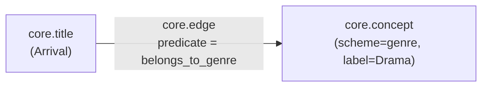

Three tables where one column would have done. What that buys, concretely in this application:

| Capability                                                                | Impossible with a delimited string     |
| ------------------------------------------------------------------------- | -------------------------------------- |
| `sem.user_taste_affinity` grouping watched titles by genre                | Would require string splitting per row |
| The graph treating Drama as a **node** with 2,139 connections             | A string is not a node                 |
| `core.node_degree` computing hub penalty over genres                      | No entity to compute degree for        |
| Renaming "Sci-Fi" → "Science Fiction" in one row                          | A corpus-wide string update            |
| The domain/range trigger asserting the object is a `genre`-scheme concept | Nothing to check                       |

**The same shape is used six more times**: themes, franchises, studios, networks, source works,
and influence — all through `core.edge` with a different `predicate`.

### 6.2 Normal forms, only where they explain something

**1NF — atomic values.** Mostly held. Two deliberate exceptions use Postgres arrays:
`core.person.also_known_as text[]` and `usr.viewing.companions text[]`. Neither is a lookup key,
neither is joined on, and both are read as a whole. **Likely rationale:** promoting companions to a
table would add a join to serve data that is only ever displayed inline, with no query that filters
by it. If "films watched with Sarah" ever becomes a feature, that calculus changes.

**2NF — no partial dependency on part of a composite key.** `usr.title_state` has the composite key
`(account_id, title_id)` and every non-key column (`status`, `is_favorite`, `added_at`) depends on
**both**. Status is not a property of the title; it is not a property of the account; it is a
property of the pair. That is the whole insight of [§9](#9-user-data-model), stated in normal-form
terms.

**3NF — no transitive dependency.** Title attributes depend on the title, not on its genre or its
director. The one place a transitive dependency is deliberately introduced is `core.episode.title_id`
(derivable via `season_id → season.title_id`) — see below.

Beyond that, textbook normal forms stop being the useful lens. The more interesting question in
this model is **provenance separation**, which no normal form describes: `core.edge` and
`core.edge_derived` are identical in shape and separated purely so one can be truncated without
touching the other.

### 6.3 Deliberate denormalizations

Four, each with a stated reason:

| Denormalization                 | Derivable from                  | Why                                                                                               |
| ------------------------------- | ------------------------------- | ------------------------------------------------------------------------------------------------- |
| `core.episode.title_id`         | `season_id → season.title_id`   | _"episode lists filter by title constantly"_ — saves a join on the hottest episode query          |
| `usr.episode_progress.title_id` | `episode_id → episode.title_id` | _"so progress aggregates do not join through season"_                                             |
| `core.title.sort_title`         | `normalizeTitle(title)`         | Must be **indexable** — `pg_trgm` GIN over a computed expression per query would defeat the index |
| `core.person.sort_name`         | `personSortName(name)`          | Same, plus two GIN indexes on it                                                                  |
| `usr.share.rating_snapshot`     | `usr.rating` at a point in time | **Not an optimization — a semantic requirement.** The snapshot _is_ the fact.                     |

The last one is worth separating from the others. The first four trade storage for speed and can be
recomputed. The share snapshot cannot be recomputed, because the thing it records — what the rating
was _when you sent the link_ — no longer exists anywhere else. It is denormalized in shape and
normalized in meaning.

### 6.4 Where the model is deliberately _not_ relational

`core.edge.attributes jsonb` holds per-predicate payload: `salience` for `explores_theme`,
`derived_from` for provenance. This is schemaless on purpose — each predicate wants different
attributes, and a column per predicate-attribute would be a wide sparse table.

The boundary is drawn exactly where it should be: **anything queried or sorted on gets a column**
(`billing_order` lives on `core.credit`, not in jsonb, precisely so the cast list can be indexed),
and **anything merely carried along gets jsonb**. `sem.title` does reach into jsonb once —
`ORDER BY (e.attributes->>'salience')::numeric DESC` when aggregating theme labels — which is the
one place the tradeoff is visible.

---

## 7. External data → internal data

### 7.1 The pipeline

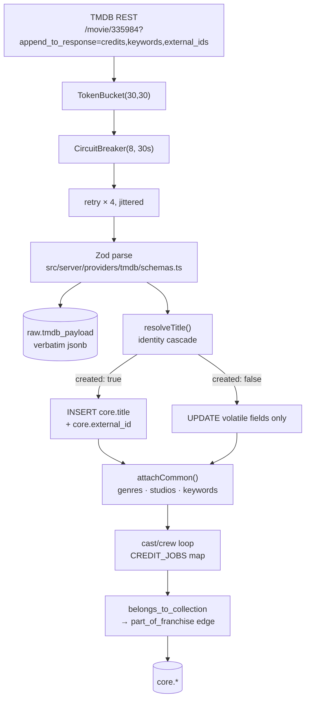

**Zod is the contract boundary.** [`schemas.ts`](src/server/providers/tmdb/schemas.ts) defines
`tmdbMovie`, `tmdbShow`, `tmdbPerson`, `tmdbSeasonDetail`, `tmdbWatchProviders`. A changed TMDB
field produces a typed failure _at the edge_ rather than an `undefined` three layers in. The
inferred types (`TmdbMovie`, `TmdbShow`) are the **response types** — they exist only inside
`src/server/providers/` and `src/server/ingest/` and never escape into the application.

### 7.2 Movie mapping

From [`Ingestor.persistMovie`](src/server/ingest/ingest.ts):

| TMDB field                                | Internal field                                            | Transformation                                                                         | Reason                                                                                                          |
| ----------------------------------------- | --------------------------------------------------------- | -------------------------------------------------------------------------------------- | --------------------------------------------------------------------------------------------------------------- |
| `id`                                      | `core.external_id.source_id`                              | `String(m.id)`                                                                         | Ids are text so every resource shares one shape                                                                 |
| —                                         | `core.title.id`                                           | `core.uuid_generate_v7()`                                                              | **Application identity is minted, not borrowed**                                                                |
| `title`                                   | `title.title`                                             | copied                                                                                 |                                                                                                                 |
| `title` + year                            | `title.slug`                                              | `slugify(m.title, year ?? m.id)`                                                       | Stable, human-readable, unique. Falls back to the TMDB id when there is no year.                                |
| `title`                                   | `title.sort_title`                                        | `normalizeTitle()` — NFKD, strip diacritics, strip leading articles, strip punctuation | The ER blocking key and the fuzzy-search key                                                                    |
| `original_title`                          | `title.original_title`                                    | copied                                                                                 |                                                                                                                 |
| `release_date`                            | `title.release_date`                                      | copied; **year also extracted** into a local for slug + ER blocking                    |                                                                                                                 |
| `runtime`                                 | `title.runtime_minutes`                                   | copied                                                                                 |                                                                                                                 |
| `status`                                  | `title.status`                                            | copied                                                                                 |                                                                                                                 |
| `overview`                                | `title.overview`                                          | copied                                                                                 |                                                                                                                 |
| `original_language`                       | `title.original_language`                                 | copied                                                                                 |                                                                                                                 |
| `poster_path`                             | `title.poster_path`                                       | copied **as a path fragment**                                                          | The full URL is composed at render time by [`tmdb-image.ts`](src/lib/tmdb-image.ts) so the size bucket can vary |
| `backdrop_path`                           | `title.backdrop_path`                                     | copied                                                                                 |                                                                                                                 |
| `popularity`                              | `title.popularity` + `popularity_as_of`                   | copied **plus a `now()` stamp**                                                        | Volatile. Never read without its stamp.                                                                         |
| `vote_average`, `vote_count`              | same                                                      | copied                                                                                 |                                                                                                                 |
| `budget`, `revenue`                       | same                                                      | copied                                                                                 |                                                                                                                 |
| `homepage`, `adult`                       | same                                                      | copied                                                                                 |                                                                                                                 |
| `imdb_id` ?? `external_ids.imdb_id`       | `core.external_id` row, `source='imdb'`                   | `??` fallback across two locations                                                     | TMDB puts it in different places depending on the endpoint                                                      |
| `belongs_to_collection`                   | `core.collection` + `part_of_franchise` edge              | upsert then `assertEdge`                                                               | Becomes a **relationship**, not a column                                                                        |
| `genres[]`                                | `core.concept(scheme='genre')` + `belongs_to_genre` edges | `upsertConcept` then `assertEdge`                                                      | Normalized into the graph                                                                                       |
| `production_companies[]`                  | `core.organization(kind='studio')` + `produced_by` edges  | **first 6 only**                                                                       | **Likely rationale:** the tail is noise for a relationship whose path weight is already 3.8                     |
| `keywords.keywords[]`                     | `core.title_keyword`                                      | copied, **not** to concept or edge                                                     | Folksonomy input, not ontological fact                                                                          |
| `credits.cast[]`                          | `core.credit`, `predicate='acted_in'`                     | **first 20 only**; `character` → `character_name_raw`, `order` → `billing_order`       |                                                                                                                 |
| `credits.crew[]`                          | `core.credit`                                             | **filtered through `CREDIT_JOBS`** — see below                                         |                                                                                                                 |
| `vote_average`, `popularity` on re-ingest | same                                                      | **only these refresh**                                                                 | Everything else is treated as stable                                                                            |
| Everything else TMDB returns              | —                                                         | **ignored**                                                                            | `tagline`, `spoken_languages`, `production_countries`, `videos`, `images`, `recommendations`, `similar`         |

**The crew filter is where roles become predicates.** This map is the entire translation from
TMDB's free-text `job` strings to our ontology:

```ts
const CREDIT_JOBS: Record<string, string> = {
  Director: 'directed',
  Screenplay: 'wrote',
  Writer: 'wrote',
  Story: 'wrote',
  Teleplay: 'wrote',
  'Original Music Composer': 'composed_for',
  'Director of Photography': 'shot',
};
```

Seven TMDB job strings collapse to four predicates. **Any crew member whose job is not in this map
is silently skipped** (`if (!predicate) continue`) — producers, editors, costume designers, gaffers
and hundreds of others are fetched, parsed, and discarded. The original `job` string is still
preserved on the credits that survive, so "Screenplay" and "Story" remain distinguishable even
though both map to `wrote`.

### 7.3 Show mapping — where it differs

| Difference       | Movie                               | Show                                                          |
| ---------------- | ----------------------------------- | ------------------------------------------------------------- |
| Title field      | `title`                             | `name`                                                        |
| Original title   | `original_title`                    | `original_name`                                               |
| Release date     | `release_date`                      | `first_air_date`                                              |
| End date         | —                                   | `last_air_date` → `end_date`                                  |
| Runtime          | `runtime`                           | **`episode_run_time[0] ?? null`** — first element of an array |
| Credits endpoint | `credits`                           | **`aggregate_credits`**                                       |
| IMDb id          | `imdb_id` ?? `external_ids.imdb_id` | `external_ids.imdb_id` only                                   |
| Budget / revenue | copied                              | **not present**                                               |
| Networks         | —                                   | `core.organization(kind='network')` + `aired_on` edges        |
| Seasons          | —                                   | `core.season` rows upserted on `(title_id, season_number)`    |
| Episodes         | —                                   | **Not during ingest** — see below                             |

**Aggregate credits fan out.** A TV person can hold several jobs across a series run — writer on
some episodes, director on others. So each crew entry loops over `c.jobs`, emitting one credit per
matching job:

```ts
const relevant = c.jobs.filter((j) => CREDIT_JOBS[j.job]);
for (const j of relevant) {
  await this.upsertCredit(pid, titleId, CREDIT_JOBS[j.job]!, { job: j.job, episodeCount: j.episode_count, … });
}
```

For cast, `c.roles[0]?.character` is taken — **only the first role**, so an actor playing two
characters across a run keeps one name.

**Episodes are deliberately deferred.** `ingestEpisodes` is a separate method, not part of
`persistShow`:

> The corpus holds ~1,026 seasons; pulling all their episodes at ingest would be a thousand extra
> requests for data almost none of which anyone looks at. This runs when someone actually starts
> tracking a show.

It is triggered by `enqueueEpisodeHydration` in
[`tracking-hooks.ts`](src/server/repos/tracking-hooks.ts) the moment a user sets a status on a show.
**Season 0 (specials) is included** — excluding it would silently drop episodes from the progress
denominator.

### 7.4 A bug worth studying

The show path carries this comment:

> Shows must write the IMDb link here too, exactly as movies do. Omitting it made ingest
> non-idempotent: `resolveTitle` adds the link on the NEXT run, so a second identical ingest
> produced one extra `external_id` row and show IMDb ids arrived a run late.

The failure was invisible in the data — the id eventually appeared — and only showed up as an
**idempotency test failing on a row count**. That test exists precisely because idempotency is what
makes replay safe.

### 7.5 Person mapping

Two separate paths, and the split is the point.

| Path                | Trigger                                  | Fields available                                                             |
| ------------------- | ---------------------------------------- | ---------------------------------------------------------------------------- |
| `ensurePerson`      | Any title ingest, from a credits payload | `id`, `name`, `profile_path`, `known_for_department`, `gender`, `popularity` |
| Person detail fetch | Someone opens a person page              | `+ biography`, `birthday`, `deathday`, `place_of_birth`, `also_known_as`     |

From the schema comment:

> `ensurePerson` only ever sees what a CREDITS payload carries […] So biography, birthday, deathday
> and place of birth were null for all **58,714** people in the corpus, and a person page was a
> photo and a job title.
>
> Deliberately separate from `ensurePerson`: calling this during a title ingest would add one
> request per cast member, turning a single film into thirty.

`detail_synced_at` distinguishes the two, so a person with genuinely no biography is not re-fetched
on every page view.

### 7.6 What stays external

| Data                               | Why it is never stored                                                                                                                                                     |
| ---------------------------------- | -------------------------------------------------------------------------------------------------------------------------------------------------------------------------- |
| Poster and backdrop **images**     | Only the path is stored. The bytes are served from `image.tmdb.org` directly, bypassing Next's optimizer ([ADR 0012](docs/adr/0012-tmdb-images-bypass-next-optimizer.md)). |
| Search results for unknown titles  | `search/multi` results are cached by Next for 300s and never written to `core`. A keystroke is not an ingest.                                                              |
| Trending / discover lists          | Fetched with `next: { revalidate }`, rendered, discarded                                                                                                                   |
| TMDB user ratings, lists, accounts | Out of scope entirely                                                                                                                                                      |

---

## 8. Identity and entity resolution

### 8.1 Two kinds of identity, and why the distinction matters

|                 | External identity                                     | Application identity       |
| --------------- | ----------------------------------------------------- | -------------------------- |
| **What**        | `tmdb:335984`, `imdb:tt2543164`, `wikidata:Q21030411` | `core.title.id` — a UUIDv7 |
| **Owned by**    | The provider                                          | Us                         |
| **Stability**   | Provider's promise. Can be merged, retired, reused.   | Permanent                  |
| **Cardinality** | **Many per entity**                                   | Exactly one                |
| **Stored in**   | `core.external_id`                                    | The entity's PK            |

**Why not just use the TMDB id as the primary key?** Four concrete consequences, all visible in
this codebase:

1. **A second provider could not attach.** Wikidata supplies `based_on` edges for titles TMDB
   already gave us. With `tmdb_id` as the key, a Wikidata fact about a film has nowhere to point
   except through a lookup — which is what `core.external_id` is, so you would build it anyway.
2. **Merging becomes impossible.** `mergeEntities` repoints external ids from a merged entity to a
   surviving one. If the id _were_ the identity, merging two records would mean deleting one
   provider's id.
3. **Every table would carry a provider's concern.** `usr.title_state.title_id` would be a TMDB id,
   and the user layer would be coupled to a vendor.
4. **UUIDv7 is time-sortable and index-friendly**, needing no coordination. A TMDB id is neither
   time-ordered nor ours to mint for entities TMDB does not have — `core.work` rows come from
   Wikidata and have no TMDB id at all.

The rule, stated once: **external ids are _attributes_ of an entity, not its identity.**

### 8.2 Three levels of identity in the model

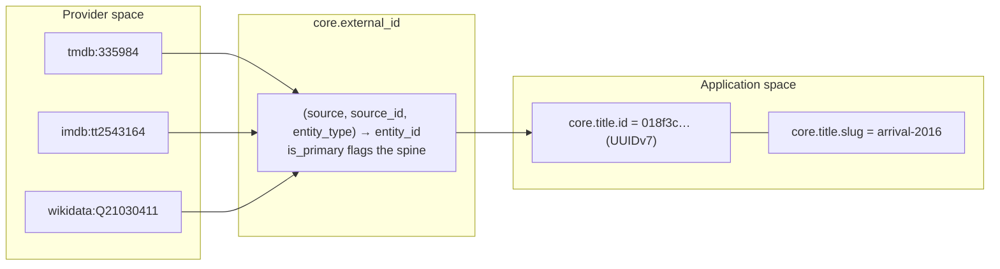

**Three identifiers, three jobs:**

| Identifier              | Job                                         | Who sees it |
| ----------------------- | ------------------------------------------- | ----------- |
| `external_id.source_id` | Deduplicate against the provider            | Ingest only |
| `id` (UUIDv7)           | Referential integrity, all FKs, RLS scoping | Server code |
| `slug`                  | URL, bookmarks, share links                 | Users       |

`slug` is a third identity worth naming separately: it is stable, unique, and human-readable, and
it is what appears in `/title/arrival-2016`. Changing a title's display name does **not** change its
slug — `ON CONFLICT (slug) DO UPDATE SET title = excluded.title` updates the name and leaves the
slug alone, so bookmarks survive.

### 8.3 The title resolution cascade

[`resolveTitle`](src/server/ingest/resolve.ts#L100), short-circuiting:

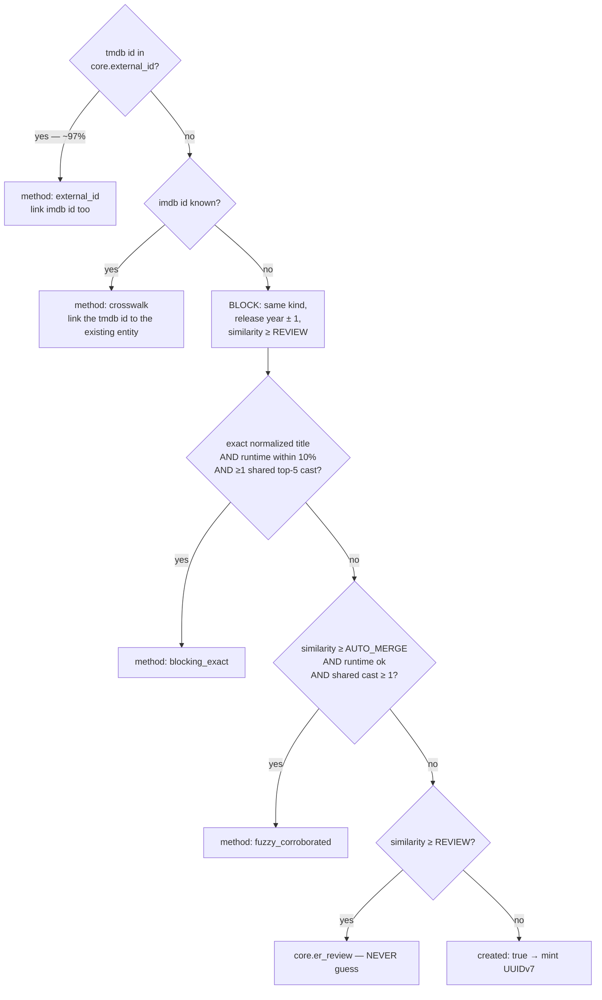

**Blocking** is the classic record-linkage move: never compare every incoming record against every
stored one. The block here is `(kind, release_year ± 1)` plus a `pg_trgm` similarity floor, which
turns an O(n) scan into an index-backed candidate set of at most 5.

**The corroboration requirement is what makes fuzzy matching safe.** Title similarity alone
produces disasters — _The Office_ UK vs. US, the six _Pinocchio_ films, _Dune_ 1984 vs. 2021.
`countSharedCast` checks the incoming top-5 billed cast against the candidate's `acted_in` credits
through `core.external_id`:

```sql
SELECT count(DISTINCT x.source_id)::int
FROM core.credit cr
JOIN core.external_id x ON x.entity_type = 'person' AND x.entity_id = cr.person_id AND x.source = 'tmdb'
WHERE cr.title_id = $1 AND cr.predicate = 'acted_in' AND x.source_id = ANY($2::text[])
```

Note the review-queue reason string when an exact title match has no shared cast:
`'identical normalized title but no shared cast'`. **That is the two Offices, caught and queued
rather than merged.**

### 8.4 Person resolution — a different weighting

Names collide heavily and TMDB itself has duplicate person records, so the signals are inverted:
**filmography overlap is strong, name is weak.**

| Condition                              | Outcome                                      |
| -------------------------------------- | -------------------------------------------- |
| Same name, **conflicting birthday**    | `continue` — _"Same name, different human."_ |
| Same name, filmography overlap **≥ 2** | Auto-merge                                   |
| Same name, overlap **exactly 1**       | Queue for review                             |
| Same name, overlap **0**               | **Not queued** — see below                   |

The zero-overlap case is the subtle one, and the code argues it explicitly:

> **ZERO overlap is NOT ambiguity** — it is evidence of two different people. […] So only the
> middle band is queued: exactly one shared title, which is too little to merge on and too much to
> dismiss.

This is a genuinely good piece of reasoning to internalize. Absence of corroboration is not the
same as ambiguity; treating it as ambiguity would flood the review queue with false positives and
make it useless.

### 8.5 Upsert behavior and duplicate prevention

Every write in ingest is an idempotent upsert on a **natural key**:

| Table                | Conflict target                                                              | On conflict                                                   |
| -------------------- | ---------------------------------------------------------------------------- | ------------------------------------------------------------- |
| `core.title`         | `(slug)`                                                                     | Update `title`, `synced_at`                                   |
| `core.person`        | `(slug)`                                                                     | Update `name`, `synced_at`                                    |
| `core.concept`       | `(scheme, slug)`                                                             | Update `label`                                                |
| `core.organization`  | `(slug)`                                                                     | Update `name`                                                 |
| `core.credit`        | `(person_id, title_id, predicate, coalesce(episode_id,…), coalesce(job,''))` | Update `billing_order`, `episode_count`, `character_name_raw` |
| `core.edge`          | `(subject_type, subject_id, predicate, object_type, object_id)`              | Update `attributes`, `source`                                 |
| `core.external_id`   | `(source, source_id, entity_type)`                                           | Update `last_verified`                                        |
| `core.episode`       | `(season_id, episode_number)`                                                | Update name, overview, air date, runtime, still               |
| `core.season`        | `(title_id, season_number)`                                                  | Update `name`, `episode_count`                                |
| `core.title_keyword` | `(title_id, keyword_source_id)`                                              | `DO NOTHING`                                                  |

**The contract this establishes**, stated at the top of `ingest.ts`:

> Every write here is an idempotent upsert keyed on the natural key, so re-running the whole ingest
> produces **byte-identical core state apart from `synced_at`**. That is asserted by a test, and it
> is what makes the crosswalk replayable.

**What happens if the same movie is retrieved twice.** Step 1 of the cascade hits, `res.created` is
`false`, and the code takes the `else` branch: only `popularity`, `popularity_as_of`,
`vote_average`, `vote_count` and `synced_at` are updated. All edges and credits are re-upserted and
converge to the same rows. `stats.reused` increments rather than `stats.created`.

An in-run `personCache`, `conceptCache` and `orgCache` avoid re-resolving the same person hundreds
of times within a single ingest — a per-run memoization, not a persistent cache.

### 8.6 Merges are reversible

`mergeEntities(sql, …)` writes `core.merge_log` with an evidence bundle, repoints external ids, and
re-points edges with `ON CONFLICT DO NOTHING` so collapsed duplicates are absorbed rather than
erroring. `revertMerge(mergeId)` exists and is tested. `core.entity_alias` retains the merged
entity's name with `alias_type = 'merged_from'`, so search still finds it.

---

## 9. User data model

### 9.1 The central distinction

```
Movie.status = 'watched'              ← WRONG. A property of the work.
User → Movie → status = 'watched'     ← RIGHT. A property of the pair.
```

This is not a stylistic preference. With `status` as a column on `core.title`:

- Two users cannot disagree. The second one to mark something watched overwrites the first.
- The application role would need **write access to `core`**, which is exactly the grant the
  architecture removes to guarantee a user cannot contaminate the global model.
- Deleting an account would mean mutating the shared catalog.
- The graph would change shape per user — a title's `status` is not a fact about the title.

In Throughline the relationship is a row in `usr.title_state` with the composite primary key
`(account_id, title_id)`. **The status lives on the join, not on either side.** In normal-form
terms, `status` depends on the full composite key — 2NF, arrived at from the domain rather than
from the textbook.

### 9.2 What each user concept actually is

| Concept               | Implementation                                           | Kind                     |
| --------------------- | -------------------------------------------------------- | ------------------------ |
| **Watchlist**         | `title_state.status = 'watchlist'`                       | Stored enum value        |
| **Watching**          | `title_state.status = 'watching'`                        | Stored enum value        |
| **Watched**           | `title_state.status = 'watched'`                         | Stored enum value        |
| **Abandoned**         | `title_state.status = 'abandoned'`                       | Stored enum value        |
| **Favorite**          | `title_state.is_favorite boolean`                        | **Separate stored flag** |
| **Rating**            | Row in `usr.rating` with `superseded_at IS NULL`         | Versioned row            |
| **Viewing**           | Row in `usr.viewing`                                     | Event                    |
| **Episode watched**   | Row in `usr.episode_progress`                            | Event / tick             |
| **Progress %**        | **Derived in `sem.user_title`**                          | Calculated, never stored |
| **Next episode**      | **Derived in `sem.user_title`** via LATERAL              | Calculated, never stored |
| **View count**        | **Derived** — `count(*)` over viewings                   | Calculated               |
| **Days on watchlist** | **Derived** — `now()::date - added_at::date`             | Calculated               |
| **Rewatch**           | `viewing.is_rewatch`, computed by `EXISTS` **at insert** | Stored, computed once    |
| **Continue Watching** | Query over `sem.user_title` ordered by `updated_at`      | Derived at query time    |
| **Taste affinity**    | `sem.user_taste_affinity` view                           | Derived at query time    |

Notice the split: **states are stored, quantities are derived.** Nothing in the user layer caches a
count.

### 9.3 Four tables for one relationship, and why

A single `user_movies` table with `status`, `rating`, `watched_date`, `is_favorite` would be the
obvious first design. Here is what each split buys:

| Split out              | Because                                                                                                                     |
| ---------------------- | --------------------------------------------------------------------------------------------------------------------------- |
| `usr.viewing`          | A title can be watched **more than once**. One row cannot hold three dates, three companions lists, three notes.            |
| `usr.rating`           | A judgment can **change**, and the change is interesting. `superseded_at` keeps the history that an `UPDATE` would destroy. |
| `usr.state_event`      | _"When did I add this?"_ and _"Did I abandon it and come back?"_ are questions a current-state row cannot answer.           |
| `usr.episode_progress` | Progress is per-episode, not per-title. A title-level percentage cannot say _which_ episode is next.                        |

The cost is real: marking something watched touches four tables in one transaction. The benefit is
that `sem.user_title` re-assembles them into one row, so **application code reads a single view and
never sees the split**.

### 9.4 `usr.note` is polymorphic

```
note(subject_type, subject_id, body, is_private)
```

Notes can attach to people and concepts too, not only titles — a `text` discriminator plus a bare
`uuid`, with no FK. The same polymorphic pattern as `core.edge`, and the same tradeoff: flexibility
bought with the loss of referential integrity. Unlike `core.edge`, there is **no trigger validating
the subject type here** — the only place in the model where a polymorphic reference is unguarded.

### 9.5 Isolation is structural

Every table above carries `account_id` and is protected by row-level security:

```sql
ALTER TABLE usr.title_state ENABLE ROW LEVEL SECURITY;
ALTER TABLE usr.title_state FORCE ROW LEVEL SECURITY;
CREATE POLICY own_rows ON usr.title_state
  USING      (account_id = usr.current_account_id())
  WITH CHECK (account_id = usr.current_account_id());
```

`FORCE` makes the policy apply to the table **owner** as well. `WITH CHECK` means an insert
carrying someone else's `account_id` is _rejected_, not silently written. And every `sem.user_*`
view carries `security_invoker = true` — without which the views would bypass RLS entirely while
every base-table test still passed.

---

## 10. State modeling

### 10.1 Two independent axes, not one

| Axis         | Values                                          | Exclusive?                     | Stored as                         |
| ------------ | ----------------------------------------------- | ------------------------------ | --------------------------------- |
| **Status**   | `watchlist`, `watching`, `watched`, `abandoned` | **Yes** — one value            | `title_state.status text` + CHECK |
| **Favorite** | true / false                                    | **No** — independent of status | `title_state.is_favorite boolean` |

They are not hierarchical and not derived from each other. You can favorite a show you are still
watching, or a film sitting on your watchlist that you loved as a child and want to rewatch. From
[ADR 0005](docs/adr/0005-favorites-as-relationship-not-status.md): **favorite means affinity;
rating means judgment; status means lifecycle.** Three axes, three representations.

`listLibrary` in [`user.ts`](src/server/repos/user.ts) takes `favorites` as a **separate argument**
rather than a fifth status value, and the comment says why:

> the moment it becomes one, a favorited show you are midway through has to stop being 'watching'.

### 10.2 The status state machine

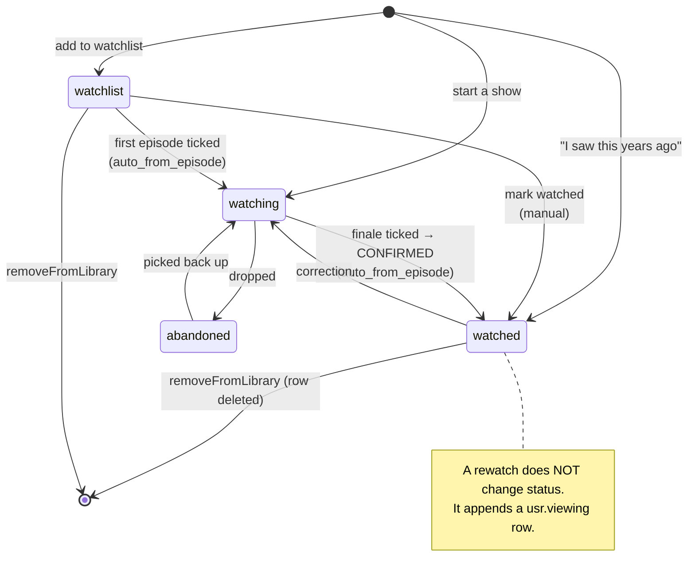

**Every transition is legal.** There is no guard rejecting a move — users correct mistakes, and the
model's job is to record what happened, not to police it. What the model _does_ guarantee is that
every transition is logged.

**Two transitions are automatic**, and both are distinguishable in the log by `source`:

| Trigger                                                          | Transition           | Source              | Where                                                  |
| ---------------------------------------------------------------- | -------------------- | ------------------- | ------------------------------------------------------ |
| First episode ticked on a show not already `watching`/`watched`  | `* → watching`       | `auto_from_episode` | [`episodes.ts:201`](src/server/repos/episodes.ts#L201) |
| Finale ticked — **`justCompleted` is returned, the UI confirms** | `watching → watched` | `auto_from_episode` | `confirmFinishedAction`                                |

The second one is the interesting design choice. `markThrough` returns
`justCompleted: aired > 0 && watched >= aired && from !== 'watched'` — a **signal, not an action**.
The database is not changed until the user confirms through `confirmFinishedAction`. An automatic
transition that fires silently is one the user cannot disagree with.

**Timestamp semantics** in the upsert are worth reading closely:

```sql
started_at   = COALESCE(usr.title_state.started_at, excluded.started_at)   -- never moves once set
completed_at = CASE WHEN excluded.status = 'watched'
                    THEN COALESCE(usr.title_state.completed_at, now())
                    ELSE usr.title_state.completed_at END                 -- survives a status change away
updated_at   = now()                                                       -- always moves
```

`started_at` is _when you first began_ and must not reset on a correction. `completed_at` survives
moving back to `watching`. `updated_at` is the one that always moves, which is why **Continue
Watching orders by it** — from the view comment: _"`added_at` would pin a show you resumed last
night to wherever it sat when you first added it."_

The `state_event` write is conditional on `from !== status`, so re-affirming the same status does
not pollute the log with no-op transitions.

### 10.3 What happens in the database when a user clicks "Watched"

```mermaid
sequenceDiagram
    participant U as User
    participant C as track-controls.tsx
    participant A as markWatchedAction
    participant R as markWatched (repo)
    participant DB as Postgres

    U->>C: tap "Watched"
    C->>C: useOptimistic → pill changes immediately
    C->>A: server action
    A->>A: requireAccountId() → Zod parse
    A->>R: markWatched(accountId, titleId, value?)
    R->>DB: BEGIN; set_config('app.account_id', …, true)
    DB->>DB: 1. UPSERT usr.title_state → 'watched'
    DB->>DB: 2. INSERT usr.state_event (if status changed)
    DB->>DB: 3. INSERT usr.viewing, is_rewatch via EXISTS, RETURNING id
    DB->>DB: 4. if rating: UPDATE supersede; INSERT usr.rating (viewing_id)
    DB->>DB: COMMIT
    R-->>A: { isRewatch }
    A->>A: revalidateTracking() → revalidatePath('/', '/library', '/title/[slug]')
    A->>A: drainSoon() via after()
    A-->>C: ok → setConfirmed('watched')
```

**One transaction, four tables.** If any statement fails, none of it happened — you cannot end up
with a rating for a viewing that does not exist.

**`is_rewatch` is computed in SQL at insert time:**

```sql
EXISTS (SELECT 1 FROM usr.viewing v2 WHERE v2.account_id = $1 AND v2.title_id = $2)
```

Computing it in TypeScript would mean a second round trip and a race. Computing it at _read_ time
would mean the flag changes meaning as history grows — the first viewing would retroactively become
a rewatch. Stamping it once, at insert, is correct.

### 10.4 What changes downstream

| Layer                     | Effect of one "Watched" click                                                                                                |
| ------------------------- | ---------------------------------------------------------------------------------------------------------------------------- |
| `usr.*`                   | 3–4 rows written                                                                                                             |
| `sem.user_title`          | Recomputes on next read — `status`, `view_count`, `rating`, `last_watched_on`                                                |
| `sem.user_taste_affinity` | Recomputes on next read — this title's director, genres, themes and franchise all gain `n_titles` and shift `affinity_score` |
| Metrics on `/universe/me` | All five change                                                                                                              |
| Suggestions               | Change — the title's edges become new evidence                                                                               |
| **The graph / ontology**  | **Does not change.** See below.                                                                                              |
| UI                        | `revalidatePath('/', '/library', '/title/[slug]')`                                                                           |

### 10.5 The ontology does not change when a user acts

This is the most important sentence in the section, and it is easy to assume the opposite.

Marking a film watched writes **zero rows to `core`**. No node is created, no edge is created, no
predicate is touched. The application role has no write grant on `core` at all — it is not merely
that the code declines to, it is that the database would refuse.

What changes is **your position in a graph that already existed**. The personal layer is an overlay:

```ts
// src/app/(app)/universe/explore/page.tsx
const titleIds = neighborhood.nodes.filter((n) => n.type === 'title').map((n) => n.id);
const tracked = await trackedAmong(accountId, titleIds);
mine = new Set([...tracked].map((tid) => `title:${tid}`));
```

> The personal layer over the global one. This is the only thing the signed-in view has that the
> public page cannot: **not a graph, but YOUR position in it.**

The constellation renders the same nodes and edges for every viewer; the "Yours · N of M" toggle
highlights the intersection. Two users looking at _Arrival_ see an identical graph and different
highlighting.

---

## 11. Relationships are data

### 11.1 The complete relationship inventory

| Entity A     | Relationship          | Entity B                  | Stored where                  | Cardinality         | Populated?           |
| ------------ | --------------------- | ------------------------- | ----------------------------- | ------------------- | -------------------- |
| Person       | `directed`            | Title / Episode           | `core.credit`                 | M:N                 | ✅ ingest            |
| Person       | `acted_in`            | Title / Episode           | `core.credit`                 | M:N                 | ✅ ingest (top 20)   |
| Person       | `wrote`               | Title / Episode           | `core.credit`                 | M:N                 | ✅ ingest            |
| Person       | `composed_for`        | Title                     | `core.credit`                 | M:N                 | ✅ ingest            |
| Person       | `shot`                | Title                     | `core.credit`                 | M:N                 | ✅ ingest            |
| Title        | `belongs_to_genre`    | Concept(genre)            | `core.edge`                   | M:N                 | ✅ ingest            |
| Title        | `explores_theme`      | Concept(theme)            | `core.edge`                   | M:N                 | ✅ `deriveThemes`    |
| Title        | `part_of_franchise`   | Collection                | `core.edge`                   | M:1 in practice     | ✅ ingest + Wikidata |
| Title        | `produced_by`         | Organization(studio)      | `core.edge`                   | M:N (≤6)            | ✅ ingest            |
| Title        | `aired_on`            | Organization(network)     | `core.edge`                   | M:N                 | ✅ ingest (shows)    |
| Title        | `based_on`            | Work                      | `core.edge`                   | M:N                 | ✅ Wikidata only     |
| Title/Person | `influenced_by`       | Title/Person              | `core.edge`                   | M:N                 | ✅ Wikidata only     |
| Title        | `similar_to`          | Title                     | `core.edge_derived`           | M:N, symmetric      | ✅ `deriveSimilar`   |
| Title        | `distributed_by`      | Organization(distributor) | `core.edge`                   | M:N                 | ❌ **never written** |
| Title        | `sequel_to`           | Title                     | `core.edge`                   | M:N                 | ❌ **never written** |
| Title        | `remake_of`           | Title                     | `core.edge`                   | M:N                 | ❌ **never written** |
| Title        | `features_character`  | Character                 | `core.edge`                   | M:N                 | ❌ **never written** |
| Character    | `portrayed_by`        | Person                    | `core.edge`                   | M:N                 | ❌ **never written** |
| Concept      | `broader_than`        | Concept                   | `core.edge`                   | 1:N                 | ❌ **never written** |
| Season       | `season_of`           | Title                     | **FK `season.title_id`**      | M:1                 | ✅ structural        |
| Episode      | `episode_of`          | Season                    | **FK `episode.season_id`**    | M:1                 | ✅ structural        |
| Title        | _has availability on_ | Organization              | `core.availability`           | M:N per region      | ✅ (**not an edge**) |
| Title        | _tagged with_         | (keyword string)          | `core.title_keyword`          | M:N                 | ✅ (**not an edge**) |
| **Account**  | **`tracks`**          | **Title**                 | **`usr.title_state`**         | **M:N**             | ✅ user              |
| **Account**  | **`favorited`**       | **Title**                 | **`title_state.is_favorite`** | **M:N**             | ✅ user              |
| **Account**  | **`rated`**           | **Title**                 | **`usr.rating`**              | **M:N versioned**   | ✅ user              |
| **Account**  | **`watched`** (event) | **Title / Episode**       | **`usr.viewing`**             | **M:N, repeatable** | ✅ user              |
| **Account**  | **`progressed`**      | **Episode**               | **`usr.episode_progress`**    | **M:N**             | ✅ user              |
| **Account**  | **`shared`**          | **Title**                 | **`usr.share`**               | **M:N**             | ✅ user              |
| Person       | _collaborated with_   | Person                    | **nowhere**                   | —                   | **2-hop query only** |

**Thirteen of twenty-one declared predicates carry data.** The eight that do not are declared in
`ontology.yaml`, enforced by CHECK constraints, and populated by nothing. They are not broken —
they are a vocabulary ahead of its ingest.

### 11.2 Why there is no `collaborated_with` edge

Two people sharing a title is fully derivable, and materializing it would be actively harmful:

- **O(n²) in cast size.** A 30-person cast generates 435 pairs. Across a 5,000-title corpus that is
  roughly 2M junk edges.
- **It destroys the reason.** The interesting fact is not _that_ two people are connected but
  _through what_ — and a direct edge discards the title that connects them, which is precisely what
  the path narration needs.

Person→person connections are found as **2-hop paths through a title**, by `findPaths`. When
performance ever demands otherwise, the answer is a purpose-built projection (that is what
`core.person_bacon` was designed to be), not a general edge.

### 11.3 Classification

| Kind                                     | Which                                                 | Where computed                                           |
| ---------------------------------------- | ----------------------------------------------------- | -------------------------------------------------------- |
| **Explicitly stored, provider-asserted** | All credits, genres, studios, networks, franchise     | `core.credit`, `core.edge`, `provenance='asserted'`      |
| **Explicitly stored, our curation**      | `explores_theme`, `influenced_by`                     | `core.edge`, `provenance='curated'`                      |
| **Explicitly stored, derived**           | `similar_to`                                          | `core.edge_derived`, `provenance='derived'`              |
| **Structural, stored as FKs**            | `season_of`, `episode_of`                             | Excluded from `sem.edge_bidirectional`                   |
| **Derived at query time**                | Inverse of every edge                                 | `sem.edge_bidirectional` UNION                           |
| **Derived at query time**                | Person↔person, taste affinity, progress, next episode | `findPaths`, `sem.user_taste_affinity`, `sem.user_title` |
| **Never stored**                         | `collaborated_with`                                   | 2-hop traversal                                          |
| **Used for visualization**               | Everything in `sem.edge_bidirectional`                | `neighborhood()` → canvas                                |

### 11.4 Provenance is a first-class column

Three tiers, on every edge, visible in the UI as a visual distinction:

| Provenance | Meaning                  | Source values                                 |
| ---------- | ------------------------ | --------------------------------------------- |
| `asserted` | A provider said so       | `tmdb`, `wikidata`                            |
| `curated`  | **We** decided           | `crosswalk`, `wikidata` (for `influenced_by`) |
| `derived`  | An algorithm computed it | `method = 'shared_signal_idf_v1'`             |

From `derive-themes.ts`: _"Derived theme edges carry provenance `'curated'`, not `'asserted'`: no
provider said this film explores Memory. **We did.**"_

That distinction — between a fact you received and a claim you are making — is the thing most data
models leave implicit and then cannot recover.

---

## 12. Ontology

### 12.1 What "ontology" means inside this application

Not a philosophical exercise and not an OWL file. Concretely, the ontology here is **four
artifacts**, all generated from one source:

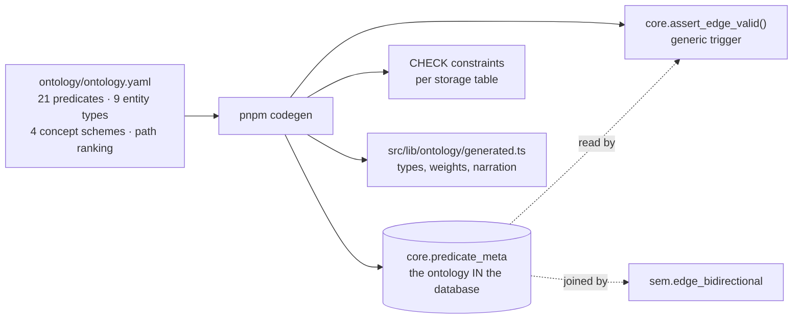

The line that makes it real, from the generated SQL:

> The validation trigger below is **generic logic over this table, NOT generated branches** — so
> adding a predicate changes data, never code.

### 12.2 The four components

**Entities** — nine types, seven of them graph nodes:

| Type           | Table               | Graph node                 |
| -------------- | ------------------- | -------------------------- |
| `title`        | `core.title`        | ✅                         |
| `person`       | `core.person`       | ✅                         |
| `concept`      | `core.concept`      | ✅                         |
| `collection`   | `core.collection`   | ✅                         |
| `organization` | `core.organization` | ✅                         |
| `work`         | `core.work`         | ✅                         |
| `character`    | `core.character`    | ✅ (declared; table empty) |
| `season`       | `core.season`       | ❌ structural part         |
| `episode`      | `core.episode`      | ⚠️ credit target only      |

**Relationships** — 21 predicates, each declaring `domain`, `range`, `inverse`, `storage`,
`path_weight`, and flags.

**Concepts** — controlled vocabularies inside `core.concept`, partitioned by `scheme`. Two
populated (`genre`, `theme`), two declared and not (`mood`, `format`).

**Properties** — two kinds, and the split is deliberate:

| Kind                    | Where                                                     | Example                                                     |
| ----------------------- | --------------------------------------------------------- | ----------------------------------------------------------- |
| Entity attributes       | Columns                                                   | `title.runtime_minutes`                                     |
| Relationship attributes | `core.edge.attributes jsonb`, or columns on `core.credit` | `salience` on `explores_theme`; `billing_order` on a credit |

### 12.3 The ontology diagram

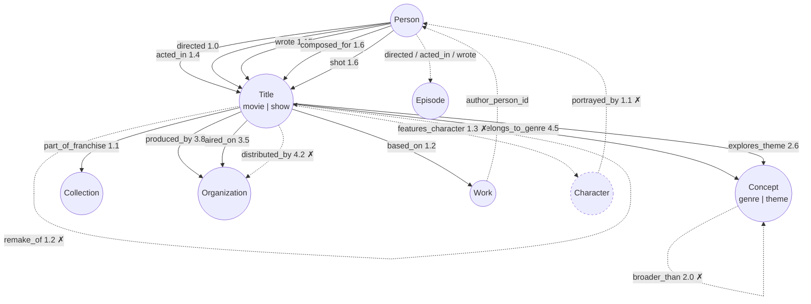

Solid arrows carry data. **Dashed arrows marked ✗ are declared and never populated.** Numbers are
path weights — lower means a stronger, more explanatory relationship.

### 12.4 Answering the structural questions

| Question                                 | Answer                                                                                                                                                                                                                                                                                                                    |
| ---------------------------------------- | ------------------------------------------------------------------------------------------------------------------------------------------------------------------------------------------------------------------------------------------------------------------------------------------------------------------------- |
| **Which are hierarchical?**              | `broader_than` (concept→concept) is declared. **Nothing populates it**, and `core.concept.parent_id` is never set. `themes.yaml` declares a cluster→theme hierarchy that `deriveThemes` flattens. `organization.parent_org_id` is likewise declared and unpopulated. **The ontology currently has no working hierarchy.** |
| **Which are directional?**               | All of them. Every edge is stored once in a canonical direction, and `sem.edge_bidirectional` generates the reverse row with the declared `inverse` label.                                                                                                                                                                |
| **Which are symmetric?**                 | One: `similar_to` (`is_symmetric: true`). Stored once in canonical order, emitted both ways.                                                                                                                                                                                                                              |
| **Which are many-to-many?**              | All non-structural predicates. `part_of_franchise` is 1:N in practice but not constrained to be.                                                                                                                                                                                                                          |
| **Which represent user behavior?**       | **None.** No user relationship is an ontology predicate. The ontology describes the world; `usr.*` describes a person's relationship to it.                                                                                                                                                                               |
| **Which represent real-world concepts?** | All 21.                                                                                                                                                                                                                                                                                                                   |

That fifth row is a deliberate boundary. `watched` is _not_ a predicate, `favorited` is _not_ a
predicate, and `rated` is _not_ a predicate. They are rows in `usr.*` that the semantic layer joins
**to** the graph without being part of it.

### 12.5 Database schema vs. data model vs. ontology

|                     | Definition                                                                     | In Throughline                                                                                                                                                                                                                                           |
| ------------------- | ------------------------------------------------------------------------------ | -------------------------------------------------------------------------------------------------------------------------------------------------------------------------------------------------------------------------------------------------------- |
| **Database schema** | How bytes are physically stored — tables, columns, types, indexes, constraints | `drizzle/schema/*.ts` + `drizzle/sql/*.sql`. `core.edge` is a table with a polymorphic `uuid` and a jsonb column. `core.credit` has a `billing_order smallint` because an ordered cast list must be indexable.                                           |
| **Data model**      | How application concepts relate — entities, cardinality, keys                  | _Person has many Credits; Credit belongs to one Title; Account has one TitleState per Title._ Expressed in Drizzle relations and FKs, and visible in [§4](#4-entity-relationship-model).                                                                 |
| **Ontology**        | What those concepts _mean_ in the domain, and which statements are well-formed | `ontology.yaml` → `core.predicate_meta`. _A `directed` edge's subject must be a `person` and its object a `title` or `episode`; its inverse is `directed_by`; it costs 1.0 to traverse because it is among the most explanatory relationships there is._ |

The three are **not** the same thing, and this application is unusually clear about it because the
ontology is enforced separately from the schema. Concretely:

- The **schema** permits `core.edge` to hold any `(text, uuid, text, text, uuid)` tuple.
- The **data model** says edges connect entities.
- The **ontology** says `explores_theme` may only go from a `title` to a `concept` **whose scheme is
  `theme`** — and rejects the insert otherwise.

That last check is not expressible in the schema. It needs the predicate's declared range _and_ a
lookup into `core.concept.scheme`, which is exactly what `assert_edge_valid()` does.

### 12.6 The trigger, in full

```sql
SELECT * INTO m FROM core.predicate_meta WHERE predicate = NEW.predicate;
IF NOT FOUND THEN RAISE EXCEPTION 'predicate % is not declared in ontology.yaml', NEW.predicate;

IF m.storage <> TG_TABLE_SCHEMA || '.' || TG_TABLE_NAME THEN
  RAISE EXCEPTION 'predicate % is stored in %, not %.%';          -- wrong table

IF NOT (NEW.subject_type = ANY (m.domain_types)) THEN … ;          -- domain
IF NOT (NEW.object_type  = ANY (m.range_types))  THEN … ;          -- range

IF m.range_concept_schemes IS NOT NULL AND NEW.object_type = 'concept' THEN
  SELECT scheme INTO obj_scheme FROM core.concept WHERE id = NEW.object_id;
  IF NOT (obj_scheme = ANY (m.range_concept_schemes)) THEN … ;     -- SUBTYPE

IF m.range_org_kinds IS NOT NULL AND NEW.object_type = 'organization' THEN
  SELECT kind INTO obj_kind FROM core.organization WHERE id = NEW.object_id;
  IF NOT (obj_kind = ANY (m.range_org_kinds)) THEN … ;             -- SUBTYPE
```

**Five checks, and the last two are the ones a plain schema could never do.** `aired_on` requires an
organization of kind `network`; `produced_by` requires `studio` or `production`; `explores_theme`
requires a concept in scheme `theme`. Subtype constraints across a polymorphic reference, enforced
in the database.

And it has already caught a real modeling error. From `ingest.ts`:

> The first draft wrote them as `belongs_to_genre` edges and **the ontology trigger rejected it** —
> correctly, since a keyword is not a genre.

---

## 13. Ontology vs. database schema

### 13.1 Concept by concept

| Concept                    | In the database                                                                                  | In the ontology                                                                                                                                                                                                  |
| -------------------------- | ------------------------------------------------------------------------------------------------ | ---------------------------------------------------------------------------------------------------------------------------------------------------------------------------------------------------------------- |
| **Movie**                  | A `core.title` row with `kind = 'movie'`, ~25 columns, PK `id`, unique `slug`                    | An **entity type** `title` with subtype discriminator `kind`. Legal subject of 8 predicates, legal object of 3.                                                                                                  |
| **TV show**                | The _same table_, `kind = 'show'`, plus `end_date` and child `season`/`episode` rows             | The **same entity type**. The ontology does not distinguish them — they share 100% of their edges.                                                                                                               |
| **Person**                 | A `core.person` row; two trigram indexes on `sort_name`/`name`; two sync stamps                  | An **entity type**. Subject of 5 credit predicates. **Roles are not types** — Director is not an entity.                                                                                                         |
| **Genre**                  | A `core.concept` row, `scheme='genre'`, `is_curated=false`                                       | A **concept in a scheme**, reachable only via `belongs_to_genre`, whose range is constrained to that scheme. Path weight **4.5 — near-useless for explanation** — and `excluded_from_path_intermediates = true`. |
| **Theme**                  | A `core.concept` row, `scheme='theme'`, `is_curated=true`, **with a `description`**              | A **curated concept** with a written definition. Path weight 2.6. The edge carries `salience` in `attributes`.                                                                                                   |
| **Actor**                  | **Not a table.** A `core.credit` row with `predicate='acted_in'`, `job='Actor'`, `billing_order` | **Not an entity.** A predicate — a _way a person participates_. Its inverse is `features_actor`.                                                                                                                 |
| **Director**               | `core.credit` row, `predicate='directed'`                                                        | Predicate, weight 1.0 — the strongest explanatory relationship in the vocabulary                                                                                                                                 |
| **Character**              | A `core.character` table that is **empty**, plus `credit.character_name_raw` strings             | Entity type `character`, with `portrayed_by` and `features_character`. **Fully declared, entirely unpopulated.**                                                                                                 |
| **User**                   | `usr.account` — email, display name, region, RLS-scoped                                          | **Absent.** There is no `account` entity type in `ontology.yaml`.                                                                                                                                                |
| **Watched**                | `usr.title_state.status = 'watched'` + `usr.state_event` + `usr.viewing` rows                    | **Absent.** Not a predicate. Not in `predicate_meta`.                                                                                                                                                            |
| **Favorite**               | `usr.title_state.is_favorite boolean`                                                            | **Absent.**                                                                                                                                                                                                      |
| **Rating**                 | `usr.rating` rows, `smallint` 1..10, versioned by `superseded_at`                                | **Absent** from the ontology; **central** to the semantic layer (`sem.user_taste_affinity` weights affinity by rating lift).                                                                                     |
| **Similarity**             | `core.edge_derived` rows with `method` and `score`                                               | Predicate `similar_to`, `is_symmetric = true`, weight 2.2, provenance `derived`                                                                                                                                  |
| **Franchise**              | `core.collection` row + `part_of_franchise` edges                                                | Entity type + predicate, weight 1.1                                                                                                                                                                              |
| **Streaming availability** | `core.availability` — a table with region, offer type, `valid_to`                                | **Deliberately absent.** Modeling it as an edge would make the graph a different shape in Germany than in the US, and a different shape next Tuesday.                                                            |
| **Keyword**                | `core.title_keyword` rows                                                                        | **Deliberately absent.** A folksonomy is provider input, not ontological fact.                                                                                                                                   |

### 13.2 In the database but not the ontology

| Thing                                                             | Why it is excluded                                                                                                                                           |
| ----------------------------------------------------------------- | ------------------------------------------------------------------------------------------------------------------------------------------------------------ |
| Everything in `usr.*`                                             | The ontology describes the world; the user layer describes one person's relationship to it. Keeping them apart is what lets the same graph serve every user. |
| `core.availability`                                               | Volatile and regional — would destroy path determinism                                                                                                       |
| `core.title_keyword`                                              | Folksonomy, deliberately not adopted as vocabulary                                                                                                           |
| `core.job`, `core.rate_limit`, `core.er_review`, `core.merge_log` | Operational, not domain                                                                                                                                      |
| `core.external_id`, `core.entity_alias`                           | Identity plumbing                                                                                                                                            |
| Entity _attributes_ (`runtime`, `budget`, `popularity`)           | `ontology.yaml` declares entity types and predicates; it does not enumerate columns                                                                          |

### 13.3 In the ontology but not (meaningfully) in the database

| Thing                                      | Status                                                                                                                                                                |
| ------------------------------------------ | --------------------------------------------------------------------------------------------------------------------------------------------------------------------- |
| `portrayed_by`, `features_character`       | Declared, constrained, **zero rows**                                                                                                                                  |
| `sequel_to`, `remake_of`, `distributed_by` | Declared, **zero rows**                                                                                                                                               |
| `broader_than`                             | Declared, **zero rows**; `parent_id` also never set                                                                                                                   |
| `mood` concept scheme                      | Declared with `source: ontology/moods.yaml`; **codegen never reads that file**                                                                                        |
| `format` concept scheme                    | Declared with `phase: 2`, explicitly deferred                                                                                                                         |
| `character` entity type                    | Table exists, **no INSERT anywhere**                                                                                                                                  |
| `season_of`, `episode_of`                  | Declared as `structural`; realized as **FKs**, not edges — a case where the ontology and the schema deliberately disagree on representation while agreeing on meaning |

### 13.4 So — is this a formal ontology?

Honest answer: **it is a lightweight formal ontology, not a full one, and the distinction is worth
being precise about.**

**What it genuinely has**, which most application schemas do not:

- A **declared vocabulary** of entity types and predicates, in one machine-readable file
- **Domain and range constraints** per predicate, **enforced at write time**
- **Subtype constraints** across polymorphic references (concept scheme, organization kind)
- **Declared inverses** for every predicate, materialized at query time
- **Provenance tiers** distinguishing asserted, curated and derived claims
- **Weights** encoding how explanatory each relationship is
- **Definitions in natural language** for curated concepts (`themes.yaml` → `concept.description`)
- A generic validator, so the vocabulary is **data rather than code**

**What it does not have**, and what a formal ontology in the OWL/RDF sense would:

- No **URIs or namespaces**. Identity is a local UUID; there is no `http://…/Title`.
- No **formal semantics** — no `rdfs:subClassOf`, no `owl:TransitiveProperty`, no `owl:sameAs`
- No **reasoner**. Nothing infers new facts from axioms. `similar_to` is computed by a hand-written
  IDF query, not derived by entailment.
- **No class hierarchy.** `broader_than` exists in the vocabulary and has no rows.
- No **cardinality axioms** beyond database unique constraints
- No **SPARQL endpoint or triple store**. (Ironically, Wikidata is queried by SPARQL — the ontology
  it draws _from_ is more formal than the one it feeds.)

**The practical ontology of Throughline** is therefore: _`core.predicate_meta`, plus the trigger
that enforces it, plus the path weights that say how much each relationship explains._ That is a
real ontology doing real work — it rejects malformed statements and it ranks explanations — and
calling it more than that would be overclaiming.

---

## 14. Semantic layer

### 14.1 What it consists of, physically

Three things, and only the first is a database object:

1. **Fourteen `sem.*` views** in [`drizzle/sql/20-views.sql`](drizzle/sql/20-views.sql) — the only
   database surface application code may read, enforced by `scripts/check-layers.sh`
2. **`ontology/metrics.yaml` + the resolver** in
   [`src/lib/metrics/resolve.ts`](src/lib/metrics/resolve.ts) — metric definitions as data
3. **`src/lib/tracking.ts`** — the vocabularies of the personal layer, which are the **single
   source** for both the TypeScript unions and the database CHECK constraints

That third one is easy to miss and is genuinely part of the semantic layer: it is where "what
counts as a status" is defined once, in a form both the type system and the database consume.

### 14.2 What each term actually means here

#### **What does "Movie" mean?**

A `core.title` row with `kind = 'movie'` — surfaced as `sem.title`, which adds:

| Added by the view  | Meaning                                                                                            |
| ------------------ | -------------------------------------------------------------------------------------------------- |
| `release_year`     | `EXTRACT(YEAR FROM release_date)::int` — the form every UI actually wants                          |
| `genres text[]`    | Labels, aggregated from `belongs_to_genre` edges, **alphabetical**                                 |
| `themes text[]`    | Labels from `explores_theme` edges, **ordered by salience descending**                             |
| `primary_director` | _The most popular person with a title-level `directed` credit_ — a definition, not a stored column |
| `franchise`        | First `part_of_franchise` collection name                                                          |
| `tmdb_id`          | Pulled from `core.external_id` so search can dedupe without reaching into the crosswalk            |

Two of those are business rules, not data. **"Primary director" does not exist in TMDB** — a film
can have several directors, and the semantic layer defines the primary one as the most popular:

```sql
(SELECT p.name FROM core.credit cr JOIN core.person p ON p.id = cr.person_id
  WHERE cr.title_id = t.id AND cr.predicate = 'directed' AND cr.episode_id IS NULL
  ORDER BY p.popularity DESC NULLS LAST LIMIT 1) AS primary_director
```

Note `episode_id IS NULL` — an episode director is not the film's director. And the ordering of
`themes` by salience while `genres` are alphabetical is itself a semantic statement: **themes have
strength, genres do not.**

#### **What does "Watched" mean?**

It means three different things in three places, and conflating them is a real source of confusion:

| Sense                | Representation                             | Answers                               |
| -------------------- | ------------------------------------------ | ------------------------------------- |
| **A standing state** | `title_state.status = 'watched'`           | "Is this in my Watched shelf?"        |
| **An event**         | A `usr.viewing` row                        | "When did I watch it, and with whom?" |
| **A transition**     | A `state_event` with `to_status='watched'` | "When did I _decide_ I'd watched it?" |

For a **show**, "watched" carries a fourth, derived sense: `progress_pct = 100`, which is computed
over **aired** episodes, not total:

```sql
CASE WHEN prog.episodes_aired > 0
     THEN round(100.0 * prog.episodes_watched / prog.episodes_aired)::int END
```

> Aired, not total: a show mid-season must not read 40% when you are caught up.

That is a semantic definition in the strictest sense. "Caught up" and "finished" are different
concepts, and the denominator is where the difference lives.

#### **What does "Favorite" mean?**

`title_state.is_favorite = true`. Semantically: **affinity, not judgment, and orthogonal to
lifecycle.** The model insists on all three:

- Not a status (you can favorite something you are still watching)
- Not a rating (a 5★ documentary you will never rewatch is not a favorite; a 4★ comfort film you
  have seen nine times is)
- Not derivable (nothing infers it)

#### **What does "Rating" mean?**

A _versioned judgment_, stored as `smallint` 1..10 and meaning 0.5–5.0 stars.

| Layer      | Representation                                                            |
| ---------- | ------------------------------------------------------------------------- |
| Storage    | `usr.rating.value smallint`, `CHECK BETWEEN 1 AND 10`                     |
| Current    | The row `WHERE superseded_at IS NULL`, enforced by a partial unique index |
| Semantic   | `sem.user_title.rating = (r.value::numeric / 2)` → `4.5`                  |
| TypeScript | `starsToValue(4.5) → 9`, `valueToStars(9) → 4.5`, in `tracking.ts`        |
| UI         | Five stars, half-star drag                                                |

`starsToValue` **throws rather than rounding silently** on out-of-range input — a semantic-layer
function refusing to fabricate a value.

In `sem.user_taste_affinity`, rating takes on a further meaning: **rating lift against your own
mean**, not absolute rating. Rating everything 4★ produces no affinity signal; rating one director
consistently above your average does.

#### **What does "Person" mean?**

**One human being, with roles attached to edges rather than to identity.** `sem.person` adds:

```sql
COALESCE((SELECT jsonb_object_agg(predicate, n)
  FROM (SELECT cr.predicate, count(DISTINCT cr.title_id) AS n
        FROM core.credit cr WHERE cr.person_id = p.id GROUP BY cr.predicate) s
), '{}'::jsonb) AS role_summary
```

`role_summary` is `{"directed": 12, "wrote": 8, "acted_in": 3}` — **the roles-as-predicates
decision made visible as data.** A model with Director and Writer as entity types could not produce
this object for one person, because it would be two people.

Note `count(DISTINCT cr.title_id)`: a writer credited as both "Writer" and "Screenplay" on one film
counts once.

#### **What does "Genre" mean?**

A concept in the `genre` scheme — and, semantically, **the weakest kind of connection in the
system**. That meaning is encoded in three separate places:

| Place                                             | Encoding                                                                       |
| ------------------------------------------------- | ------------------------------------------------------------------------------ |
| `predicate_meta.path_weight`                      | `4.5` — the highest cost in the vocabulary                                     |
| `predicate_meta.excluded_from_path_intermediates` | `true` — cannot sit in the middle of a path                                    |
| `deriveSimilar`                                   | IDF weighting — sharing "Drama" scores near zero because 2,000 titles share it |

"Both are Drama" is true and useless, and the semantic layer says so numerically in three places.

### 14.3 The semantic-layer diagram

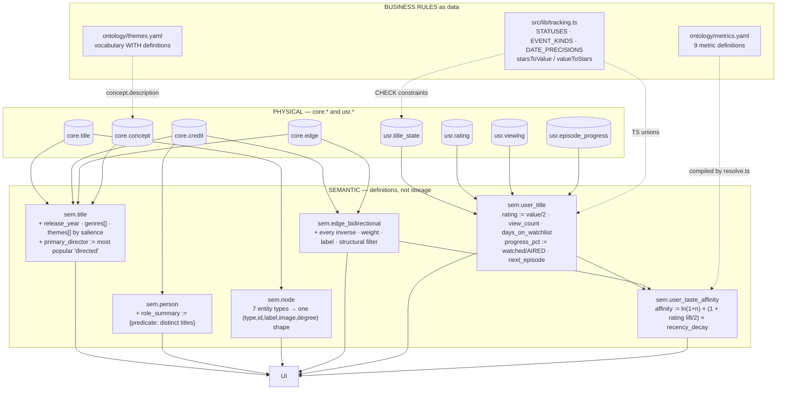

### 14.4 Standardized concepts and naming conventions

| Convention                 | Rule                                                   | Why                                                                        |
| -------------------------- | ------------------------------------------------------ | -------------------------------------------------------------------------- |
| **`sem.*` prefix**         | Only surface app code may query                        | `check-layers.sh` fails the build otherwise                                |
| **`user_` prefix**         | The view is account-scoped and RLS applies             | Reading `sem.user_title` without `withUser` returns zero rows              |
| **`::int` on every count** | `count(*)` is bigint → the driver returns a **string** | `view_count + 1` would silently become `"11"`                              |
| **`_at` suffix**           | A `timestamptz`                                        |                                                                            |
| **`_on` suffix**           | A `date` (`watched_on`, `first_watched_on`)            | Distinguishes a day from an instant                                        |
| **`predicate`**            | Always the canonical name                              | Inverse names (`directed_by`) exist only inside `sem.edge_bidirectional`   |
| **`canonical_predicate`**  | Carried alongside an inverse so joins work             | Joining `predicate_meta` on an inverse name drops half the graph, silently |

### 14.5 The metric layer

Nine metrics in [`ontology/metrics.yaml`](ontology/metrics.yaml); five active in `PHASE_1_METRICS`:
`genre_distribution`, `top_directors`, `rating_distribution`, `viewing_over_time`,
`watchlist_aging`. Declared but not rendered: `theme_distribution`, `franchise_coverage`,
`completion_rate`, `under_watched_genres`.

`resolveMetric(name, accountId)` compiles a definition into account-scoped SQL. Two safety
properties: `assertSemanticSource` requires the `source` to begin with `sem.`, and the account id is
always a bound parameter.

### 14.6 The best evidence that the semantic layer is load-bearing

From [`suggestions.ts`](src/server/repos/suggestions.ts):

> This is the clearest demonstration in the app that the semantic layer is load-bearing:
> `sem.user_taste_affinity` **already existed** and already powered the five metrics on
> `/universe/me`. One view, another feature, no new model and no new table.
>
> The product rule is that **the REASON is the product.** A recommendation you cannot interrogate is
> indistinguishable from a guess.

Each suggestion carries `reasons: { label, predicate, n }[]`, rendered by
[`suggestion-copy.ts`](src/lib/suggestion-copy.ts) into a sentence: _"Denis Villeneuve, whose work
you have watched 4 of."_ The evidence is the same edges the graph draws.

One detail in that view is a bug fix worth reading:

> The canonical name, because the affinity row holds the INVERSE (`directed_by`) while the person →
> title edge holds the forward one (`directed`). Coverage has to compare like with like: counting
> every edge from a person to a title said **Nolan had 44 films when he directed 19**, silently
> folding in his writing and producing credits.

And `similar_to` is deliberately excluded from the affinity predicate list: _"it is derived FROM
this kind of signal, so feeding it back in would count the same evidence twice."_

---

## 15. Semantic layer vs. ontology

### 15.1 Four layers, one example

Take: **Denis Villeneuve directed Arrival.**

| Layer              | What it says                                                                                                                                                                                                                                                                                                                                                                                             |
| ------------------ | -------------------------------------------------------------------------------------------------------------------------------------------------------------------------------------------------------------------------------------------------------------------------------------------------------------------------------------------------------------------------------------------------------- |
| **Database**       | A `core.credit` row: `person_id=…`, `title_id=…`, `predicate='directed'`, `job='Director'`, `department='Directing'`, `billing_order=NULL`, `source='tmdb'`                                                                                                                                                                                                                                              |
| **Ontology**       | `directed` is a predicate whose domain is `{person}` and range is `{title, episode}`; its inverse is `directed_by`; it is stored in `core.credit`; it costs **1.0** to traverse — among the most explanatory relationships in the vocabulary                                                                                                                                                             |
| **Semantic layer** | `sem.edge` projects it with `attributes = {job: 'Director'}` and `provenance = 'asserted'`. `sem.person.role_summary` counts it as one of Villeneuve's `directed` titles. `sem.title.primary_director` resolves it to the string "Denis Villeneuve" — _the most popular person with a title-level directed credit_. `sem.user_taste_affinity` converts it into an affinity score if you have watched it. |
| **UI**             | "Directed by Denis Villeneuve" on the detail page; a gold node on the constellation; _"Denis Villeneuve, whose work you have watched 4 of"_ under a suggestion                                                                                                                                                                                                                                           |

**The ontology says the statement is well-formed. The semantic layer says what it means for this
product. The database says where the bytes are. The UI says it in English.**

### 15.2 A second example where the four diverge more sharply

**Take: this film explores Memory.**

| Layer              | What it says                                                                                                                                                                                                                                                           |
| ------------------ | ---------------------------------------------------------------------------------------------------------------------------------------------------------------------------------------------------------------------------------------------------------------------- |
| **Database**       | `core.edge` row, `predicate='explores_theme'`, `attributes={"salience":0.9,"derived_from":"tmdb_keywords"}`, `provenance='curated'`, `source='crosswalk'`                                                                                                              |
| **Ontology**       | `explores_theme`: domain `{title}`, range `{concept}` **restricted to scheme `theme`**; inverse `explored_by`; weight 2.6. The trigger would reject this edge if it pointed at a genre.                                                                                |
| **Semantic layer** | `sem.title.themes` includes "Memory", ordered by salience ahead of weaker themes. `deriveThemes` defines the rule: sum salience across the title's keywords, keep the top 6 above 0.5. `themes.yaml` supplies the _definition_ — which lands in `concept.description`. |
| **UI**             | An accent-outlined chip, visually distinct from neutral genre chips                                                                                                                                                                                                    |

The divergence is the point. The **ontology** does not know what "Memory" means — only that it is a
legal object for this predicate. The **semantic layer** knows the threshold, the cap, the ordering,
and the one-sentence definition. Neither is redundant.

### 15.3 The division of labor

|                       | Ontology                                       | Semantic layer                               |
| --------------------- | ---------------------------------------------- | -------------------------------------------- |
| **Expressed in**      | `ontology.yaml` → `core.predicate_meta`        | `sem.*` views, `metrics.yaml`, `tracking.ts` |
| **Answers**           | "Is this statement well-formed?"               | "What does this mean for a reader?"          |
| **Enforced by**       | CHECK constraints + trigger, at **write** time | Views computing at **read** time             |
| **Knows about users** | **No**                                         | **Yes** — `sem.user_*` is half of it         |
| **Changes when**      | A new relationship type is needed              | A new product question is asked              |
| **Failure mode**      | An insert raises an exception                  | A number is subtly wrong (Nolan's 44 films)  |

The last row is the practical difference. An ontology violation is **loud** — the database refuses.
A semantic-layer error is **quiet** — it produces a plausible number that is wrong, which is why
those views carry the densest comments in the codebase.

---

## 16. Derived data

### 16.1 The full inventory

| Derived value                            | Source data                       | Transformation                                      | Where used               | Computed            | Persisted         |
| ---------------------------------------- | --------------------------------- | --------------------------------------------------- | ------------------------ | ------------------- | ----------------- |
| `sem.title.release_year`                 | `release_date`                    | `EXTRACT(YEAR …)::int`                              | Every card               | Query time          | No                |
| `sem.title.genres[]`                     | `core.edge` + `core.concept`      | `array_agg` alphabetical                            | Detail, library filters  | Query time          | No                |
| `sem.title.themes[]`                     | `core.edge` + `core.concept`      | `array_agg` **by salience desc**                    | Detail chips             | Query time          | No                |
| `sem.title.primary_director`             | `core.credit` + `core.person`     | Most popular title-level `directed`                 | Cards, share pages       | Query time          | No                |
| `sem.person.role_summary`                | `core.credit`                     | `jsonb_object_agg(predicate, count DISTINCT title)` | Person page              | Query time          | No                |
| `sem.concept.title_count`                | `core.edge`                       | `count(*)` as object                                | Concept pages            | Query time          | No                |
| **Inverse of every edge**                | `sem.edge` + `predicate_meta`     | `UNION ALL` with swapped ends + inverse label       | All traversal            | Query time          | No                |
| `sem.user_title.rating`                  | `usr.rating`                      | `value::numeric / 2`, current only                  | Everywhere               | Query time          | No                |
| `sem.user_title.view_count`              | `usr.viewing`                     | `count(*)::int` where `episode_id IS NULL`          | Rewatch badge            | Query time          | No                |
| `sem.user_title.days_on_watchlist`       | `added_at`                        | `GREATEST(0, now()::date - added_at::date)`         | Watchlist aging          | Query time          | No                |
| `sem.user_title.episodes_aired`          | `core.episode`                    | `count(*) FILTER (air_date <= today)` via LATERAL   | Progress                 | Query time          | No                |
| `sem.user_title.progress_pct`            | above + progress rows             | `watched / aired`                                   | Progress rings           | Query time          | No                |
| `sem.user_title.next_episode_*`          | `core.episode` + progress         | LATERAL, lowest unwatched, `LIMIT 1`                | Continue Watching        | Query time          | No                |
| `sem.user_taste_affinity.affinity_score` | `sem.user_title` + edges          | `ln(1+n) × (1 + lift/2) × recency_decay`            | Metrics, suggestions     | Query time          | No                |
| **`core.node_degree.degree`**            | `sem.edge` both ends              | `count(*)` grouped                                  | Hub penalty, node radius | **Nightly cron**    | **Yes — matview** |
| **`core.edge_derived` (similar_to)**     | `core.credit` + edges             | **IDF over shared signals**                         | Similar rail, graph      | **On demand job**   | **Yes — table**   |
| **`core.edge` (explores_theme)**         | `title_keyword` + crosswalk       | Sum salience, top 6 above 0.5                       | Themes everywhere        | **On demand job**   | **Yes — table**   |
| **`usr.viewing.is_rewatch`**             | `usr.viewing`                     | `EXISTS(…)` at insert                               | Rewatch display          | **At write**        | **Yes**           |
| **`core.title.accent_color`**            | Poster image                      | Chroma-weighted dominant hue                        | Detail gradient, cards   | **Backfill script** | **Yes**           |
| **`core.title.sort_title`**              | `title`                           | `normalizeTitle()`                                  | ER blocking, search      | **At write**        | **Yes**           |
| Path cost / interestingness              | `sem.edge_bidirectional` + degree | Weighted sum, hub penalty                           | `/universe/connect`      | Query time          | **No**            |
| Path narration                           | `predicate_meta` labels           | Template composition, **no LLM**                    | Path chain               | Query time          | No                |
| Suggestions                              | `sem.user_taste_affinity`         | Bounded traversal + 2-per-seed cap                  | `/`                      | Query time          | No                |
| Graph node positions                     | Node/edge set                     | **Fruchterman–Reingold, 320 iterations**            | Constellation            | **Client-side**     | No                |
| Unread release mark                      | Cookie vs `releases.ts`           | Date comparison                                     | Me tab dot               | Middleware          | Cookie only       |

### 16.2 The pattern

**Almost nothing is persisted.** Four exceptions, each with a specific justification:

| Persisted              | Why not computed at read time                                                                                                                                      |
| ---------------------- | ------------------------------------------------------------------------------------------------------------------------------------------------------------------ |
| `core.node_degree`     | A `count(*)` over both ends of `sem.edge` per candidate node, inside a path query that already examines thousands of candidates. Refreshed `CONCURRENTLY` nightly. |
| `core.edge_derived`    | The IDF query is a multi-CTE aggregate over the whole corpus. It is an offline computation by nature.                                                              |
| `explores_theme` edges | Same — and it must be an _edge_ so the graph can traverse it and the trigger can validate it                                                                       |
| `is_rewatch`           | Its truth value **changes as history grows**. Computed at read time, the first viewing would retroactively become a rewatch.                                       |

The last is the subtlest and the most instructive: some derived values must be stamped because they
describe a moment, not a state.

### 16.3 Where each is computed

| Location                    | What                                                                                                                                                                           |
| --------------------------- | ------------------------------------------------------------------------------------------------------------------------------------------------------------------------------ |
| **Postgres, query time**    | Everything in `sem.*`. Progress, affinity, role summaries, inverses.                                                                                                           |
| **Postgres, scheduled**     | `core.node_degree` refresh                                                                                                                                                     |
| **Postgres, job-triggered** | `explores_theme`, `similar_to` — both wholesale recomputes                                                                                                                     |
| **Node, at write**          | `is_rewatch` (as SQL inside the insert), `sort_title`, slug                                                                                                                    |
| **Node, at read**           | Path ranking assembly, narration composition, suggestion copy                                                                                                                  |
| **Browser**                 | **Only graph layout.** 320 iterations of force simulation, then it stops — _"a simulation left running is a battery drain on a public page somebody may leave open in a tab."_ |

Nothing meaningful is computed client-side. The browser positions nodes; it does not decide what
they are.

---

## 17. Graph representation

### 17.1 The decisive question: is the graph the database, or separate?

**The graph is a projection of the relational database, computed per request. There is no graph
store, no separate graph model, and nothing is persisted in graph form.**

Every node and edge drawn on screen comes from a SQL query against `sem.node` and
`sem.edge_bidirectional`, executed in the server component that renders the page, and discarded
when the response is sent. Two consequences:

- The graph is **never stale** relative to the database, because it _is_ the database.
- The graph is **never cached**, so every view pays the query cost — bounded deliberately (see
  node caps below).

### 17.2 Node construction

`sem.node` is a seven-way `UNION ALL` flattening every entity type into one shape:

```sql
CREATE OR REPLACE VIEW sem.node AS
  SELECT 'title'::text AS node_type, t.id, t.slug, t.title AS label,
         CASE WHEN t.release_date IS NOT NULL
              THEN EXTRACT(YEAR FROM t.release_date)::text END AS sublabel,
         t.poster_path AS image_path, t.popularity
  FROM core.title t
  UNION ALL SELECT 'person', p.id, p.slug, p.name, p.known_for_department, p.profile_path, p.popularity FROM core.person p
  UNION ALL SELECT 'concept', c.id, c.slug, c.label, c.scheme, NULL, NULL FROM core.concept c
  UNION ALL SELECT 'collection', col.id, col.slug, col.name, col.kind, col.poster_path, NULL FROM core.collection col
  UNION ALL SELECT 'organization', o.id, o.slug, o.name, o.kind, o.logo_path, NULL FROM core.organization o
  UNION ALL SELECT 'character', ch.id, ch.slug, ch.name, NULL, NULL, NULL FROM core.character ch
  UNION ALL SELECT 'work', w.id, w.slug, w.title, w.kind, NULL, NULL FROM core.work w;
```

| Node property | Source                                                                   |
| ------------- | ------------------------------------------------------------------------ |
| **Node id**   | `(node_type, id)` — a composite. The client key is `` `${type}:${id}` `` |
| **Label**     | Title / person name / concept label / org name — per type                |
| **Sublabel**  | Release year, department, concept scheme, org kind — per type            |
| **Image**     | Poster, profile photo, logo — or null                                    |
| **Degree**    | `LEFT JOIN core.node_degree` — the matview                               |
| **Slug**      | For the href                                                             |

Note that the _sublabel_ carries different information per type. A concept's sublabel is its
`scheme` — so the UI can tell the reader a node is a theme rather than a genre without a second
query.

### 17.3 Edge construction

`sem.edge_bidirectional` is where the graph actually becomes traversable. Two UNION halves —
forward and inverse — joined to `core.predicate_meta`:

| Edge property                            | Source                                                             |
| ---------------------------------------- | ------------------------------------------------------------------ |
| `predicate`                              | The _directional_ name — `directed` forward, `directed_by` inverse |
| `canonical_predicate`                    | Always the forward name, for joining back                          |
| `is_inverse`                             | Which half produced this row                                       |
| `path_weight`                            | From `predicate_meta`                                              |
| `predicate_label` / `inverse_label`      | Narration templates                                                |
| `excluded_from_path_intermediates`       | Hub rule                                                           |
| `provenance`, `confidence`, `attributes` | Carried from `sem.edge`                                            |

Both halves filter `WHERE NOT m.is_structural`, which is what keeps `season_of` and `episode_of` out
of the graph entirely.

**The comment on this view records a failure mode worth memorizing:**

> Inverse rows carry an inverse predicate name (`directed_by`) that does **NOT** exist in
> `core.predicate_meta`, which is keyed on canonical names (`directed`). Any query that joins
> `predicate_meta` on `predicate` therefore silently drops every inverse edge — **half the graph** —
> and returns nothing, with no error.

And symmetric predicates are included in the inverse half _deliberately_:

> A symmetric edge is stored exactly once, in canonical order. Skipping its inverse row does not
> avoid a duplicate — it deletes the other direction outright, so `similar_to` would be reachable
> from A to B and never from B to A. […] just a title whose "similar" list is silently empty
> because it happened to sort second.

### 17.4 Two different graph shapes, for two different jobs

|             | `neighbors()`                            | `neighborhood()`               |
| ----------- | ---------------------------------------- | ------------------------------ |
| **Returns** | `NeighborGroup[]` — grouped by predicate | `Neighborhood` — nodes + edges |
| **Shape**   | A **star**, one hop                      | A **network**, two hops        |
| **Caps**    | 8 per group (12 on explore)              | 24 first ring, 60 second       |
| **Used by** | `NeighborGroups` list component          | `ConstellationCanvas`          |
| **Purpose** | Readable, accessible, grouped            | Drawable structure             |

**Why two hops is not an arbitrary choice** — this is the single best piece of reasoning in the
graph code:

> One hop is a star and cannot be anything else — a title's neighbors are people, concepts and
> studios, and nothing in the ontology joins those to each other directly. **Measured on _Paris,
> Texas_: 40 neighbors, zero edges between them.** Two hops turns that into ~54 nodes and ~262
> edges, because the second ring reconnects the first: two actors meet again at another film they
> were both in, and THAT is the structure worth drawing.

The first two renderer versions produced a bicycle wheel, and the fix was **in the query, not the
renderer**: _"No layout algorithm invents structure that is not there."_

**Hubs are excluded from the second ring** (`WHERE d.degree < 400`) — _"Drama has 2,139 connections
and would pull every node into one indistinguishable blob"_ — the same principle as the path
finder's `hubDegreeBan`.

**Deduplication before the LIMIT**, with a measured reason: _"a person holding four credit rows on
one show would otherwise consume four of the 24 first-hop slots and draw as one node, quietly
shrinking the ring to 21 distinct things."_

### 17.5 Database → rendered graph

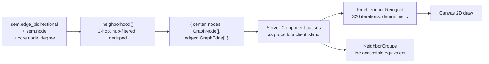

`GraphEdge` carries `source`/`target` as `` `${type}:${id}` `` strings _"so a renderer can index
without re-deriving"_ — a small but telling detail: the shape is designed for its consumer.

### 17.6 Positioning, filtering, interaction

**Positioning** is the only thing computed in the browser. Fruchterman–Reingold, 320 steps, with:

- The focused node **pinned at center** (`fixed: true`)
- **Deterministic seeding from the node index, never `Math.random`** — _"the same neighborhood must
  settle the same way every time, or a resize would reshuffle the picture under the reader's
  cursor"_
- O(n²) repulsion, explicitly justified: _"a quadtree would be optimizing the wrong thing"_ at ≤100
  nodes
- The simulation **runs once and stops**

**Node radius** is log-scaled on degree: `3.5 + min(8, log1p(degree) × 1.25)` — _"Drama has 2,139
connections and a source work has 8."_ Color is `graphPalette[node.type]`, one per entity type.

**Two filters, both client-side and non-destructive:**

| Filter                          | Effect                                                                        |
| ------------------------------- | ----------------------------------------------------------------------------- |
| **"Yours · N of M"**            | Highlights nodes in the `mine` set — the personal layer over the global graph |
| **Predicate highlight** (`lit`) | Clicking a predicate legend entry emphasizes edges of that type               |

Neither refetches. Both call `drawRef.current()` to repaint.

**Interaction:** hover shows a floating label; click runs `hit(e)` and `router.push(hrefOf(...))`.
There is **no expand/collapse** — navigating re-centers on a new node and issues a fresh query.

**The canvas is `aria-hidden`**, with a deliberate reason:

> Decorative: every node is a real link in the lists below. Adding these to the tab order would make
> a screen reader read the whole neighborhood twice.

`NeighborGroups` below it is the conforming equivalent — the same data, as grouped links.

---

## 18. Ontology visualization

### 18.1 The stack

| Layer         | Implementation                                                                              |
| ------------- | ------------------------------------------------------------------------------------------- |
| **Library**   | **None.** Hand-written Canvas 2D. No Sigma, no graphology, no D3, no React Flow.            |
| **Input**     | `Neighborhood { center, nodes: GraphNode[], edges: GraphEdge[] }`                           |
| **Layout**    | `simulate()` — Fruchterman–Reingold                                                         |
| **Render**    | `canvas.getContext('2d')`, redrawn on filter change                                         |
| **Component** | [`constellation-canvas.tsx`](src/components/graph/constellation-canvas.tsx), `'use client'` |

Using no library is itself a data-model statement: the graph is small and bounded by construction
(≤ 85 nodes), so the expensive part is the _query_, not the rendering.

### 18.2 Where it appears

| Route                             | Center node                               | Auth       |
| --------------------------------- | ----------------------------------------- | ---------- |
| `/universe`                       | `featuredNodes()` — a curated opener list | session    |
| `/universe/explore?focus=type:id` | The focused node                          | session    |
| `/explore`                        | A featured node                           | **public** |
| `/explore/[type]/[slug]`          | Resolved from the slug                    | **public** |

The public routes render the **same graph** with `linkTo: 'explore'` (slug URLs) rather than
`'universe'` (id URLs), and without the personal overlay.

**The opener list is a data-modeling lesson in itself.** It used to be `ORDER BY degree DESC`:

> degree turns out to be a poor proxy for "worth looking at". What it actually ranks first is
> anthology films whose 300 cameo credits are all one-offs, long-running procedurals, and studios —
> production credits on a thousand films make Universal the best-connected node in the corpus and
> the dullest possible thing to open on.

A high-degree node is not an interesting node. The same insight that drives the path finder's hub
penalty, arrived at independently from the front door.

### 18.3 What happens on click

1. `hit(e)` maps canvas coordinates to the nearest placed node within its radius
2. `hrefOf(node, linkTo)` builds `/universe/explore?focus=type:id` or `/explore/type/slug`
3. `router.push(...)` — a client-side navigation
4. The **server component re-runs**: `graphEngine.node()`, `neighbors()`, `neighborhood()`, and
   `trackedAmong()` in parallel
5. A fresh neighborhood renders, re-simulated from scratch

There is no incremental expansion and no client-side graph state. **Every navigation is a new
query.** Simple, always correct, and it costs one round trip.

### 18.4 What is _not_ visualized

The ontology's **schema** — the predicate vocabulary itself — has no diagram in the app. What is
drawn is always an _instance_ graph: these specific titles and people, not "title →
belongs_to_genre → concept".

The closest thing to a schema view is `ontologyStats()` in
[`universe.ts`](src/server/repos/universe.ts), which renders counts as text:

```sql
SELECT (SELECT count(*) FROM core.title)   AS titles,
       (SELECT count(*) FROM core.person)  AS people,
       (SELECT count(*) FROM core.credit)  AS credits,
       (SELECT count(*) FROM core.edge) + (SELECT count(*) FROM core.edge_derived) AS edges,
       (SELECT count(*) FROM core.concept) AS concepts
```

plus `predicates: PREDICATES.length` from the generated module. **Note what that count means:** it
is the number of predicates _declared_, not the number carrying data. Eight of them have no rows,
so the displayed figure overstates the working vocabulary by about 38%.

---

## 19. Semantic-layer visualization

### 19.1 There are two visualizations, and they are separate

|                          | Ontology visualization                          | Semantic-layer visualization                                                              |
| ------------------------ | ----------------------------------------------- | ----------------------------------------------------------------------------------------- |
| **Where**                | `/universe/explore`, `/explore/*`               | `/universe/me`                                                                            |
| **Component**            | `ConstellationCanvas` + `NeighborGroups`        | `charts/index.tsx` — `Donut`, `RankedList`, `Histogram`, `Sparkline`, `BucketBar`, `Stat` |
| **Reads**                | `sem.node`, `sem.edge_bidirectional`            | `sem.user_taste_affinity`, `sem.user_title`, `sem.user_viewing`                           |
| **Shows**                | **The world** — what exists and how it connects | **You** — what you have watched and how you rate it                                       |
| **Same for every user?** | **Yes**, apart from the "Yours" highlight       | **No** — entirely per-account                                                             |
| **Rendering**            | Client component, Canvas 2D                     | **Server components, plain SVG, zero JS**                                                 |
| **Defined by**           | `ontology.yaml`                                 | `metrics.yaml`                                                                            |

They are genuinely different things and correctly kept apart:

- The constellation shows **structure**: nodes, edges, degree, predicate types.
- The charts show **distribution**: how your watching spreads across genres, directors, ratings and
  time.

You cannot read "I watch more sci-fi than anything else" off a graph, and you cannot read "Arrival
and Blade Runner 2049 share a director, a screenwriter and a cinematographer" off a donut.

### 19.2 Where they meet

`/universe/me` renders **both**: the charts, and a personal graph orbit. And `sem.user_taste_affinity`
is the join — it sits on top of `sem.edge_bidirectional` (the ontology) and `sem.user_title` (the
personal layer) and produces something neither could alone:

```sql
FROM sem.user_title ut
JOIN sem.edge_bidirectional e ON e.subject_type = 'title' AND e.subject_id = ut.title_id
JOIN sem.node n ON n.node_type = e.object_type AND n.id = e.object_id
WHERE ut.status = 'watched'
  AND e.predicate IN ('directed_by','written_by','features_actor',
                      'belongs_to_genre','explores_theme','part_of_franchise')
```

**That WHERE clause is a semantic decision, not a technical one.** It enumerates _"the predicates a
person would recognize as taste."_ `produced_by` is excluded — nobody's taste is "films made by
Legendary Pictures." `similar_to` is excluded because it is derived from this same signal.

### 19.3 Why the chart components ship no JavaScript

Six chart types, all **server components** rendering plain SVG. A chart library would have shipped
tens of kilobytes to draw six static shapes. The data is already aggregated in SQL by the time it
reaches the component — there is nothing left for the client to compute.

This is the visualization consequence of doing aggregation in the database: **if the server sends
finished numbers, the client needs no charting engine.**

---

## 20. Data lineage

### 20.1 Movies

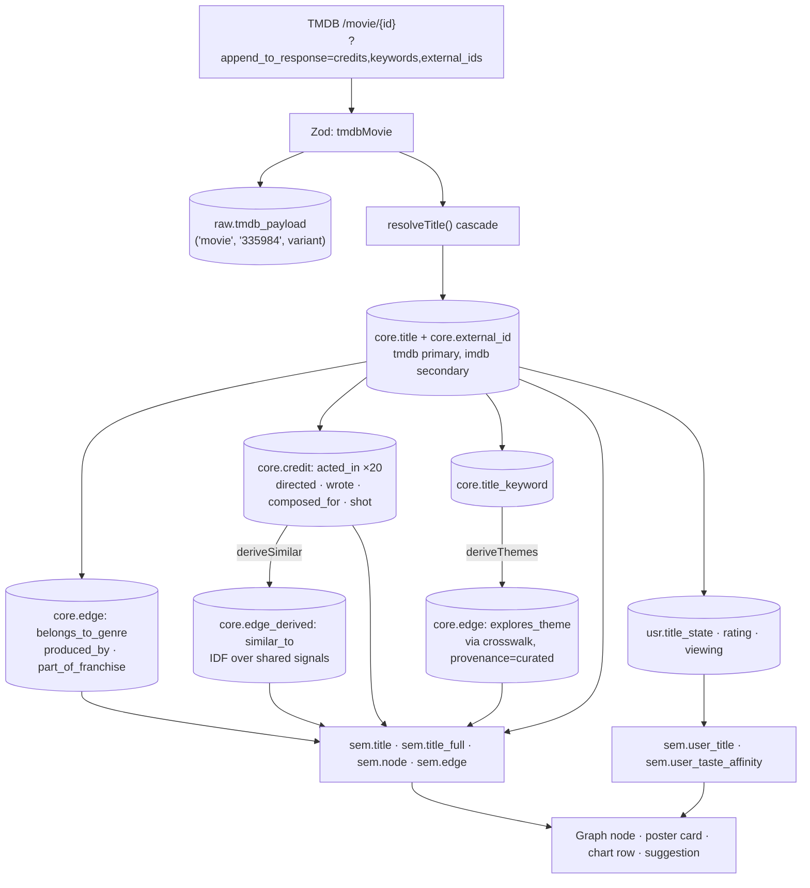

### 20.2 TV shows — the divergences

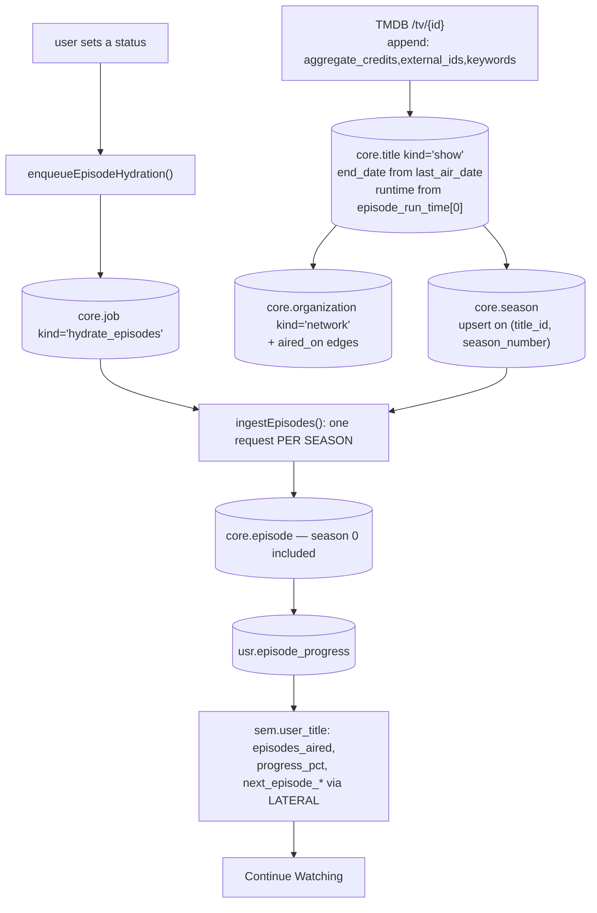

The critical branch: **episodes are not ingested until someone tracks the show.** Until then a show
has seasons but no episodes, and `episodes_aired` is 0, so `progress_pct` is `NULL` rather than a
misleading zero.

### 20.3 People

```
TMDB credits payload (id, name, photo, department)
  → ensurePerson() → resolvePerson() cascade
  → core.person (biography NULL, synced_at set, detail_synced_at NULL)
  → core.credit rows carry the ROLE as predicate
  → sem.person.role_summary = {"directed": 12, "acted_in": 3}
  → [user opens a person page]
  → TMDB /person/{id} → biography, birthday, also_known_as → detail_synced_at set
  → sem.node (person) → constellation node, gold
  → sem.user_taste_affinity (via directed_by / features_actor) → "Top directors" chart
```

### 20.4 Genres vs. themes — the same destination, opposite provenance

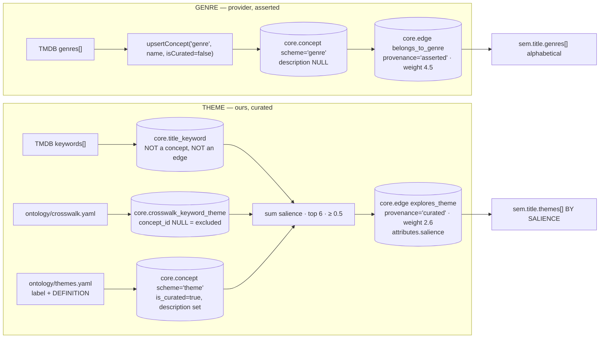

Two vocabularies, one table, opposite provenance — and the difference shows up as weight, ordering,
the presence of a definition, and chip styling.

### 20.5 User ratings and statuses

```
UI tap
  → track-controls.tsx (useOptimistic)
  → markWatchedAction / setRatingAction  [requireAccountId → Zod]
  → repo fn (accountId first)
  → withUser(): BEGIN; set_config('app.account_id', …, true)
      → usr.title_state UPSERT      (the standing relationship)
      → usr.state_event INSERT      (the transition, append-only)
      → usr.viewing INSERT          (the event, is_rewatch via EXISTS)
      → usr.rating supersede+INSERT (the judgment, versioned)
    COMMIT
  → sem.user_title            (rating/2, view_count, progress, next episode)
  → sem.user_taste_affinity   (ln(1+n) × rating lift × recency decay)
  → charts · suggestions · "Yours" highlight on the constellation
  → revalidatePath('/', '/library', '/title/[slug]')
```

**The lineage stops at `usr`.** No arrow points back into `core`.

---

## 21. CRUD lifecycle

| Entity                             | Create                                                             | Read                                      | Update                                                                                     | Delete                                                                                    | Upsert?                                   |
| ---------------------------------- | ------------------------------------------------------------------ | ----------------------------------------- | ------------------------------------------------------------------------------------------ | ----------------------------------------------------------------------------------------- | ----------------------------------------- |
| **`core.title`**                   | `persistMovie`/`persistShow` when `resolveTitle` returns `created` | `sem.title`, `sem.title_full`, `sem.node` | Re-ingest: **volatile fields only** (`popularity`, votes, `synced_at`)                     | **Never by app code**                                                                     | Yes, on `(slug)`                          |
| **`core.person`**                  | `ensurePerson` from a credits payload                              | `sem.person`, `sem.node`                  | Re-ingest refreshes `popularity`, `profile_path` (coalesced); detail fetch fills biography | Never                                                                                     | Yes, on `(slug)`                          |
| **`core.credit`**                  | Cast/crew loops during ingest                                      | `sem.edge`, `sem.title_credit`            | Refreshes `billing_order`, `episode_count`, `character_name_raw`                           | Cascade only                                                                              | Yes, on the 5-part natural key            |
| **`core.edge`**                    | `assertEdge`, `enrichWikidata`, `deriveThemes`                     | `sem.edge`, `sem.edge_bidirectional`      | `ON CONFLICT` updates `attributes`, `source`                                               | `deriveThemes` deletes `WHERE predicate='explores_theme' AND source='crosswalk'`          | Yes, on the 5-part natural key            |
| **`core.edge_derived`**            | `deriveSimilar`                                                    | `sem.edge`                                | Wholesale recompute                                                                        | `DELETE WHERE predicate='similar_to' AND method='shared_signal_idf_v1'`                   | Yes, natural key **+ method**             |
| **`core.concept`**                 | `upsertConcept` (genres), `deriveThemes` (themes)                  | `sem.concept`, `sem.node`                 | Label/description refresh                                                                  | Never                                                                                     | Yes, on `(scheme, slug)`                  |
| **`core.season`/`episode`**        | `persistShow` / `ingestEpisodes`                                   | `sem.season`, `sem.episode`               | Upsert refreshes names, air dates                                                          | Cascade from title                                                                        | Yes                                       |
| **`core.external_id`**             | Every entity creation                                              | `resolveTitle` step 1                     | `last_verified` touched                                                                    | Repointed on merge                                                                        | Yes, on the 3-part PK                     |
| **`core.title_keyword`**           | `attachCommon`                                                     | `deriveThemes`                            | —                                                                                          | Never                                                                                     | `DO NOTHING`                              |
| **`core.crosswalk_keyword_theme`** | `deriveThemes`                                                     | `deriveThemes`                            | Salience/decided_by refresh                                                                | **`DELETE` all, then rebuild** — the file is the source of truth                          | Yes, two unique indexes                   |
| **`core.job`**                     | `enqueue_job` (dedupes pending)                                    | `claim_jobs`                              | `finish_job` / `fail_job`                                                                  | `housekeeping` prunes                                                                     | Dedupe on `(kind, payload)` while pending |
| **`usr.title_state`**              | `setStatus`, `markWatched`, `toggleFavorite`                       | `sem.user_title`                          | Same functions                                                                             | **`removeFromLibrary` — hard delete**                                                     | Yes, on `(account_id, title_id)`          |
| **`usr.state_event`**              | Every status change and favorite toggle                            | Timeline, `source` analysis               | **Never**                                                                                  | **Never**                                                                                 | No — append only                          |
| **`usr.rating`**                   | `setRating`, `markWatched` with a value                            | `sem.user_title.rating`                   | Only `superseded_at` is ever set                                                           | `clearRating` supersedes; row stays                                                       | No — supersede + insert                   |
| **`usr.viewing`**                  | `markWatched`, log-a-viewing                                       | `sem.user_viewing`                        | Rarely                                                                                     | Cascade                                                                                   | No — events accumulate                    |
| **`usr.episode_progress`**         | `setEpisodeWatched`, `markThrough`, `markSeason`                   | `sem.user_title` LATERAL                  | —                                                                                          | Unticking deletes the row                                                                 | Yes, on `(account_id, episode_id)`        |
| **`usr.share`**                    | `createShare` (snapshots)                                          | `usr.share_by_slug()`                     | `view_count` increment; `revoked_at`                                                       | Never — revoked, not deleted                                                              | No                                        |
| **`usr.account`**                  | Better Auth `user.create` hook                                     | `getSession`                              | Profile edits                                                                              | **`usr.delete_account(uuid)` — hard delete, cascades all `usr`, leaves `core` untouched** | No                                        |

### 21.1 The three deletion behaviors, and what they mean

| Pattern         | Where                                                       | Meaning                                                       |
| --------------- | ----------------------------------------------------------- | ------------------------------------------------------------- |
| **Hard delete** | `removeFromLibrary`, `delete_account`, unticking an episode | The relationship genuinely ends                               |
| **Supersede**   | `usr.rating.superseded_at`                                  | The judgment changed; the old one is still true of its moment |
| **Revoke**      | `usr.share.revoked_at`                                      | The link is dead; the record that you shared it is not        |

Three ways to say "no longer current," because they are three different facts. And note that
`removeFromLibrary` leaves the `state_event` rows behind — _"Forget a title entirely. The event log
keeps that it once mattered."_

### 21.2 Nothing in `core` is ever deleted by the application

There is no delete path for a title, a person, a credit, or an entity-level edge. The only `DELETE`
statements against `core` are the two **wholesale recompute** clears in `deriveThemes` and
`deriveSimilar`, both narrowly scoped by `source` / `method`.

**Likely rationale:** a title someone tracked must not vanish because a provider retired it, and
cascade deletes from `core.title` would take user data with them.

---

## 22. Data integrity

### 22.1 The full mechanism inventory

| Layer                            | Mechanism                                                                | Example                                           | Catches                           |
| -------------------------------- | ------------------------------------------------------------------------ | ------------------------------------------------- | --------------------------------- |
| **TypeScript**                   | `strict: true`, no `any` at boundaries                                   | `Status` union from `STATUSES`                    | Compile-time misuse               |
| **Zod — inbound**                | Server-action input parsing                                              | `base.safeParse(input)`                           | Malformed client payloads         |
| **Zod — provider**               | `tmdbMovie`, `tmdbShow`, …                                               | `client.movie(id, tmdbMovie)`                     | **TMDB schema drift**             |
| **Database — FK**                | 35 foreign keys — 15 in `core`, 20 in `usr` — mostly `ON DELETE CASCADE` | `credit.person_id → person.id`                    | Orphans                           |
| **Database — PK**                | Surrogate UUIDs; composite PKs where the pair _is_ the key               | `title_state(account_id, title_id)`               | Duplicate relationships           |
| **Database — UNIQUE**            | Natural keys on every upsert target                                      | `edge_natural_uq`                                 | Duplicate facts                   |
| **Database — partial UNIQUE**    | Conditional uniqueness                                                   | `rating_current_uq WHERE superseded_at IS NULL`   | Two current ratings               |
| **Database — NOT NULL**          | Required fields                                                          | `title.sort_title`, `account.display_name`        | Missing identity data             |
| **Database — CHECK (enum)**      | Built from `tracking.ts` arrays                                          | `status IN ('watchlist',…)`                       | Typo'd status values              |
| **Database — CHECK (range)**     |                                                                          | `value BETWEEN 1 AND 10`                          | A rating of 47                    |
| **Database — CHECK (shape)**     | Cross-column consistency                                                 | `state_event_shape_ck`, `viewing_date_present_ck` | Half-written rows                 |
| **Database — CHECK (generated)** | From `ontology.yaml`                                                     | `edge_predicate_declared`                         | Undeclared predicates             |
| **Database — TRIGGER**           | `core.assert_edge_valid()`                                               | Domain, range, storage, **subtype**               | Ontology violations               |
| **Database — RLS**               | `FORCE ROW LEVEL SECURITY` + `WITH CHECK`                                | `own_rows` on 7 tables                            | Cross-tenant reads **and writes** |
| **Database — GRANT**             | `app_web` has no write on `core`; no UPDATE/DELETE on `state_event`      |                                                   | Whole categories of write         |
| **Application**                  | `assertSemanticSource` requires `sem.` prefix                            | Metric resolver                                   | A metric reaching into `core`     |
| **Application**                  | `requireAccountId()` **throws**                                          | Every action                                      | Unscoped queries                  |
| **CI**                           | `check-layers.sh`, `check-drift.ts`                                      |                                                   | Layer violations, ontology drift  |

### 22.2 The cross-column CHECKs are the unusual ones

Most schemas stop at type and enum checks. Three here assert _relationships between columns_:

```sql
-- A status_change must say what it changed to; a favorite event must not pretend to be one.
CHECK ( (event_kind = 'status_change' AND to_status IS NOT NULL)
     OR (event_kind <> 'status_change' AND to_status IS NULL AND from_status IS NULL) )

-- 'unknown' precision is the ONLY case where a watched date may be absent.
CHECK (watched_on IS NOT NULL OR date_precision = 'unknown')

-- medium is optional, but if present must be from the vocabulary
CHECK (medium IS NULL OR medium IN ('theater','streaming','physical','tv','flight'))
```

Each prevents a row that is individually type-valid and semantically incoherent — the class of bad
data that is hardest to find later because nothing errors.

### 22.3 What happens if bad data tries to enter

| Attempt                                                               | Result                                                                                   |
| --------------------------------------------------------------------- | ---------------------------------------------------------------------------------------- |
| `INSERT core.edge` with `predicate = 'stars_in'`                      | **CHECK violation.** _"predicate is not declared"_                                       |
| `INSERT` `directed` with a `title` subject                            | **Trigger.** _"ontology violation: directed subject must be one of {person}, got title"_ |
| `INSERT` `explores_theme` pointing at a **genre** concept             | **Trigger, subtype check.** _"requires a concept in scheme {theme}"_                     |
| `INSERT` `aired_on` pointing at a **studio**                          | **Trigger.** _"requires an organization of kind {network}"_                              |
| `INSERT` `similar_to` into `core.edge`                                | **Trigger, storage check.** _"predicate is stored in core.edge_derived, not core.edge"_  |
| `INSERT usr.rating` with `value = 47`                                 | **CHECK violation**                                                                      |
| Second current rating for the same title                              | **Partial unique index violation**                                                       |
| `usr.title_state` with `status = 'wathced'`                           | **CHECK violation**                                                                      |
| `state_event` with `event_kind='favorited'` and `to_status='watched'` | **Shape CHECK violation**                                                                |
| `usr.viewing` with no date and precision `'day'`                      | **Date-present CHECK violation**                                                         |
| Insert into `usr.*` with someone else's `account_id`                  | **RLS `WITH CHECK`** — rejected                                                          |
| App code attempting `INSERT core.edge`                                | **Permission denied** — no grant                                                         |
| TMDB returns a string where a number was                              | **Zod throws** at the client boundary; circuit breaker counts it                         |
| Duplicate ingest of the same movie                                    | **No error** — natural-key upsert converges                                              |

The pattern: **a malformed claim fails loudly at write time, in the database, at the point of
insertion.** Nothing coerces, nothing skips, nothing "cleans."

### 22.4 The gaps, honestly

| Gap                                                             | Risk                                                                                             |
| --------------------------------------------------------------- | ------------------------------------------------------------------------------------------------ |
| `core.edge.subject_id`/`object_id` have **no FK** — polymorphic | A deleted entity would leave a dangling edge. Mitigated by nothing in `core` ever being deleted. |
| `core.external_id.entity_id` has no FK                          | Same                                                                                             |
| `usr.note.subject_id` has no FK **and no trigger**              | The only unguarded polymorphic reference in the model                                            |
| `usr.rating.viewing_id` has no FK                               | A deleted viewing would orphan the link                                                          |
| `core.character.collection_id` has no FK                        | Moot — the table is empty                                                                        |
| `core.organization.parent_org_id` has no FK                     | Moot — never populated                                                                           |

### 22.5 A note on where enum vocabularies live

`src/lib/tracking.ts` is imported **by the Drizzle schema** — an unusual direction of dependency
that is exactly right here:

```ts
import { STATUSES, EVENT_KINDS, … , sqlInList } from '../../src/lib/tracking';
…
check('title_state_status_ck', sql.raw(`status IN (${sqlInList(STATUSES)})`))
```

One array produces both the TypeScript union and the database CHECK. They cannot drift. The file's
header records what it replaced:

> every one of these columns was plain `text` with the allowed values written in a comment above it,
> so the database would happily have stored a status with a typo in it and every query filtering on
> the real value would quietly miss it.

---

## 23. Data consistency

### 23.1 If TMDB changes a movie's metadata

Nothing happens automatically. Reconciliation is pull-based, through two paths:

| Path                | Trigger                                          | What refreshes                     |
| ------------------- | ------------------------------------------------ | ---------------------------------- |
| `refresh_stale` job | Daily cron                                       | Titles whose `synced_at` is oldest |
| `hydrateOnDemand`   | Someone opens a title we hold but consider stale | That title                         |

And on re-ingest, **only the volatile fields are updated**:

```sql
UPDATE core.title SET popularity = $1, popularity_as_of = now(),
       vote_average = $2, vote_count = $3, synced_at = now() WHERE id = $4
```

**A corrected title, overview, or runtime on TMDB does not propagate to an existing row.** Edges
and credits _are_ re-upserted and do converge — a newly-added cast member appears, and a
`billing_order` correction lands. But scalar title attributes are treated as stable after first
ingest.

> **Likely rationale:** the fields that change are the ones stamped as volatile, and re-writing a
> title's name would invalidate the slug relationship. Whether this is intentional or an oversight
> is not stated anywhere in the code — it is simply what the `else` branch does. If TMDB fixes a
> typo in a title, this application keeps the typo.

**Deleted upstream.** No handling. A title retired by TMDB stays in `core` indefinitely. **Likely
rationale:** a user who tracked it should not lose their history because a provider reorganized.

### 23.2 If a user removes a title from their watchlist

```sql
DELETE FROM usr.title_state WHERE account_id = $1 AND title_id = $2
```

| Affected                                            | Result                                                               |
| --------------------------------------------------- | -------------------------------------------------------------------- |
| `usr.title_state`                                   | Row deleted                                                          |
| `usr.state_event`                                   | **Untouched.** The history that it once mattered survives.           |
| `usr.rating`, `usr.viewing`, `usr.episode_progress` | **Untouched** — no cascade from `title_state`                        |
| `sem.user_title`                                    | The title disappears (the view is `FROM usr.title_state`)            |
| `sem.user_taste_affinity`                           | Its edges stop contributing                                          |
| **The ontology / graph**                            | **Nothing changes.** Not one row in `core`.                          |
| The constellation                                   | The node still renders; it simply stops being highlighted as "yours" |

That last pair is the clearest statement of the architecture. **Removing a film from your watchlist
does not remove it from the world.**

Worth noting as a modeling consequence: ratings and viewings **outlive** the `title_state` row.
Re-adding the title later restores a relationship that still has its rating attached, because
`sem.user_title` LEFT JOINs the current rating on `(account_id, title_id)` rather than through
`title_state`.

### 23.3 If a title were deleted from `core`

It is not, but the cascade is fully specified: `season`, `episode`, `credit`, `availability`,
`title_keyword`, and every `usr` table referencing it would cascade. **`core.edge` would not** — its
`subject_id`/`object_id` are polymorphic with no FK, so edges would dangle. The integrity guarantee
here rests on the delete never happening rather than on the constraint.

### 23.4 Ontology ↔ database consistency

Three mechanisms, and this is the tightest coupling in the system:

| Mechanism                                                   | Guarantees                                                                               |
| ----------------------------------------------------------- | ---------------------------------------------------------------------------------------- |
| `pnpm codegen`                                              | `predicate_meta`, CHECK constraints, trigger, and TS types all come from `ontology.yaml` |
| `scripts/check-drift.ts` in CI                              | Regenerates and diffs against what is committed — **the build fails if they disagree**   |
| `TRUNCATE core.predicate_meta` + re-INSERT on every migrate | The table cannot hold a stale predicate                                                  |

Remove a predicate from `ontology.yaml` and re-migrate, and the CHECK constraint would **reject
existing rows on their next update** while the trigger would refuse new ones. The ontology is not
advisory.

### 23.5 Derived data ↔ source data

| Derived                   | Consistency model                                        | Staleness window    |
| ------------------------- | -------------------------------------------------------- | ------------------- |
| `sem.*` views             | **Always consistent** — computed at read                 | Zero                |
| `core.node_degree`        | **Eventually consistent** — nightly refresh              | Up to 24h           |
| `explores_theme` edges    | **Manually consistent** — recomputed when the job is run | Unbounded until run |
| `similar_to` edges        | Same                                                     | Unbounded until run |
| `core.title.accent_color` | Backfill script only                                     | Unbounded           |

**`core.node_degree` is the one with a visible consequence.** It feeds the hub penalty and node
radius. A title ingested today has degree 0 in the matview until tomorrow — so it is never banned
as a path intermediate and draws at minimum radius. Harmless, self-correcting, and worth knowing
when a freshly-ingested node looks oddly small.

### 23.6 What is _not_ consistent, by design

| Boundary                                | Deliberate inconsistency                                                                          |
| --------------------------------------- | ------------------------------------------------------------------------------------------------- |
| `usr.share` snapshot vs. current rating | The share shows what you said **then**. See [ADR 0008](docs/adr/0008-share-snapshot-not-live.md). |
| `raw.tmdb_payload` vs. `core`           | The payload is a historical record. After pruning it holds only consumed fields.                  |
| `core.title.popularity` vs. TMDB now    | Always stale; the `popularity_as_of` stamp is the honesty mechanism                               |
| `core.availability` vs. reality         | Regional and weekly; `valid_to` bounds it                                                         |

Each of these is a case where "consistent with the source" would be the **wrong** goal. A snapshot
that updates is not a snapshot.

---

## 24. Caching and freshness

| Data                                | Source           | Cached?                     | Where                    | How fresh                                                   |
| ----------------------------------- | ---------------- | --------------------------- | ------------------------ | ----------------------------------------------------------- |
| TMDB search (`search/multi`)        | TMDB             | Yes                         | Next data cache          | `revalidate: 300` (5 min); 6s timeout                       |
| TMDB movie / show / credits         | TMDB             | Yes                         | Next data cache          | `revalidate: 86400` (24h)                                   |
| TMDB watch providers                | TMDB             | Yes                         | Next data cache          | `revalidate: 43200` (12h)                                   |
| TMDB trending / discover            | TMDB             | Yes                         | Next data cache          | `discoverCached`, per-endpoint                              |
| `sem.title`, `sem.node` and friends | Postgres         | **No**                      | —                        | Per request                                                 |
| **Anything `usr.*`**                | Postgres         | **Never**                   | —                        | Per request, always                                         |
| `core.node_degree`                  | Postgres         | **Yes — materialized**      | Matview                  | Nightly `refresh_degree`                                    |
| `explores_theme`, `similar_to`      | Postgres         | **Yes — persisted as rows** | `core.edge*`             | Until recomputed                                            |
| Session                             | Postgres         | Yes                         | `React.cache`            | One lookup per render                                       |
| Page HTML                           | —                | **No**                      | —                        | Every authenticated route reads `cookies()` → force-dynamic |
| Posters / backdrops                 | `image.tmdb.org` | Yes                         | Browser + service worker | Cache-first, 200-entry LRU                                  |
| Visited pages                       | —                | Yes                         | Service worker           | Stale-while-revalidate, 24h cap, 40 entries                 |
| `/offline`, `/icon-192.png`         | —                | Yes                         | Service worker           | Precached at install                                        |

### 24.1 Invalidation

**After a mutation**, `revalidateTracking(slug?)` calls:

```ts
revalidatePath('/');
revalidatePath('/library');
if (slug) revalidatePath(`/title/${slug}`);
```

Path-based, not tag-based — there are only three surfaces a tracking change can be visible on.

**The `usr.*` never-cache rule** is what makes this simple. If user data were cached, invalidation
would have to be per-account and every cached page would be a leak waiting for a mistake.

### 24.2 Freshness monitoring

`/api/health` asserts freshness as a _health_ signal, and the thresholds are set where they mean
something:

| Signal              | Threshold                         | Why that number                                                                                                    |
| ------------------- | --------------------------------- | ------------------------------------------------------------------------------------------------------------------ |
| Scheduled job age   | **48h** (`MAX_AGE_S`)             | Hobby cron is daily; a 24h bound fires on ordinary jitter                                                          |
| On-demand job kinds | **Undone work, not elapsed time** | Their last-run time only decays; two had already tripped a 48h bound while working perfectly                       |
| Queue stall         | **26h** (`QUEUE_STALL_S`)         | Longer than the gap between drains, so anything tripping it survived a drain unclaimed                             |
| Theme coverage      | **70%**                           | An **alert** threshold, not the 80% target — _"an alert that fires permanently […] is one people learn to ignore"_ |
| Corpus freshness    | **80% within 7 days**             | A weekly refresh cadence cannot satisfy a 48-hour window                                                           |

The governing idea, which generalizes well beyond this app: **a job that succeeds at doing nothing
is not healthy, and an alert that is always on is an alert nobody reads.**

### 24.3 Three things deliberately not cached

| Not cached           | Why                                                                                                              |
| -------------------- | ---------------------------------------------------------------------------------------------------------------- |
| Graph neighborhoods  | Bounded by construction (≤85 nodes); caching would add staleness for no measurable gain                          |
| Path-finding results | `core.path_cache` exists as a table and **is never used** — see [§36](#36-discrepancies-declared-vs-implemented) |
| Metric results       | Small per-user data; correctness beats a few milliseconds                                                        |

---

## 25. Data access patterns

| Pattern               | User intent                  | Query                                              | Tables / views                              | Transformation                                                      | Result                        |
| --------------------- | ---------------------------- | -------------------------------------------------- | ------------------------------------------- | ------------------------------------------------------------------- | ----------------------------- |
| **Search**            | "Find something"             | Parallel local + provider                          | `sem.title`, `sem.person` + TMDB            | Provider hits filtered against local `tmdb_id`; status chips merged | Two groups, deduped           |
| **Detail**            | "Tell me about this"         | Single-row hydration                               | `sem.title_full`                            | Nested cast/crew jsonb                                              | One page from few round trips |
| **Library**           | "What am I tracking?"        | Filter + sort                                      | `sem.user_title`                            | `status` filter or `is_favorite`; six sort modes                    | Poster grid                   |
| **Continue Watching** | "Where was I?"               | `status='watching'`, `next_episode_id IS NOT NULL` | `sem.user_title`                            | LATERAL-derived next episode                                        | Horizontal rail               |
| **Episode list**      | "Which have I seen?"         | Join progress to episodes                          | `sem.episode` + `usr.episode_progress`      |                                                                     | Checkbox list                 |
| **Neighbors**         | "What is this connected to?" | One hop, grouped                                   | `sem.edge_bidirectional`, `sem.node`        | `DISTINCT ON`, 8–12 per group, `+N more`                            | Grouped links                 |
| **Constellation**     | "Show me the shape"          | Two hops, hub-filtered                             | same + `core.node_degree`                   | Dedupe → cap 24/60 → force layout                                   | Canvas                        |
| **Path finding**      | "Why are these connected?"   | Bidirectional fixed-depth joins                    | `sem.edge_bidirectional` + degree           | Cost, hub ban, diversity filter, narration                          | 3 ranked paths                |
| **Metrics**           | "What is my taste?"          | Compiled from YAML                                 | `sem.user_taste_affinity`, `sem.user_title` | Account filter bound                                                | Chart rows                    |
| **Suggestions**       | "What should I watch?"       | Traverse from affinity seeds                       | `sem.user_taste_affinity` + edges           | 2-per-seed cap; reasons attached                                    | Ranked cards with evidence    |
| **Share page**        | (a stranger) "What is this?" | One row by slug                                    | `usr.share_by_slug()` + `sem.title`         | **Never opens a user transaction**                                  | Public page                   |
| **Export**            | "Give me my data"            | Everything for one account                         | All `usr.*`                                 | JSON                                                                | Download                      |

### 25.1 Why the schema looks the way it does

Read the table above backwards and the design choices explain themselves:

| Access pattern                                       | Schema consequence                                                          |
| ---------------------------------------------------- | --------------------------------------------------------------------------- |
| Library filters by status constantly                 | `title_state(account_id, status)` index; composite PK                       |
| Favorites is a separate shelf                        | Partial index `(account_id) WHERE is_favorite`                              |
| Cast lists are always ordered                        | `credit(title_id, predicate, billing_order)` — the whole query in one index |
| Filmography pages exist                              | `credit(person_id, predicate)`                                              |
| Traversal goes **both** ways                         | `edge(subject…)` **and** `edge(object…)`                                    |
| Search fires on a keystroke                          | Two `pg_trgm` GIN indexes on `person`, one on `title.sort_title`            |
| Progress must show _which_ episode is next           | `episode_progress` keyed by episode, not title; LATERAL in the view         |
| Path finding must penalize hubs                      | `core.node_degree` matview                                                  |
| Every list needs status + rating + progress together | **`sem.user_title` exists at all**                                          |

That last row is the one to internalize: **`sem.user_title` is a direct response to an access
pattern.** Without it, every list component would hand-roll a four-table join.

### 25.2 The one measured index

`core.person` carries two GIN trigram indexes, and the schema records why:

> `sort_name % 'john krasinski'` over 58,714 rows is a sequential scan computing similarity for
> every one, **measured at 109ms** — far too slow for something that fires on a keystroke. The
> btree above cannot serve a trigram operator; only a GIN trgm index can.

And a second, for the substring fallback: _"A leading wildcard defeats a btree, but a GIN trgm index
serves it — which is the difference between 29ms and a couple."_

---

## 26. Query patterns

### 26.1 The ordered cast list

```sql
SELECT … FROM sem.title_credit WHERE title_id = $1 AND predicate = 'acted_in' ORDER BY billing_order
```

Served entirely by `credit(title_id, predicate, billing_order)` — filter, sort and all. **This is
the query that justifies `core.credit` being its own table**; from `attributes jsonb` the sort would
be unindexable.

### 26.2 `sem.user_title` — the workhorse

One row per (account, title), assembled from four sources:

```sql
FROM usr.title_state ts
JOIN core.title t ON t.id = ts.title_id
LEFT JOIN usr.rating r ON r.account_id = ts.account_id AND r.title_id = ts.title_id
                      AND r.superseded_at IS NULL          -- the current rating only
LEFT JOIN LATERAL ( …aggregate episodes vs. progress… ) prog ON true
LEFT JOIN LATERAL ( …lowest unwatched episode, LIMIT 1… ) nxt ON true
```

Plus three correlated subqueries for `view_count`, `first_watched_on`, `last_watched_on`.

**Two LATERAL joins**, because each needs the outer row's `title_id` _and_ returns several columns.
The second is the "next episode" resolver — ordered, `LIMIT 1`, and correlated on both
`title_id` and `account_id`.

**Performance note:** for a large library this view does per-row subqueries. Data volumes here are
small (hundreds of rows per user), so it is a plain view; the spec's materialization plan was never
needed.

### 26.3 Bidirectional path finding

```
depth-1 ∪ depth-2 ∪ depth-3 from A    ⟕    same from B    →  meet  →  cost  →  diversity  →  top 3
```

**Explicit fixed-depth joins, not a recursive CTE.** Fixed depths let the planner use the covering
indexes and are far easier to `EXPLAIN` than a recursive CTE with array-based cycle detection.

Cost: `Σ predicate_weight × (1 + 0.45 × ln(1 + degree)) × (1/confidence)`, with nodes above degree
2,000 **banned** from intermediate positions and genre edges dropped entirely — _"in a two-hop path
both edges touch the intermediate, so there is no position where 'both are Drama' is worth saying."_

Then diversity: reject any path sharing more than 50% of its intermediates with one already emitted.

### 26.4 Similarity by inverse document frequency

`deriveSimilar` is the most analytically interesting query in the codebase, and it is pure SQL:

```sql
WITH corpus AS (SELECT count(*)::numeric AS n FROM core.title),
crew_df AS (
  SELECT person_id, count(DISTINCT title_id)::numeric AS df
  FROM core.credit WHERE episode_id IS NULL
    AND predicate IN ('directed','wrote','composed_for','shot')
  GROUP BY 1
),
crew AS (
  SELECT a.title_id AS x, b.title_id AS y,
         sum(ln(corpus.n / crew_df.df) *
             CASE a.predicate WHEN 'directed' THEN 1.6 WHEN 'wrote' THEN 1.1 … END) …
)
```

**IDF is doing the real work**, and the header says exactly why:

> Sharing "Drama" is worth almost nothing because 2,000 titles share it; sharing "Artificial
> Personhood" is worth a great deal because twelve do. Without that weighting every film is similar
> to every other film through its genre — **the same failure mode the path ranker's hub penalty
> exists to prevent.**

Raw scores are unbounded sums mapped smoothly to 0..1 (`HALF_SCORE = 8`) _"rather than clipping, so
ordering is preserved across the whole range."_ Top `SIMILAR_PER_TITLE = 12` neighbors are kept.

**And the result is explainable**: every edge carries the reason it exists, so the UI says
"director" or "theme" rather than "the algorithm says so." A content-based recommender whose output
is a sentence.

### 26.5 Theme derivation

```sql
WITH scored AS (
  SELECT tk.title_id, x.concept_id, sum(x.salience) AS score,
         row_number() OVER (PARTITION BY tk.title_id
                            ORDER BY sum(x.salience) DESC, x.concept_id) AS rn
  FROM core.title_keyword tk
  JOIN core.crosswalk_keyword_theme x ON lower(x.keyword_label) = lower(tk.keyword_label)
  WHERE x.concept_id IS NOT NULL
  GROUP BY tk.title_id, x.concept_id
), kept AS (
  SELECT title_id, concept_id, least(score, 1.0) AS salience
  FROM scored WHERE score >= 0.5 AND rn <= 6
)
INSERT INTO core.edge (…) SELECT 'title', title_id, 'explores_theme', 'concept', concept_id, …
```

A window function for top-N-per-group, a threshold, a cap, and `least(score, 1.0)` to respect the
ontology's declared 0..1 range. The tiebreaker on `concept_id` makes it **deterministic** — the same
corpus derives the same edges every run, which is what makes the idempotency test meaningful.

Note the join is on `lower(keyword_label)`, **not on the TMDB keyword id** — _"TMDB keyword ids are
stable, but the mapping is authored against human-readable names."_

### 26.6 Deduplication before limiting

Both `neighbors()` and `neighborhood()` open with `DISTINCT ON`, and both comments give measured
numbers:

> `sem.edge` unions `core.credit`, where one person can hold several rows under the same predicate —
> a TV writer credited on four episodes, a screenwriter listed as both Writer and Screenplay.
> Without this, that person occupied four of the twelve slots in their group, rendered with a
> duplicate React key, and inflated the "N more" count by the same amount. **Measured on the seeded
> corpus: 4 rows for one writer.**

`DISTINCT ON (predicate, object_type, object_id) … ORDER BY …, path_weight ASC` keeps the
strongest row per distinct neighbor.

### 26.7 Two performance rules that recur

**`::int` on every count.** `count(*)` is `bigint`; postgres.js returns it as a **string** to
protect precision. _"A string that looks like a number is worse than either, because
`view_count + 1` silently becomes `"11"`."_

**Bound every traversal.** Frontier cap 4,000, first ring 24, second ring 60, 8–12 per group,
similar 12 per title, themes 6 per title, paths 3. Nothing in the graph layer is unbounded.

---

## 27. Data architecture tradeoffs

### 27.1 One Postgres, no graph database

|                    |                                                                                                                                                                                                                            |
| ------------------ | -------------------------------------------------------------------------------------------------------------------------------------------------------------------------------------------------------------------------- |
| **Decision**       | All traversal is SQL against `sem.edge_bidirectional`. No Neo4j, no AGE, no separate store.                                                                                                                                |
| **Benefit**        | The user layer can **join to the graph**. "My watched films grouped by director" is one query the planner optimizes. Entity resolution runs once. One backup, one migration tool, one connection pool.                     |
| **Cost**           | Path finding is hand-written SQL rather than a two-line Cypher query. No native variable-length pattern matching. The `findPaths` query is long.                                                                           |
| **Alternative**    | Neo4j alongside Postgres, synced by a pipeline                                                                                                                                                                             |
| **Why it matters** | Across two stores, `sem.user_taste_affinity` becomes application-level join code: pull ids from the graph, pass a 5,000-element array into Postgres, merge in TypeScript. **That is the code you would write most often.** |

The escape hatch is pre-built: `GraphEngine` in [`types.ts`](src/lib/graph/types.ts) is a
three-method interface, and [ADR 0003](docs/adr/0003-no-graph-database.md) records the trigger
conditions — p95 `findPaths` above 250 ms, more than 5M edges, or a feature needing unbounded
pattern matching.

### 27.2 Local corpus vs. live API

|                    |                                                                                                                                                                                                                             |
| ------------------ | --------------------------------------------------------------------------------------------------------------------------------------------------------------------------------------------------------------------------- |
| **Decision**       | Ingest and store canonical data locally; query TMDB only for search and unknown titles                                                                                                                                      |
| **Benefit**        | The graph exists at all. You cannot traverse an API. Sub-millisecond joins, no rate limit on reads, works when TMDB is down.                                                                                                |
| **Cost**           | Staleness. Storage. An ER problem that would not exist otherwise.                                                                                                                                                           |
| **Alternative**    | Proxy everything live                                                                                                                                                                                                       |
| **Why it matters** | A live-API design could show a title's cast. It could not compute `node_degree`, rank paths, or derive similarity across a corpus — **every interesting feature in this app requires the corpus to be local and joinable.** |

### 27.3 Generated UUIDs vs. TMDB ids as keys

|                    |                                                                                                                                                                                                                                                   |
| ------------------ | ------------------------------------------------------------------------------------------------------------------------------------------------------------------------------------------------------------------------------------------------- |
| **Decision**       | UUIDv7 primary keys; `core.external_id` as a crosswalk                                                                                                                                                                                            |
| **Benefit**        | Multiple providers per entity. Reversible merges. Entities with no TMDB id at all (`core.work`). No vendor coupling in `usr.*`. Time-sortable, index-friendly.                                                                                    |
| **Cost**           | Every ingest starts with a crosswalk lookup. One more table. Debugging needs a join.                                                                                                                                                              |
| **Alternative**    | `tmdb_id integer PRIMARY KEY`                                                                                                                                                                                                                     |
| **Why it matters** | Wikidata supplies `based_on` for titles TMDB already gave us. With `tmdb_id` as identity, that fact has nowhere to attach except through a lookup table — **which is `core.external_id`, so you build it anyway, just later and under pressure.** |

### 27.4 Hybrid edge storage: typed `credit` + generic `edge`

|                    |                                                                                                                                                                                        |
| ------------------ | -------------------------------------------------------------------------------------------------------------------------------------------------------------------------------------- |
| **Decision**       | ~85% of edges in a typed table with real columns; the long tail in a polymorphic one                                                                                                   |
| **Benefit**        | The hottest query (ordered cast list) is one index scan. The long tail costs no schema changes.                                                                                        |
| **Cost**           | `sem.edge` must UNION three tables. Two mental models.                                                                                                                                 |
| **Alternative**    | All edges generic (cast list becomes an unindexable jsonb sort) or all typed (a table per predicate)                                                                                   |
| **Why it matters** | The 80/20 split is real: one relationship type dominates by volume **and** needs attributes, and the rest need neither. See [ADR 0004](docs/adr/0004-credit-table-vs-generic-edge.md). |

### 27.5 Separating `core.edge_derived`

|                    |                                                                                                                                                                                                |
| ------------------ | ---------------------------------------------------------------------------------------------------------------------------------------------------------------------------------------------- |
| **Decision**       | Identical shape, separate table, distinguished only by being computed                                                                                                                          |
| **Benefit**        | `TRUNCATE` is always safe. Provider facts and human curation cannot be destroyed by a bad inference run. `method` lets generations coexist.                                                    |
| **Cost**           | One extra table; a three-way UNION in `sem.edge`                                                                                                                                               |
| **Alternative**    | A `provenance = 'derived'` flag on one table                                                                                                                                                   |
| **Why it matters** | With a flag, recomputation is `DELETE WHERE provenance='derived'` — one typo away from deleting curated rows. **The separation makes the dangerous operation impossible rather than careful.** |

### 27.6 Views as the only application surface

|                    |                                                                                                                                                                                                                                                                 |
| ------------------ | --------------------------------------------------------------------------------------------------------------------------------------------------------------------------------------------------------------------------------------------------------------- |
| **Decision**       | `sem.*` only; enforced by `scripts/check-layers.sh` in CI                                                                                                                                                                                                       |
| **Benefit**        | Provider schema changes are absorbed in ingest. Business definitions live in one place. Refactoring `core` does not touch the app.                                                                                                                              |
| **Cost**           | A view for every access pattern. Some views do per-row subqueries. Changing a view's column order requires a drop and recreate.                                                                                                                                 |
| **Alternative**    | Query `core` directly with a repository convention                                                                                                                                                                                                              |
| **Why it matters** | A semantic layer that the application is merely _encouraged_ to use erodes in about three sprints — someone needs one column that is not in a view, reaches into `core`, and the view becomes optional. **A build failure is what keeps the abstraction real.** |

### 27.7 Deriving themes rather than adopting keywords

|                    |                                                                                                                                                                                                                                                                                                                    |
| ------------------ | ------------------------------------------------------------------------------------------------------------------------------------------------------------------------------------------------------------------------------------------------------------------------------------------------------------------ |
| **Decision**       | TMDB keywords → `core.title_keyword` (not concepts); a curated 120-theme vocabulary (in 17 clusters) with definitions; an authored crosswalk between them                                                                                                                                                          |
| **Benefit**        | A defensible vocabulary. Themes carry meaning and salience. Re-derivable from stored data. Genuinely ours.                                                                                                                                                                                                         |
| **Cost**           | Hours of authoring. Incomplete coverage (~76% against an 80% goal). `decided_by = 'llm_draft'` rows still awaiting review.                                                                                                                                                                                         |
| **Alternative**    | Treat each keyword as a concept                                                                                                                                                                                                                                                                                    |
| **Why it matters** | A folksonomy is not a vocabulary. _"New york city" is a setting, not a theme._ Adopting 40k keywords would produce a graph where everything connects to everything through noise — and the crosswalk's explicit **exclusion** rows ("considered and deliberately not a theme") are as informative as the mappings. |

### 27.8 A job table instead of a queue service

|                    |                                                                                                                                                                                                                                                  |
| ------------------ | ------------------------------------------------------------------------------------------------------------------------------------------------------------------------------------------------------------------------------------------------ |
| **Decision**       | `core.job` + `FOR UPDATE SKIP LOCKED` + a cron drain                                                                                                                                                                                             |
| **Benefit**        | Enqueue happens in the same transaction as the data that motivates it. No fifth vendor. Dedupe on `(kind, payload)` is a unique index.                                                                                                           |
| **Cost**           | No fan-out, no durable multi-step workflows, no dashboard. Bounded by the cron cadence — **daily on Vercel Hobby**, which forced on-demand hydration to be synchronous.                                                                          |
| **Alternative**    | Inngest, QStash, SQS                                                                                                                                                                                                                             |
| **Why it matters** | See [ADR 0011](docs/adr/0011-job-table-over-queue-service.md). The daily-cron constraint visibly shaped the data flow: episodes hydrate on tracking rather than on ingest, and `after()` drains on mutation so tracking does not wait for 4 a.m. |

### 27.9 Storing ratings as `smallint` 1..10

|                    |                                                                                                                                                                                            |
| ------------------ | ------------------------------------------------------------------------------------------------------------------------------------------------------------------------------------------ |
| **Decision**       | Half-stars as integers; convert at the edges                                                                                                                                               |
| **Benefit**        | No floating-point comparison hazards. A CHECK constraint is trivially expressible. Ten discrete values are exactly ten.                                                                    |
| **Cost**           | Every read and write converts. A reader seeing `value = 9` must know it means 4.5.                                                                                                         |
| **Alternative**    | `numeric(2,1)`                                                                                                                                                                             |
| **Why it matters** | The conversion is centralized in `tracking.ts` and `sem.user_title`, and `starsToValue` **throws rather than rounding silently** — an out-of-range rating is a bug, not a value to coerce. |

### 27.10 Ontology as a table, not as code

|                    |                                                                                                                                                                                                                                             |
| ------------------ | ------------------------------------------------------------------------------------------------------------------------------------------------------------------------------------------------------------------------------------------- |
| **Decision**       | `core.predicate_meta` + one generic trigger                                                                                                                                                                                                 |
| **Benefit**        | _"Adding a predicate changes data, never code."_ The validator is ~40 lines regardless of vocabulary size. `sem.edge_bidirectional` joins it for weights and labels.                                                                        |
| **Cost**           | Validation is a trigger — a per-row `SELECT` on every edge insert. Bulk ingest pays it.                                                                                                                                                     |
| **Alternative**    | Generated CHECK constraints per predicate, or application-level validation                                                                                                                                                                  |
| **Why it matters** | Application-level validation is bypassable by any direct connection. **The trigger already caught a real modeling error** — keywords written as `belongs_to_genre` edges — at the moment of insertion rather than in a report months later. |

---

## 28. Why a relational database can represent an ontology

### 28.1 The translation, term by term

| Graph / ontology concept  | Relational realization here                                                              |
| ------------------------- | ---------------------------------------------------------------------------------------- |
| **Node**                  | A row in an entity table, surfaced through `sem.node` as `(node_type, id, label, …)`     |
| **Node type / class**     | A table — `core.title`, `core.person` — plus the `node_type` discriminator in `sem.node` |
| **Edge**                  | A row in `core.credit`, `core.edge`, or `core.edge_derived`                              |
| **Edge type / predicate** | The `predicate` column, constrained by a generated CHECK                                 |
| **Edge direction**        | Column order: `(subject_type, subject_id) → (object_type, object_id)`                    |
| **Inverse edge**          | Generated at query time by the `UNION ALL` in `sem.edge_bidirectional`                   |
| **Edge properties**       | `attributes jsonb`, or real columns on `core.credit`                                     |
| **Many-to-many**          | A join table — which is what `core.credit` and `core.edge` are                           |
| **Domain / range**        | `predicate_meta.domain_types` / `range_types`, enforced by trigger                       |
| **Subclass / subtype**    | `concept.scheme`, `organization.kind`, checked by the same trigger                       |
| **Traversal**             | A `JOIN` on `sem.edge_bidirectional`                                                     |
| **Multi-hop traversal**   | Repeated joins — depth-1 ∪ depth-2 ∪ depth-3                                             |
| **Node degree**           | `core.node_degree`, a materialized `GROUP BY`                                            |
| **Edge weight**           | `predicate_meta.path_weight`                                                             |
| **Shortest / best path**  | Bidirectional joins + a cost function in SQL                                             |
| **Graph projection**      | A `SELECT` returning `{nodes, edges}`                                                    |

**Nothing in that table is a workaround.** A property graph _is_ a set of typed relations; a
relational database is a system for storing and querying typed relations. The mapping is direct.

### 28.2 Why it works so well at this scale

| Factor                  | Here                                                                                                             |
| ----------------------- | ---------------------------------------------------------------------------------------------------------------- |
| **Edge count**          | Hundreds of thousands. Graph databases earn their keep at 10⁸+.                                                  |
| **Path depth**          | Bounded at 3 per side. The hard case for SQL is _unbounded_ depth.                                               |
| **Query shape**         | Known and fixed — neighbors, two-hop, ranked paths. Not ad-hoc pattern matching.                                 |
| **The decisive factor** | **The user layer must join to the graph.** That join is free in one database and is application code across two. |

### 28.3 The two things SQL genuinely makes harder

**Unbounded variable-length paths.** `MATCH (a)-[*]->(b)` has no fixed-depth SQL equivalent; you
need a recursive CTE with array-based cycle detection, which is harder to write, harder to
`EXPLAIN`, and harder to bound. This application sidesteps it by capping depth at 3 — a product
decision as much as a technical one, since a 6-hop connection is not an explanation anyone believes.

**Verbosity.** `findPaths` is a long query. The Cypher equivalent would be a few lines. That is a
real cost, paid once, in one file, behind an interface.

### 28.4 When a graph database would actually start to pay

Per [ADR 0003](docs/adr/0003-no-graph-database.md), three documented triggers — plus two more the
data model suggests:

| Trigger                               | Why                                                                                   |
| ------------------------------------- | ------------------------------------------------------------------------------------- |
| **p95 `findPaths` > 250 ms**          | The point where SQL traversal stops being fast enough                                 |
| **> 5M edges**                        | Roughly 20× the current corpus                                                        |
| **Unbounded pattern matching needed** | "Find all cycles of collaboration"; "the shortest path of any length"                 |
| **Graph algorithms as a feature**     | PageRank, community detection, centrality — these have native implementations         |
| **Multiple graph projections**        | If person↔person, title↔title and user↔taste each needed distinct traversal semantics |

Note the second one carefully: **edges, not titles.** The corpus could grow 10× in titles and still
sit comfortably inside the threshold.

### 28.5 The honest framing

A relational database can represent an ontology, and this one does. What it does **not** do is give
you the ontology for free. Three pieces had to be built deliberately:

1. **`core.predicate_meta`** — without it, `predicate` is an unconstrained `text` column
2. **`assert_edge_valid()`** — without it, domain and range are documentation
3. **`sem.edge_bidirectional`** — without it, every query walks edges in one direction and quietly
   returns half the graph

In a graph database the first would be a schema feature, the second a constraint, and the third free.
Here all three are code. **That is the actual cost of this decision** — not performance, not
expressiveness, but the fact that you have to build the ontology machinery yourself and keep it
correct. The upside is that once built, it lives in the same transaction as everything else.

---

## 29. If Throughline became a true semantic platform

Exploration, not recommendation. The current architecture is right for what this is.

### 29.1 Current vs. potential

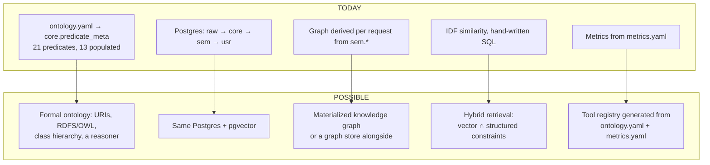

### 29.2 What would actually change

| Piece                  | Today                                                    | Would become                                                                                              | Real work                                                                                       |
| ---------------------- | -------------------------------------------------------- | --------------------------------------------------------------------------------------------------------- | ----------------------------------------------------------------------------------------------- |
| **Predicate registry** | `core.predicate_meta`                                    | Same table, plus URIs and `subPropertyOf`                                                                 | Small — the table already has the right shape                                                   |
| **Class hierarchy**    | **Nothing.** `broader_than` and `parent_id` unpopulated. | Populated hierarchy + transitive closure                                                                  | **Real work, and the most valuable single addition.** The vocabulary already declares clusters. |
| **Inference**          | None. `similar_to` is a hand-written aggregate.          | A reasoner deriving `influenced_by` transitively, or role inheritance                                     | Substantial. Needs a materialization and invalidation story.                                    |
| **Identity**           | Local UUIDs + `external_id`                              | Add `owl:sameAs`-style links to Wikidata QIDs                                                             | Small — `core.external_id` already holds QIDs                                                   |
| **Semantics**          | Definitions in `themes.yaml` → `concept.description`     | Formal axioms                                                                                             | Moderate                                                                                        |
| **Embeddings**         | None                                                     | `pgvector` over a **composed** document: title + themes + director + franchise — **not the raw overview** | Moderate. Neon supports pgvector.                                                               |
| **Retrieval**          | Structured only                                          | Vector similarity **∩** graph constraints                                                                 | Moderate                                                                                        |
| **Agent layer**        | None                                                     | Tools generated from `ontology.yaml` + `metrics.yaml`, account-scoped server-side                         | Moderate                                                                                        |
| **Serialization**      | JSON over RSC                                            | Optional RDF/JSON-LD export                                                                               | Small                                                                                           |

### 29.3 What survives unchanged

Most of it, which is the point:

| Survives                                    | Why                                                                                                                |
| ------------------------------------------- | ------------------------------------------------------------------------------------------------------------------ |
| **Four-schema separation**                  | Provenance separation is _more_ important with inference, not less. A reasoner's output belongs in `edge_derived`. |
| **`core.predicate_meta`**                   | Already the right shape. Add columns, do not rebuild.                                                              |
| **`assert_edge_valid()`**                   | Generic over the table. A richer ontology means more rows, not more code.                                          |
| **Three provenance tiers**                  | Inference makes `derived` essential — you must be able to drop every inferred fact                                 |
| **`core.edge_derived` as a separate table** | The reasoner's output table, already designed to be truncated                                                      |
| **`raw.tmdb_payload`**                      | Replay is what lets you re-derive under a new ontology                                                             |
| **`sem.*` views**                           | The boundary that makes any of this swappable                                                                      |
| **`usr.*` and RLS**                         | Entirely orthogonal to how sophisticated the ontology gets                                                         |
| **`GraphEngine` interface**                 | The swap point                                                                                                     |

### 29.4 The honest assessment

The gap between today and "a true semantic platform" is **narrower than it looks in one respect and
wider in another.**

Narrower: the infrastructure is there. A declared vocabulary, enforced domains and ranges, subtype
constraints, provenance tiers, a generic validator, and a replayable raw layer. Most applications
calling themselves semantic have none of that.

Wider: **there is no inference and no hierarchy.** `broader_than` has no rows, `parent_id` is never
set, and nothing derives a fact from other facts by rule — `similar_to` is a statistical
aggregate, not entailment. A semantic platform's defining capability is deriving what was not
stated, and this system currently only records what was.

**The single highest-value next step** would be populating the concept hierarchy that
`themes.yaml` already declares. It costs one change to `deriveThemes` (write clusters as parent
concepts and link them), and it would immediately make "films about Identity & Self" answerable
across its child themes — a query impossible today. `themes.yaml` declares **120 themes in 17
clusters**; every cluster is currently discarded at load.

---

## 30. Example: follow one movie through the entire data model

**Subject:** _Arrival_ (2016), TMDB id `329865`. Every stage below names the code that handles it.
Ids are illustrative; everything else is the actual behavior.

### Stage 1 — External: the TMDB record

```
GET https://api.themoviedb.org/3/movie/329865?append_to_response=credits,keywords,external_ids
```

**Exists:** only at TMDB. **Handled by:** `TmdbClient.movie()` —
[`client.ts`](src/server/providers/tmdb/client.ts), through `TokenBucket(30,30)` →
`CircuitBreaker(8, 30s)` → 4 retries → `tmdbMovie.parse()`.

### Stage 2 — `raw.tmdb_payload`

```sql
INSERT INTO raw.tmdb_payload (resource, source_id, variant, payload, http_status)
VALUES ('movie', '329865', 'credits,keywords,external_ids', '{"id":329865,…}'::jsonb, 200)
```

**Relationship created:** none. This is a record of _what a provider said, when_. **Why it matters
later:** revising the theme vocabulary re-derives _Arrival_'s themes from here, with no re-crawl.

### Stage 3 — Identity resolution

`resolveTitle(sql, { tmdbId: 329865, imdbId: 'tt2543164', kind: 'movie', title: 'Arrival',
releaseYear: 2016, runtimeMinutes: 116, topCastTmdbIds: [...] })` —
[`resolve.ts`](src/server/ingest/resolve.ts).

**First ingest:** no TMDB match, no IMDb match, the `(movie, 2015–2017)` block surfaces nothing
clearing the cast corroboration → `{ entityId: '', method: 'created', created: true }`.

**Every subsequent ingest:** step 1 hits on the TMDB id and short-circuits. ~97% of resolutions end
here.

### Stage 4 — `core.title`

```sql
INSERT INTO core.title (slug, kind, title, original_title, sort_title, release_date,
                        runtime_minutes, status, overview, original_language,
                        poster_path, backdrop_path, popularity, popularity_as_of, …)
VALUES ('arrival-2016', 'movie', 'Arrival', 'Arrival', 'arrival', '2016-11-10',
        116, 'Released', 'Taking place after…', 'en',
        '/<poster>.jpg', '/<backdrop>.jpg', 41.213, now(), …)
ON CONFLICT (slug) DO UPDATE SET title = excluded.title, synced_at = now()
RETURNING id
```

**Now exists:** `core.title.id = 018f3c7a-…` — a UUIDv7. **This is the application's identity for
_Arrival_ and it is not TMDB's.**

`slug` = `slugify('Arrival', 2016)` → `arrival-2016`, the URL forever.
`sort_title` = `normalizeTitle('Arrival')` → `arrival`, the ER blocking key and the trigram search
key.

### Stage 5 — `core.external_id` — the crosswalk

```sql
INSERT INTO core.external_id (source, source_id, entity_type, entity_id, is_primary, last_verified)
VALUES ('tmdb', '329865', 'title', '018f3c7a-…', true,  now()),
       ('imdb', 'tt2543164', 'title', '018f3c7a-…', false, now())
ON CONFLICT (source, source_id, entity_type) DO UPDATE SET last_verified = now()
```

**Two rows, one entity.** The IMDb row is what lets Wikidata attach in Stage 9 without creating a
duplicate.

### Stage 6 — Genre relationships

```sql
-- upsertConcept('genre', 'Drama', false)  →  concept_id
INSERT INTO core.edge (subject_type, subject_id, predicate, object_type, object_id, provenance, source)
VALUES ('title', '018f3c7a-…', 'belongs_to_genre', 'concept', '<drama>', 'asserted', 'tmdb')
```

**Three edges** — Drama, Science Fiction, Mystery. Each passes the CHECK (`belongs_to_genre` is
declared) and the trigger (subject `title` ✓, object `concept` ✓, **scheme is `genre`** ✓).

### Stage 7 — Person relationships

`ensurePerson({ id: 137427, name: 'Denis Villeneuve', … })` → `resolvePerson` → `core.person` row.

```sql
INSERT INTO core.credit (person_id, title_id, predicate, department, job,
                         character_name_raw, billing_order, source, source_credit_id)
VALUES ('<villeneuve>', '018f3c7a-…', 'directed', 'Directing', 'Director', NULL, NULL, 'tmdb', '…')
ON CONFLICT (person_id, title_id, predicate, coalesce(episode_id, …), coalesce(job, '')) DO UPDATE …
```

**The role became the predicate.** `Director` (a TMDB job string) → `directed` (an ontology
predicate) via `CREDIT_JOBS`. Villeneuve is **one person**; if he had also written it, that would be
a second `core.credit` row with `predicate = 'wrote'` — not a second person.

Amy Adams gets `predicate = 'acted_in'`, `job = 'Actor'`, `billing_order = 0`, and
`character_name_raw = 'Louise Banks'`. **`character_id` stays NULL** — nothing populates
`core.character`.

Eric Heisserer gets `wrote` (from `Screenplay`). Bradford Young gets `shot` (from `Director of
Photography`). Jóhann Jóhannsson gets `composed_for`. **Producers, editors and everyone else in the
crew array are silently skipped** — their job strings are not in `CREDIT_JOBS`.

### Stage 8 — Studios, franchise, keywords

```sql
-- produced_by, first 6 companies only
INSERT INTO core.edge (…) VALUES ('title', …, 'produced_by', 'organization', '<paramount>', 'asserted', 'tmdb');
-- keywords: NOT concepts, NOT edges
INSERT INTO core.title_keyword (title_id, keyword_source_id, keyword_label)
VALUES ('018f3c7a-…', '4565',  'dystopia'),
       ('018f3c7a-…', '9663',  'sequel'),
       ('018f3c7a-…', '14544', 'alien') …
ON CONFLICT DO NOTHING
```

_Arrival_ has no `belongs_to_collection`, so no `part_of_franchise` edge from TMDB.

### Stage 9 — Wikidata enrichment

`enrichWikidata` matches on the IMDb id from Stage 5 and finds _Story of Your Life_ by Ted Chiang:

```sql
INSERT INTO core.work (slug, kind, title, author_person_id) VALUES ('story-of-your-life', 'short_story', …);
INSERT INTO core.edge (subject_type, subject_id, predicate, object_type, object_id, provenance, source, source_ref)
VALUES ('title', '018f3c7a-…', 'based_on', 'work', '<story>', 'asserted', 'wikidata', 'Q…')
```

**A relationship TMDB cannot express**, attached to a TMDB-created entity through a shared IMDb id.
This is the entire argument for two providers.

### Stage 10 — Theme derivation (ours)

`deriveThemes` joins `core.title_keyword` to `core.crosswalk_keyword_theme` on **lowered label**,
sums salience per theme, keeps the top 6 above 0.5:

```sql
INSERT INTO core.edge (subject_type, subject_id, predicate, object_type, object_id,
                       attributes, provenance, source)
VALUES ('title', '018f3c7a-…', 'explores_theme', 'concept', '<language>',
        '{"salience":0.9,"derived_from":"tmdb_keywords"}'::jsonb, 'curated', 'crosswalk')
```

**`provenance = 'curated'`, not `'asserted'`.** No provider said _Arrival_ explores Language. **We
did.** The trigger verifies the object concept's scheme is `theme` — pointing it at a genre would
raise.

### Stage 11 — Similarity derivation (ours)

`deriveSimilar` finds _Blade Runner 2049_ shares a director (IDF-weighted 1.6×) and themes:

```sql
INSERT INTO core.edge_derived (subject_type, subject_id, predicate, object_type, object_id,
                               attributes, method, score)
VALUES ('title', '018f3c7a-…', 'similar_to', 'title', '<br2049>', '{…reason…}', 'shared_signal_idf_v1', 0.72)
```

Symmetric, stored once in canonical order, and `sem.edge_bidirectional` emits it both ways.

### Stage 12 — The semantic layer

`sem.title` for `slug = 'arrival-2016'` now computes:

| Field              | Value                               | Derivation                                      |
| ------------------ | ----------------------------------- | ----------------------------------------------- |
| `release_year`     | `2016`                              | `EXTRACT(YEAR …)`                               |
| `genres`           | `{Drama, Mystery, Science Fiction}` | Labels via `belongs_to_genre`, **alphabetical** |
| `themes`           | `{Language, Memory, Grief}`         | Labels via `explores_theme`, **by salience**    |
| `primary_director` | `Denis Villeneuve`                  | Most popular title-level `directed` credit      |
| `franchise`        | `NULL`                              | No `part_of_franchise` edge                     |
| `tmdb_id`          | `329865`                            | From `core.external_id`                         |

`sem.node` exposes it as `('title', id, 'arrival-2016', 'Arrival', '2016', '/<poster>.jpg', 41.213)`.
`sem.edge_bidirectional` exposes **both** `Villeneuve --directed--> Arrival` and
`Arrival --directed_by--> Villeneuve`.

### Stage 13 — The user relationship

You mark it watched and rate it 4½:

```
usr.title_state       (account_id, title_id, status='watched', completed_at=now())
usr.state_event       (event_kind='status_change', from_status='watchlist', to_status='watched', source='manual')
usr.viewing           (watched_on=today, date_precision='day', is_rewatch=false)
usr.rating            (value=9, viewing_id=<viewing>)
```

**Zero rows written to `core`.** The graph is unchanged.

### Stage 14 — Semantic layer, personal

`sem.user_title` returns one row: `status='watched'`, `rating=4.5` (from `9::numeric / 2`),
`view_count=1`, `progress_pct=NULL` (a movie has no episodes).

`sem.user_taste_affinity` gains rows for Villeneuve (`directed_by`), each genre
(`belongs_to_genre`), each theme (`explores_theme`), with
`affinity_score = ln(1+n) × (1 + rating_lift/2) × recency_decay`.

### Stage 15 — Graph and UI

| Surface             | What appears                                                                                                      |
| ------------------- | ----------------------------------------------------------------------------------------------------------------- |
| **Constellation**   | A blue node labeled "Arrival", radius `3.5 + min(8, log1p(degree) × 1.25)`, ringed if "yours"                     |
| **Neighbor groups** | "DIRECTED BY · Denis Villeneuve", "EXPLORES · Language, Memory", "GENRE · Drama…"                                 |
| **Detail page**     | Backdrop tinted by `accent_color`; theme chips accent-outlined, genre chips neutral                               |
| **Path finder**     | _Arrival → directed by → Denis Villeneuve → directed → Blade Runner 2049_, cost ≈ 2.0 + hub penalty on Villeneuve |
| **Charts**          | Contributes to genre distribution, top directors, rating distribution, viewing over time                          |
| **Suggestions**     | Its director, themes and genres become evidence for other titles                                                  |

### Stage 16 — The complete picture

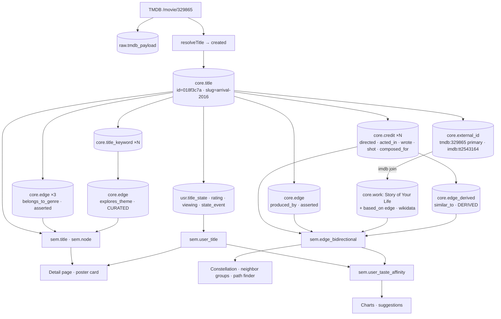

**Five kinds of claim about one film, each with its own provenance:**

| Claim                             | Who said it      | Where                              |
| --------------------------------- | ---------------- | ---------------------------------- |
| Runtime is 116 minutes            | TMDB             | `core.title`, column               |
| Villeneuve directed it            | TMDB             | `core.credit`, `asserted`          |
| Adapted from _Story of Your Life_ | Wikidata         | `core.edge`, `asserted`            |
| It explores Language              | **Throughline**  | `core.edge`, **`curated`**         |
| It resembles _Blade Runner 2049_  | **An algorithm** | `core.edge_derived`, **`derived`** |
| **You watched it and gave it 4½** | **You**          | **`usr.*`, RLS-protected**         |

---

## 31. Example: follow one user action

**Action: "I mark a movie as Watched."**

### Step 1 — Interaction

The user taps the status pill on `/title/arrival-2016`.
[`track-controls.tsx`](src/components/tracking/track-controls.tsx) — a `'use client'` island inside
a server-rendered page.

**Data structures:** `confirmed: Status` (server truth), an optimistic override from
`useOptimistic`, and `isPending` from `useTransition`.

### Step 2 — Optimistic update

```ts
startTransition(async () => {
  applyOptimistic('watched'); // the pill changes NOW
  await markWatchedAction({ titleId, slug });
  setConfirmed('watched');
});
```

**Nothing is persisted yet.** The UI is showing a claim about the future. If the action throws,
`useOptimistic` discards the override and `confirmed` wins.

### Step 3 — Server action

[`src/actions/tracking.ts`](src/actions/tracking.ts). **Framework behavior:** React serializes the
argument and POSTs it over the RSC protocol to a generated endpoint.

```ts
const accountId = await requireAccountId(); // throws if no valid session
const parsed = schema.safeParse(input); // Zod
if (!parsed.success) return { ok: false, error: 'invalid request' };
```

**Data structures:** the untrusted `input`, the parsed value, and `accountId: string`.

### Step 4 — Validation, in two places

| Layer                | Check                                                      |
| -------------------- | ---------------------------------------------------------- |
| **Zod**              | `titleId` is a uuid; `slug` optional string                |
| **Database CHECK**   | `status IN ('watchlist','watching','watched','abandoned')` |
| **Database CHECK**   | `value BETWEEN 1 AND 10` if a rating came along            |
| **RLS `WITH CHECK`** | `account_id = usr.current_account_id()` on every insert    |

Note the redundancy is intentional: Zod catches a client mistake with a friendly error, the
constraints catch _any_ path — including a direct database connection.

### Step 5 — The repository, in one transaction

`markWatched(accountId, titleId, value?)` — [`user.ts`](src/server/repos/user.ts):

```sql
BEGIN;
SELECT set_config('app.account_id', $accountId, true);   -- transaction-scoped; RLS now applies
```

**5a — the standing relationship:**

```sql
INSERT INTO usr.title_state (account_id, title_id, status, started_at, completed_at)
VALUES ($1, $2, 'watched', now(), now())
ON CONFLICT (account_id, title_id) DO UPDATE SET
  status       = excluded.status,
  updated_at   = now(),
  started_at   = COALESCE(usr.title_state.started_at, excluded.started_at),
  completed_at = COALESCE(usr.title_state.completed_at, now());
```

**5b — the transition**, only if the status actually changed:

```sql
INSERT INTO usr.state_event (account_id, title_id, event_kind, from_status, to_status, source)
VALUES ($1, $2, 'status_change', 'watchlist', 'watched', 'manual');
```

**5c — the event**, with rewatch computed in SQL:

```sql
INSERT INTO usr.viewing (account_id, title_id, watched_on, date_precision, …, is_rewatch)
VALUES ($1, $2, now()::date, 'day', …,
        EXISTS (SELECT 1 FROM usr.viewing v2 WHERE v2.account_id = $1 AND v2.title_id = $2))
RETURNING id, is_rewatch;
```

**5d — the judgment**, only if a rating was supplied:

```sql
UPDATE usr.rating SET superseded_at = now()
 WHERE account_id = $1 AND title_id = $2 AND superseded_at IS NULL;
INSERT INTO usr.rating (account_id, title_id, value, viewing_id) VALUES ($1, $2, 9, $viewingId);
COMMIT;
```

**Four tables, one transaction.** If 5d fails, 5a–5c roll back — you cannot end up with a viewing
whose rating never landed.

### Step 6 — Derived state recomputes on next read

| View                      | Change                                                         |
| ------------------------- | -------------------------------------------------------------- |
| `sem.user_title`          | `status`, `view_count += 1`, `rating = 4.5`, `last_watched_on` |
| `sem.user_taste_affinity` | New/updated rows for director, genres, themes, franchise       |
| Metrics                   | All five on `/universe/me`                                     |
| Suggestions               | This title's edges become evidence                             |

**Nothing is recomputed eagerly.** Every one of these is a view evaluated on the next query.

### Step 7 — The ontology does not change

```
core.title        — untouched
core.edge         — untouched
core.credit       — untouched
core.predicate_meta — untouched
core.node_degree  — untouched
```

The application role **cannot** write `core`. What changed is your position in a graph that already
existed, surfaced by `trackedAmong(accountId, titleIds)` as a highlight set.

### Step 8 — Cache invalidation and background work

```ts
revalidateTracking(slug); // revalidatePath('/'), ('/library'), (`/title/${slug}`)
drainSoon(); // after() — 12s budget, runs AFTER the response is flushed
```

For a **show**, `enqueueEpisodeHydration(titleId)` has already placed a `hydrate_episodes` job, and
`drainSoon()` starts it now rather than at 4 a.m.

### Step 9 — The UI settles

`setConfirmed('watched')` promotes the optimistic value to truth. The pill was already correct; the
revalidation refreshes Home and Library behind it.

### The complete chain

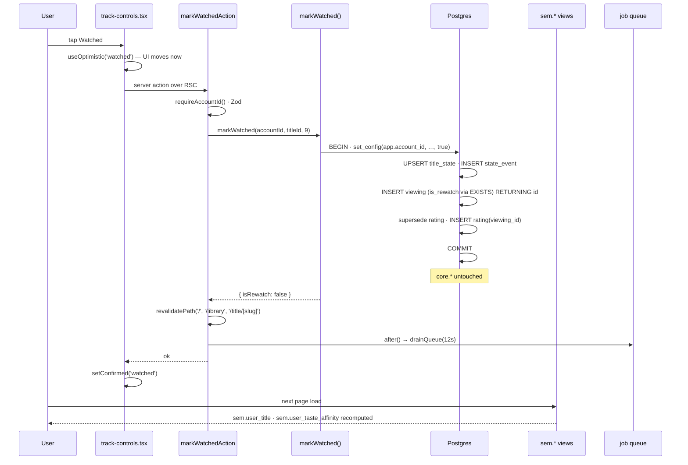

---

## 32. What is actually semantic vs. just data?

A critical pass. The word "semantic" gets attached to things that are merely structured, so each
item below is placed in a category with a reason.

### Raw data — directly sourced, uninterpreted

| Item                                    | Why it belongs here                                                               |
| --------------------------------------- | --------------------------------------------------------------------------------- |
| `raw.tmdb_payload.payload`              | Verbatim provider JSON. No interpretation.                                        |
| `core.title_keyword`                    | A folksonomy copied verbatim. **Explicitly refused admission to the vocabulary.** |
| `core.title.popularity`, `vote_average` | Provider scalars, stamped volatile, never interpreted                             |
| `core.credit.character_name_raw`        | A provider string, unresolved and displayed as-is                                 |
| `core.credit.job` / `department`        | TMDB's own labels, preserved alongside the mapped predicate                       |

### Structured data — normalized and stored, meaning not yet added

| Item                                                            | Why it belongs here                                    |
| --------------------------------------------------------------- | ------------------------------------------------------ |
| `core.title`, `core.person`, `core.season`, `core.episode` rows | Entities with typed columns. Structure, not semantics. |
| `core.external_id`                                              | Identity plumbing                                      |
| `core.availability`                                             | A regional fact table                                  |
| `core.job`, `core.rate_limit`                                   | Operational                                            |
| `usr.viewing`, `usr.state_event` rows                           | Events with typed columns                              |

### Domain model — application entities and their relationships

| Item                                     | Why it belongs here                                                      |
| ---------------------------------------- | ------------------------------------------------------------------------ |
| The nine entity types                    | _These_ are the things this domain contains                              |
| `core.credit` as a reified relationship  | A join table that carries role, ordering and character — a domain object |
| `core.edge`                              | Typed, directed relationships between domain entities                    |
| `usr.title_state`                        | The user↔title relationship as a first-class row                         |
| The status state machine                 | Lifecycle, with legal values and logged transitions                      |
| Composition (`title → season → episode`) | Part-of, with cascade semantics                                          |

### Semantic layer — definitions, rules, derived meaning

| Item                                                                     | Why it belongs here                                                                                                           |
| ------------------------------------------------------------------------ | ----------------------------------------------------------------------------------------------------------------------------- |
| **All 14 `sem.*` views**                                                 | The definitional boundary. Provider changes stop here.                                                                        |
| `sem.title.primary_director`                                             | **A definition that does not exist upstream** — _the most popular title-level directed credit_                                |
| `sem.title.themes` **ordered by salience** while genres are alphabetical | A statement that themes have strength and genres do not                                                                       |
| `sem.user_title.progress_pct` over **aired**, not total                  | "Caught up" ≠ "finished" — the denominator is the meaning                                                                     |
| `sem.user_title.next_episode_*`                                          | Defines "next" as _lowest-numbered unwatched_                                                                                 |
| `sem.person.role_summary`                                                | Makes roles-as-predicates legible as data                                                                                     |
| `sem.user_taste_affinity.affinity_score`                                 | Defines "affinity" as volume × **rating lift vs. your own mean** × recency                                                    |
| That view's predicate allowlist                                          | _"The predicates a person would recognize as taste."_ `produced_by` excluded; `similar_to` excluded to avoid double-counting. |
| `src/lib/tracking.ts`                                                    | The vocabulary of the personal layer, feeding both TS unions and DB constraints                                               |
| `starsToValue` / `valueToStars`                                          | 9 ↔ 4.5, and **throws rather than rounding**                                                                                  |
| `ontology/metrics.yaml` + the resolver                                   | Metrics as definitions, not queries in components                                                                             |
| `deriveThemes` thresholds (0.5, top 6)                                   | The rule that turns keywords into themes                                                                                      |
| `deriveSimilar` IDF weighting                                            | Defines "similar" as _sharing signals rare in the corpus_                                                                     |
| `themes.yaml` definitions → `concept.description`                        | **Literally the meaning of the vocabulary, stored**                                                                           |

### Ontology — concepts and relationships in the domain

| Item                                                | Why it belongs here                                         |
| --------------------------------------------------- | ----------------------------------------------------------- |
| `ontology/ontology.yaml`                            | The declared vocabulary                                     |
| `core.predicate_meta`                               | The same, as queryable data                                 |
| `core.assert_edge_valid()`                          | Makes the vocabulary binding at write time                  |
| Generated CHECK constraints                         | The predicate allowlist per storage table                   |
| `domain_types` / `range_types`                      | Which statements are well-formed                            |
| `range_concept_schemes` / `range_org_kinds`         | **Subtype constraints** across a polymorphic reference      |
| Declared inverses                                   | `directed` ↔ `directed_by`                                  |
| `path_weight`                                       | How explanatory each relationship is                        |
| `is_structural`, `excluded_from_path_intermediates` | Which relationships are and are not part of the graph       |
| The **three provenance tiers**                      | Asserted / curated / derived — the kind of claim being made |

### Presentation

| Item                                                   |
| ------------------------------------------------------ |
| `constellation-canvas.tsx` and the force layout        |
| `graphPalette` — a color per entity type               |
| Log-scaled node radius from degree                     |
| The six SVG chart components                           |
| Theme chips accent-outlined, genre chips neutral       |
| `suggestion-copy.ts` turning predicates into sentences |
| Path narration composed from `predicate_meta` labels   |
| `core.title.accent_color`                              |

### The genuinely ambiguous cases

| Item                                   | The tension                                                                                                                                                                                                       |
| -------------------------------------- | ----------------------------------------------------------------------------------------------------------------------------------------------------------------------------------------------------------------- |
| **`core.edge_derived` (`similar_to`)** | Domain model (it is an edge, validated by the ontology) _and_ semantic layer (the IDF rule _defines_ similarity). It is a **stored conclusion of a semantic rule** — structure holding the output of meaning.     |
| **`explores_theme` edges**             | Same shape as an asserted edge; entirely our interpretation. The `provenance` column is what resolves it: `curated` marks it as our claim. **Without that column this would be indistinguishable from raw data.** |
| **`path_weight`**                      | Sits in the ontology table, but 4.5 for `belongs_to_genre` is an _editorial_ judgment about explanatory value — semantic content living in an ontological structure.                                              |
| **`core.title.accent_color`**          | Derived from source data (the poster) but purely presentational. Data by origin, presentation by purpose.                                                                                                         |
| **`sem.node`**                         | Presentation-shaped (label, sublabel, image) but a semantic-layer object — it **defines** what "the label of a thing" means per type.                                                                             |
| **`usr.title_state.status`**           | Domain model (a lifecycle) whose _values_ are a semantic vocabulary defined in `tracking.ts` and enforced by a CHECK.                                                                                             |

### The sharpest line in the system

The clearest semantic/data boundary is the pair that looks identical in the schema:

```sql
-- Structurally identical rows in the same table
('title', X, 'belongs_to_genre', 'concept', <Drama>,   '{}',                 'asserted', 'tmdb')
('title', X, 'explores_theme',   'concept', <Memory>,  '{"salience":0.9}',   'curated',  'crosswalk')
```

Same table, same shape, same types. The difference is entirely semantic: **one is a fact we
received, the other is a claim we are making** — and the model records that difference in
`provenance`, in `is_curated` on the concept, in `path_weight` (4.5 vs. 2.6), in the presence of a
`description`, in ordering (alphabetical vs. salience), and in the chip styling.

Six independent encodings of one semantic distinction. That is what it looks like when a semantic
layer is load-bearing rather than decorative.

---

## 33. Future data model opportunities

Each tied to something that already exists.

### Populate the concept hierarchy

`themes.yaml` already declares cluster→theme. `core.concept.parent_id` exists. `broader_than` is
declared with weight 2.0. **All three are in place and none is connected.** One change to
`deriveThemes` — write clusters as parent concepts, set `parent_id`, emit `broader_than` edges —
and "films about Identity & Self" becomes answerable across its child themes. **The highest
value-to-effort item in this list.**

### Populate character resolution

`core.character` exists, `credit.character_id` exists, `portrayed_by` and `features_character` are
declared and constrained. What is missing is the resolution step. Even a conservative version —
resolve only where a normalized character name already exists within the same collection — would
unlock _"which actors have played Batman?"_ as a one-hop query, and person→character→title paths are
among the most delightful results a path finder can return.

### Load `moods.yaml`

The scheme is declared in `ontology.yaml` with a justification from a real keyword census: _"a
keyword census over 448 titles found 319 sentiment-tag assignments, more mass than any theme gap."_
The file exists. Codegen does not read it. Loading it would make _"like Arrival but less
depressing"_ expressible as a structured filter rather than a vibe.

### Use `core.path_cache`

The table exists with a documented 7-day TTL and `(endpoint_low, endpoint_high)` ordering so the
pair is order-independent. Nothing reads or writes it. Path finding recomputes on every request.

### Populate `sequel_to` and `remake_of`

Both declared with strong weights (1.0 and 1.2 — among the most explanatory in the vocabulary).
Wikidata has `follows` / `followed by` and remake relations, and `enrichWikidata` already runs
SPARQL against titles matched by IMDb id. This is an addition to an existing query, not new
infrastructure.

### Temporal edges

`core.edge.valid_from` / `valid_to` exist and are never populated. Populating them for
organizational edges would make _"produced by, as of the release date"_ correct rather than as of
today — so a film produced by a studio later acquired by another still reads correctly.

### Companion aggregation

`usr.viewing.companions text[]` is already captured. A GIN index on it would make _"31 films watched
with Sarah"_ a query. The data is being collected and never read.

### Per-viewing rating history as a visible feature

`usr.rating.viewing_id` already links judgments to viewings. The rewatch-rating-drift chart —
_"films you liked more the second time"_ — is a `metrics.yaml` entry plus a chart binding away.

### `under_watched_genres`

Already written in `metrics.yaml` and not in `PHASE_1_METRICS`. It is the first genuinely
_analytical_ metric — comparing your distribution against the corpus distribution rather than
describing yours alone.

### Embeddings over composed documents

Would slot into `core.title` as a `pgvector` column, computed from a **constructed** document —
title, curated themes with salience, director, top cast, franchise, source work — **not** the TMDB
overview. Hybrid retrieval would be vector similarity intersected with structured graph constraints,
giving the second signal a comparison against the existing IDF similarity.

### An agent tool layer

`ontology.yaml` and `metrics.yaml` are already machine-readable declarations of what can be asked.
A tool registry generated from them, account-scoped server-side, would let a model query the
semantic layer without ever seeing SQL — and its vocabulary would be _the same object the database
enforces_.

### Multi-user structure

`usr.account` and full RLS already exist. Households, shared lists, and taste-diffing between two
personal layers are all queries over structures that are already there — _"films you'd both
probably like"_ is a genuine graph query over two overlays of one graph.

---

## 34. Developer reference

### Entities

| Entity          | Table                  | Purpose                | Populated            |
| --------------- | ---------------------- | ---------------------- | -------------------- |
| Title           | `core.title`           | Movie or show          | ✅ TMDB              |
| Season          | `core.season`          | Part of a show         | ✅ TMDB              |
| Episode         | `core.episode`         | Part of a season       | ✅ TMDB, on tracking |
| Person          | `core.person`          | A human, all roles     | ✅ TMDB              |
| Concept         | `core.concept`         | Genre or theme         | ✅ TMDB + ours       |
| Collection      | `core.collection`      | Franchise              | ✅ TMDB + Wikidata   |
| Organization    | `core.organization`    | Studio / network       | ✅ TMDB              |
| Work            | `core.work`            | Source material        | ✅ Wikidata only     |
| Character       | `core.character`       | Fictional person       | ❌ **empty**         |
| Account         | `usr.account`          | A user                 | ✅                   |
| TitleState      | `usr.title_state`      | Standing relationship  | ✅                   |
| StateEvent      | `usr.state_event`      | Transition log         | ✅ append-only       |
| Rating          | `usr.rating`           | Versioned judgment     | ✅                   |
| Viewing         | `usr.viewing`          | Watching event         | ✅                   |
| EpisodeProgress | `usr.episode_progress` | Episode tick           | ✅                   |
| Note            | `usr.note`             | Free text, polymorphic | ✅                   |
| Share           | `usr.share`            | Public snapshot link   | ✅                   |

### Relationships

| Relationship         | From          | To                        | Storage             | Weight | Populated                   |
| -------------------- | ------------- | ------------------------- | ------------------- | ------ | --------------------------- |
| `directed`           | person        | title, episode            | `core.credit`       | 1.0    | ✅                          |
| `acted_in`           | person        | title, episode            | `core.credit`       | 1.4    | ✅                          |
| `wrote`              | person        | title, episode            | `core.credit`       | 1.15   | ✅                          |
| `composed_for`       | person        | title                     | `core.credit`       | 1.6    | ✅                          |
| `shot`               | person        | title                     | `core.credit`       | 1.6    | ✅                          |
| `sequel_to`          | title         | title                     | `core.edge`         | 1.0    | ❌                          |
| `portrayed_by`       | character     | person                    | `core.edge`         | 1.1    | ❌                          |
| `part_of_franchise`  | title         | collection                | `core.edge`         | 1.1    | ✅                          |
| `based_on`           | title         | work                      | `core.edge`         | 1.2    | ✅                          |
| `remake_of`          | title         | title                     | `core.edge`         | 1.2    | ❌                          |
| `features_character` | title         | character                 | `core.edge`         | 1.3    | ❌                          |
| `influenced_by`      | title, person | title, person             | `core.edge`         | 1.5    | ✅                          |
| `broader_than`       | concept       | concept                   | `core.edge`         | 2.0    | ❌                          |
| `similar_to`         | title         | title                     | `core.edge_derived` | 2.2    | ✅ symmetric                |
| `explores_theme`     | title         | concept(theme)            | `core.edge`         | 2.6    | ✅                          |
| `aired_on`           | title         | organization(network)     | `core.edge`         | 3.5    | ✅                          |
| `produced_by`        | title         | organization(studio)      | `core.edge`         | 3.8    | ✅                          |
| `distributed_by`     | title         | organization(distributor) | `core.edge`         | 4.2    | ❌                          |
| `belongs_to_genre`   | title         | concept(genre)            | `core.edge`         | 4.5    | ✅ excluded as intermediate |
| `season_of`          | season        | title                     | **FK**              | —      | ✅ structural               |
| `episode_of`         | episode       | season                    | **FK**              | —      | ✅ structural               |

### External identifiers

| System           | Entity types                            | Id format                                       | Primary?                  |
| ---------------- | --------------------------------------- | ----------------------------------------------- | ------------------------- |
| `tmdb`           | title, person, collection, organization | Numeric as text; orgs use `` `${kind}:${id}` `` | **Yes** for title, person |
| `imdb`           | title                                   | `tt2543164`                                     | No — the crosswalk key    |
| `wikidata`       | title, work                             | `Q21030411`                                     | No                        |
| `tvmaze`, `omdb` | —                                       | Declared, unused                                | —                         |

### Semantic concepts

| Concept          | Definition                                                                        | Source                      |
| ---------------- | --------------------------------------------------------------------------------- | --------------------------- |
| Movie / Show     | `core.title` with `kind`; `sem.title` adds year, genres, themes, primary director | Ingest + view               |
| Primary director | Most popular person with a **title-level** `directed` credit                      | `sem.title`                 |
| Theme            | A curated concept with a written definition, attached with salience               | `themes.yaml` + crosswalk   |
| Genre            | A provider concept, weight 4.5, barred from path intermediates                    | TMDB + `predicate_meta`     |
| Watched          | Status value **and** viewing event **and** state transition                       | `usr.*`                     |
| Progress         | `episodes_watched / episodes_**aired**`                                           | `sem.user_title`            |
| Next episode     | Lowest-numbered unwatched episode                                                 | `sem.user_title` LATERAL    |
| Rating           | `smallint` 1..10 → 0.5–5.0; current = `superseded_at IS NULL`                     | `usr.rating`, `tracking.ts` |
| Favorite         | Affinity, orthogonal to status                                                    | `title_state.is_favorite`   |
| Affinity         | `ln(1+n) × (1 + rating lift/2) × recency_decay`                                   | `sem.user_taste_affinity`   |
| Similar          | Sharing signals rare in the corpus (IDF)                                          | `deriveSimilar`             |
| Interesting path | Low weighted cost, hub-penalized, diverse                                         | `findPaths`                 |
| Provenance       | asserted / curated / derived                                                      | `core.edge.provenance`      |

### Important queries

| Query                           | Purpose           | Tables / views                                |
| ------------------------------- | ----------------- | --------------------------------------------- |
| `getTitleBySlug`                | Detail page       | `sem.title_full`                              |
| `searchTitles` / `searchPeople` | Typeahead         | `sem.title`, `sem.person` (trigram)           |
| `listLibrary`                   | Library shelves   | `sem.user_title` + `sem.title`                |
| `continueWatching`              | Home rail         | `sem.user_title` (`next_episode_id NOT NULL`) |
| `neighbors`                     | Grouped links     | `sem.edge_bidirectional`, `sem.node`          |
| `neighborhood`                  | Constellation     | same + `core.node_degree`                     |
| `findPaths`                     | "Why connected?"  | `sem.edge_bidirectional`, `core.node_degree`  |
| `tasteByPredicate`              | Charts            | `sem.user_taste_affinity`                     |
| `suggestions`                   | What to watch     | `sem.user_taste_affinity` + edges             |
| `deriveThemes`                  | Keywords → themes | `title_keyword`, `crosswalk`, `core.edge`     |
| `deriveSimilar`                 | IDF similarity    | `core.credit`, `core.edge`, `edge_derived`    |
| `getPublicShare`                | Share page        | `usr.share_by_slug()` (SECURITY DEFINER)      |
| `exportAccount`                 | Data export       | All `usr.*`                                   |

### Key files

| File                                                                         | Holds                                                          |
| ---------------------------------------------------------------------------- | -------------------------------------------------------------- |
| [`ontology/ontology.yaml`](ontology/ontology.yaml)                           | The ontology — 21 predicates, 9 entity types                   |
| [`ontology/themes.yaml`](ontology/themes.yaml)                               | Curated theme vocabulary with definitions                      |
| [`ontology/crosswalk.yaml`](ontology/crosswalk.yaml)                         | Keyword → theme mapping                                        |
| [`ontology/metrics.yaml`](ontology/metrics.yaml)                             | Nine metric definitions                                        |
| [`drizzle/schema/core.ts`](drizzle/schema/core.ts)                           | 23 canonical tables (`predicate_meta` is generated separately) |
| [`drizzle/schema/usr.ts`](drizzle/schema/usr.ts)                             | 12 user tables                                                 |
| [`drizzle/sql/20-views.sql`](drizzle/sql/20-views.sql)                       | **All 14 `sem.*` views**                                       |
| [`drizzle/generated/ontology.sql`](drizzle/generated/ontology.sql)           | `predicate_meta`, CHECKs, trigger                              |
| [`src/lib/tracking.ts`](src/lib/tracking.ts)                                 | Personal-layer vocabularies                                    |
| [`src/server/ingest/ingest.ts`](src/server/ingest/ingest.ts)                 | TMDB → canonical                                               |
| [`src/server/ingest/resolve.ts`](src/server/ingest/resolve.ts)               | Entity resolution                                              |
| [`src/server/ingest/derive-themes.ts`](src/server/ingest/derive-themes.ts)   | Keywords → themes                                              |
| [`src/server/ingest/derive-similar.ts`](src/server/ingest/derive-similar.ts) | IDF similarity                                                 |
| [`src/lib/graph/postgres-engine.ts`](src/lib/graph/postgres-engine.ts)       | Traversal and paths                                            |
| [`src/server/db/client.ts`](src/server/db/client.ts)                         | `withUser()`                                                   |

---

## 35. The mental model I should have

1. **TMDB says what exists. Wikidata says what it relates to. We say what it means. You say what
   you did about it.** Four kinds of claim, four provenances, and the model keeps them apart on
   purpose.

2. **A TMDB id is an attribute, not an identity.** `core.external_id` maps many provider ids to one
   UUIDv7 that we mint — which is what lets Wikidata attach, merges be reversible, and `core.work`
   exist with no TMDB id at all.

3. **A Title is an entity; Watched is a relationship between an account and that entity.** It lives
   on the join, in `usr.title_state`, keyed `(account_id, title_id)`. As a column on the title it
   could not survive a second user.

4. **A Person is one identity; Director is a predicate on an edge.** `sem.person.role_summary`
   returns `{"directed": 12, "acted_in": 3}` for one row — a model with Director as an entity type
   could not produce that, because it would be two people.

5. **A foreign key is a physical pointer; a predicate is a domain statement.** `core.edge` has no
   FK on `subject_id` at all — what makes it meaningful is `core.predicate_meta` plus a trigger that
   rejects any edge violating the declared domain, range, or subtype.

6. **The ontology is a table, not a diagram.** `core.predicate_meta` is real data, and
   `assert_edge_valid()` is generic logic over it — _"adding a predicate changes data, never code."_
   It has already rejected a real modeling error at insert time.

7. **`ontology.yaml` is a build input.** `pnpm codegen` compiles it into CHECK constraints, the
   trigger, `predicate_meta`, and TypeScript types; CI fails if the committed artifacts drift. The
   database is generated from the ontology.

8. **Genre and Theme are the same shape and opposite claims.** Same table, same predicate mechanics
   — and the difference shows up in `provenance`, `is_curated`, `path_weight` (4.5 vs. 2.6), the
   presence of a `description`, and salience ordering. Six encodings of one distinction.

9. **Keywords are deliberately not vocabulary.** A folksonomy sits in `core.title_keyword` as input
   to a crosswalk we authored. The first attempt to write them as genre edges was **rejected by the
   ontology trigger** — correctly.

10. **`raw` exists so the vocabulary can change.** Rewrite the theme crosswalk, re-run
    `deriveThemes`, and every `explores_theme` edge is recomputed with no re-crawl. That is the
    entire argument for keeping verbatim payloads.

11. **The semantic layer is fourteen views, and it contains definitions that exist nowhere
    upstream.** "Primary director," "progress over _aired_ episodes," "next episode," "affinity as
    rating lift against your own mean" — none of those are facts TMDB supplies. They are decisions.

12. **Almost nothing derived is stored.** Progress, counts, role summaries, inverse edges, affinity
    — all computed at read time. Four exceptions, each justified: `node_degree` (too expensive per
    query), `explores_theme` and `similar_to` (corpus-wide aggregates that must be edges), and
    `is_rewatch` (its truth changes as history grows, so it must be stamped).

13. **The graph is a projection of the relational database, computed per request.** There is no
    graph store and nothing persisted in graph form. `sem.node` and `sem.edge_bidirectional` _are_
    the graph.

14. **Two hops, not one, because one hop is a star.** A title's neighbors are people, concepts and
    studios, and nothing joins those directly — measured on _Paris, Texas_: 40 neighbors, zero edges
    among them. **The fix was in the query, not the renderer.**

15. **Inverse edges are generated, never stored.** Every edge is written once in canonical
    direction; `sem.edge_bidirectional` emits the reverse with the declared inverse label. Joining
    `predicate_meta` on an inverse name silently drops half the graph.

16. **Marking something watched writes zero rows to `core`.** The application role has no write
    grant there. What changes is your position in a graph that already existed — the personal layer
    is an overlay, not a mutation.

17. **Removing a title from your library does not remove it from the world**, and does not remove
    your rating or your viewing history either. Three different deletion semantics — hard delete,
    supersede, revoke — because they are three different facts.

18. **The interesting constraints are the cross-column ones.** `state_event_shape_ck` and
    `viewing_date_present_ck` reject rows that are individually type-valid and semantically
    incoherent — the class of bad data that is hardest to find later.

19. **Vocabularies live in one place and feed two consumers.** `src/lib/tracking.ts` produces both
    the TypeScript unions and the database CHECK constraints. They cannot drift. Before it existed,
    the columns were plain `text` with the values written in a comment.

20. **Weight is editorial judgment expressed as data.** `belongs_to_genre` at 4.5 and `directed` at
    1.0 encode how much each relationship explains — and the same judgment appears again in
    `deriveSimilar`'s IDF weighting and in the path finder's hub ban.

21. **A high-degree node is not an interesting node.** Discovered three separate times: the path
    finder's hub penalty, the constellation's second-ring filter, and the front-door opener list
    that used to rank studios first.

22. **Thirteen of twenty-one predicates carry data.** Character is a fully-declared entity with an
    empty table. `parent_id` and `broader_than` are declared and unused, so **the ontology currently
    has no working hierarchy.** That is a gap, not a design.

23. **This is a lightweight formal ontology, not a full one.** It has a declared vocabulary,
    enforced domains and ranges, subtype constraints, inverses, provenance and weights. It has no
    URIs, no reasoner, no class hierarchy, and derives nothing by entailment. Calling it more would
    be overclaiming.

24. **The four-schema separation is the load-bearing decision.** `raw` for replay, `core` for the
    world, `sem` for meaning, `usr` for you — with grants, RLS, and a CI grep making the boundaries
    real rather than conventional.

25. **The recurring lesson in this codebase is that a check which cannot fail is not a check.** A
    comment listing allowed values, a health map monitoring jobs that do not exist, a unique index
    that `NULL != NULL` defeats, a test passing as a superuser that bypasses RLS. Every one shipped
    looking correct.

---

## 36. Discrepancies: declared vs. implemented

Found across two passes. **The implementation is treated as correct**; these are places where
schema, ontology, or documentation describes something with no code path.

### Declared in the ontology, never written

| #   | Item                     | Evidence                                                                      |
| --- | ------------------------ | ----------------------------------------------------------------------------- |
| 1   | **`portrayed_by`**       | In `predicate_meta`, in the `core.edge` CHECK, weight 1.1. No code writes it. |
| 2   | **`features_character`** | Same; weight 1.3                                                              |
| 3   | **`sequel_to`**          | Same; weight 1.0 — one of the strongest declared                              |
| 4   | **`remake_of`**          | Same; weight 1.2                                                              |
| 5   | **`distributed_by`**     | Same; weight 4.2. `produced_by` and `aired_on` are written; this one is not.  |
| 6   | **`broader_than`**       | Same; weight 2.0. **The only hierarchy predicate.**                           |

Thirteen of twenty-one carry data. `ontologyStats()` reports `predicates: PREDICATES.length` — the
declared count — so the Universe panel **overstates the working vocabulary by about 38%**.

### Declared in the schema, never populated

| #   | Item                                            | Evidence                                                                                                                                           |
| --- | ----------------------------------------------- | -------------------------------------------------------------------------------------------------------------------------------------------------- |
| 7   | **`core.character`** — the entire table         | **No `INSERT INTO core.character` anywhere.** Only read by `health.ts` for a count.                                                                |
| 8   | **`core.credit.character_id`**                  | Never set. `upsertCredit` does not include the column. Characters exist only as `character_name_raw`.                                              |
| 9   | **`core.concept.parent_id`**                    | Never set. `themes.yaml` declares cluster→theme and `deriveThemes` flattens it.                                                                    |
| 10  | **`core.organization.parent_org_id`**           | Declared, no FK, never populated                                                                                                                   |
| 11  | **`core.edge.valid_from` / `valid_to`**         | Temporal validity declared, never populated                                                                                                        |
| 12  | **`core.path_cache`**                           | Full table with a documented 7-day TTL. **No reference in `src/`.** Paths recompute every request.                                                 |
| 13  | **`core.person_bacon`**                         | Full table. No reference in `src/`. No `/universe/bacon` route.                                                                                    |
| 14  | **`raw.wikidata_payload`**                      | Declared; **never written.** `enrichWikidata` applies SPARQL results directly, so Wikidata edges are not replayable the way TMDB-derived ones are. |
| 15  | **`core.title.certification`**                  | Declared, not set by ingest                                                                                                                        |
| 16  | **`core.title.blur_hash`**                      | Declared, not populated                                                                                                                            |
| 17  | **`core.external_id`** sources `tvmaze`, `omdb` | Declared in comments; no ingest path                                                                                                               |

### Declared vocabularies not loaded

| #   | Item                        | Evidence                                                                                                                                                                                                                                             |
| --- | --------------------------- | ---------------------------------------------------------------------------------------------------------------------------------------------------------------------------------------------------------------------------------------------------- |
| 18  | **`mood` concept scheme**   | `ontology.yaml` declares it with `source: ontology/moods.yaml` and a census-based justification. **`codegen.ts` reads only `ontology.yaml`, `themes.yaml` and `crosswalk.yaml`** — `moods.yaml` is never loaded and no mood concept is ever created. |
| 19  | **`format` concept scheme** | Declared with `phase: 2` — explicitly deferred, not an oversight                                                                                                                                                                                     |

### Behavior that differs from documentation

| #   | Item                                                                                                                                                                                               |
| --- | -------------------------------------------------------------------------------------------------------------------------------------------------------------------------------------------------- |
| 20  | **`docs/api.md` describes on-demand hydration as a queued job.** It is synchronous — `on-demand.ts` documents the divergence in place, citing daily-only Hobby cron.                               |
| 21  | **Four of nine metrics in `metrics.yaml` are not rendered** — `theme_distribution`, `franchise_coverage`, `completion_rate`, `under_watched_genres` are defined and absent from `PHASE_1_METRICS`. |
| 22  | **`.env.example` declares `UPSTASH_REDIS_REST_URL` / `_TOKEN`** — nothing reads them; rate limiting is entirely Postgres. (Also noted in [ARCHITECTURE.md §25](ARCHITECTURE.md).)                  |
| 23  | **`@neondatabase/serverless` is a dependency and is never imported.** All access is via `postgres.js`.                                                                                             |

### Behaviors worth knowing that are not bugs

| #   | Item                                                                                                                                                                                                                                                                                                                                             |
| --- | ------------------------------------------------------------------------------------------------------------------------------------------------------------------------------------------------------------------------------------------------------------------------------------------------------------------------------------------------ |
| 24  | **Re-ingest refreshes only volatile fields.** A corrected title, overview or runtime on TMDB does **not** propagate to an existing `core.title` row. Edges and credits do converge. Not documented anywhere — it is simply what the `else` branch does.                                                                                          |
| 25  | **Crew outside `CREDIT_JOBS` is silently discarded.** Producers, editors, costume designers — fetched, parsed, dropped. Seven job strings map to four predicates.                                                                                                                                                                                |
| 26  | **Cast is capped at 20, production companies at 6.** Deliberate bounds, no comment explaining the specific numbers.                                                                                                                                                                                                                              |
| 27  | **A show's cast takes `roles[0]` only.** An actor playing two characters across a run keeps one name.                                                                                                                                                                                                                                            |
| 28  | **`usr.note.subject_id` is polymorphic with no FK and no validating trigger** — the only unguarded polymorphic reference in the model.                                                                                                                                                                                                           |
| 29  | **RLS is deliberately _not_ enabled on `usr.auth_*`.** The schema states why: Better Auth queries them before a session exists, so there is no `app.account_id` to filter by; they are reachable only through the library's server-side handlers. _(This corrects a line in an earlier draft of ARCHITECTURE.md that listed it as an open gap.)_ |

---

_Verified against the working tree on 2026-09-26, in two passes. Every table, column, constraint,
function, file path and quoted comment was read from the code. Inferred reasoning is labeled
**Likely rationale**; anything declared-but-unimplemented is labeled **Not implemented** and
collected above._
